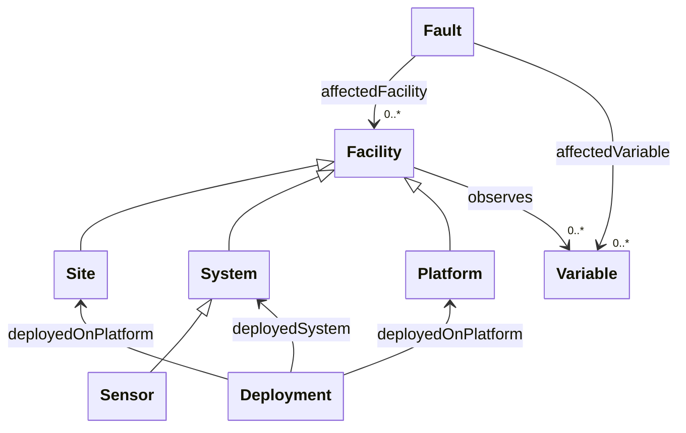
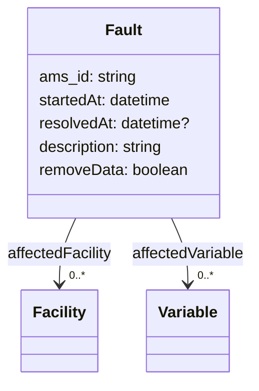
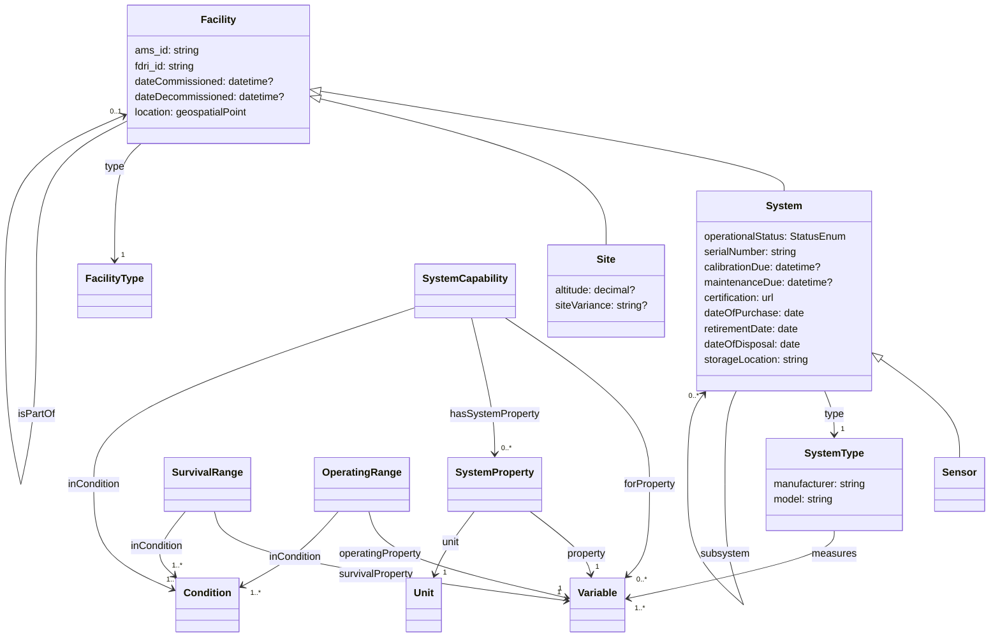
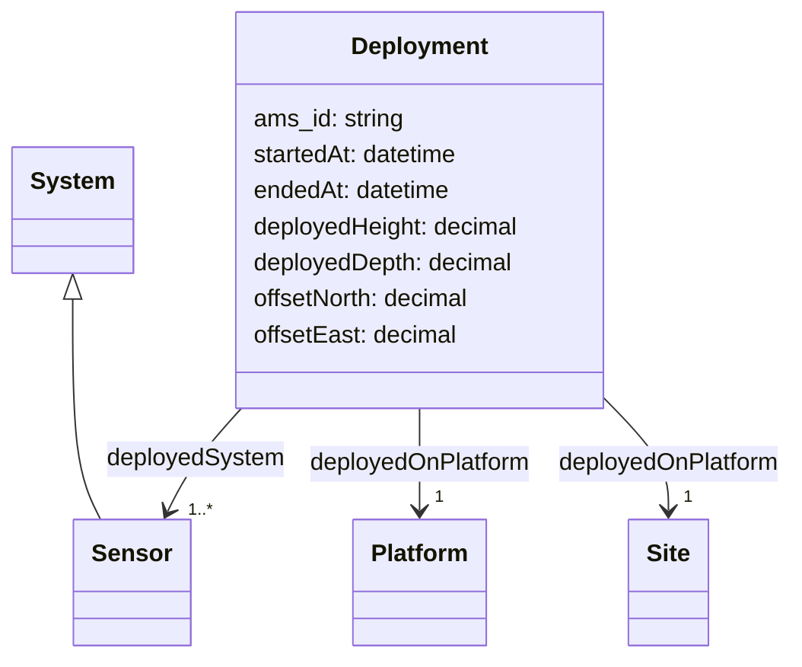
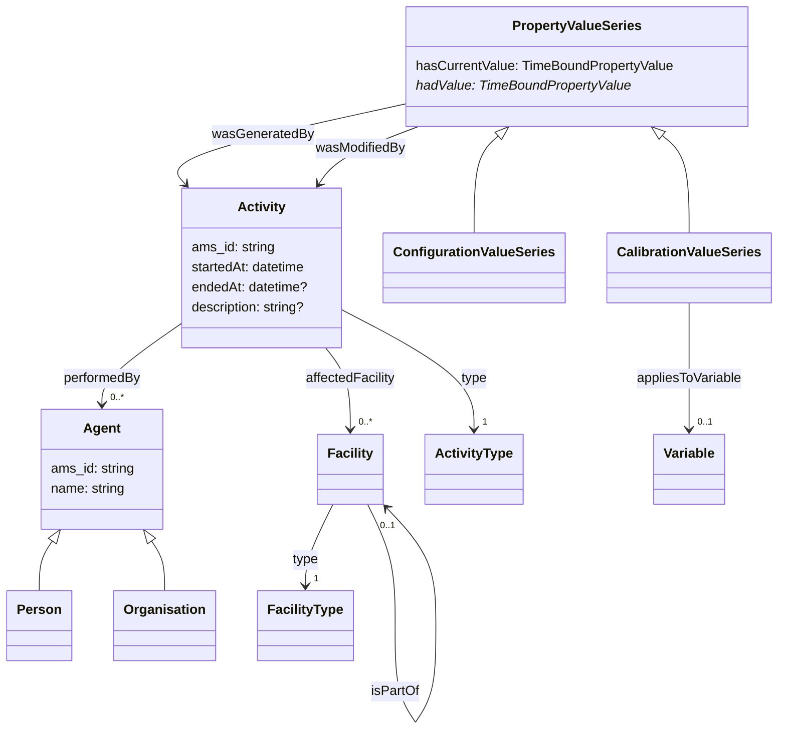
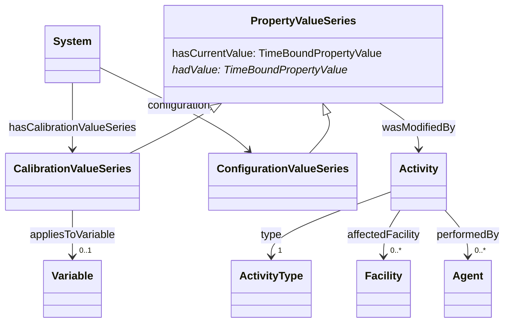

# AMS Integration

## Key metadata entities to retrieve from AMS

The class diagram below shows the sub-set of the FDRI metadata data model that touches on the entities we expect to retrieve data about from the AMS.

`Facility` is the base class for monitoring infrastructure assets.
A `Site` may host any number of `Platform`s. A `System` is deployed to a `Site` or a `Platform` at a site. A `System` may consist of a number of subsystems, or it may be a single `Sensor`.

A `Variable` is some observable environmental phenomenon - e.g. wind speed, soil moisture etc. Any `Facility` can be related to the `Variable`s that it measures.

A `Fault` is some reported issue that affects the measurement of some `Variable`s by some `Facility`.

## Fault

We would expect most fault data to be pulled from the AMS.
Faults that are reported via the SODB would still be pulled from the AMS rather than implementing a separate ingestion path for them.

Ideally we would be able to bulk retrieve fault entities which have been created or updated within a given time period.

The AMS-assigned identifier would be used to correlate the metadata record with the fault record. It is assumed that all updates to a fault status would modify the fault record.

* AMS identifier
* Description
* Affected system(s)
* Affected measurement variables
* Start timestamp
* End/Resolved timestamp
* "Remove data" flag

## Facilities

In the metadata model a Facility is the base class for many of the categories of physical asset. The primary subclasses we are interested in are Sites, Platforms and Systems/Sensors. A Site is a location which may host several platforms, each platform hosts Systems or Sensors. A System is a physical package containing one or more sensors.

Sites, Platforms, Systems and Sensors are all "soft-typed" with a category. e.g "Weather Station" for a platform, "Anemometer" for a sensor.

We need sufficient typing of assets to be able to determine which asset records fall into which categories, and from that we would be able to determine the asset type. There are also likely to be a significant number of assets that we would not reflect in the metadata store such as consumables, assets which are part of infrastructure but do not directly or indirectly host sensors etc.

For Sites (and Platforms?) we would expect to be able to retrieve both the AMS identifier and the Site Vocab DB identifier from the AMS along with additional metadata as outlined below.

* Common Facility Metadata
  * AMS identifier
  * Site Vocab DB Identifier (sites and platforms only)
  * Operating period (date commissioned to date decommissioned)
  * Geospatial location (may be as a point, bounding box, or polygon or some combination of these)

* Sites
  * Name
  * Site type
  * Network that the site belongs to
  * Altitude
  * Description
  * Land usage
  * Soil type
  * Bedrock type
  * Layout variation notes
  * Public access
  * Site owner category
  * Other network-specific site metadata (the above may not be an exhaustive list - we would expect to pull all available metadata fields and then map them to extension points in the model)

QUESTION: Which of this site metadata is mastered in the AMS and which is mastered in the Site Vocab database? The SODB metadata store should pull from the master source.

* Platforms
  * Location relative to site
  * Platform type

* Systems/Sensors
  * System Type
    * Model
  * Serial Number
  * Date calibration is due
  * Date maintenance is due
  * Date of purchase
  * Date of disposal
  * Expected retirement date
  * Storage location

* System Models
  * Variables Measured
  * Capabilities: Sensitivity, Accuracy etc.
  * Operational Range
  * Survival Range (e.g battery lifetime)

The `SystemType` is drawn from a vocabulary in which the broadest terms are generic types of sensor system (e.g. "Anemometer"), and narrower terms are specific models of sensor system (e.g. "Windmaster 3000"). In general the specific variables measured and the capabilities of the sensor system type will be recorded at this lower level. The capabilities, operational ranges and survival ranges of sensor systems can all be qualified by a condition (e.g. an standard operating temperature range).

QUESTION: Which system will be the master for the list of generic system types. Which system will be the master for the list of specific models and their capabilities?

## Deployments

Represents the period during which a sensor or system is deployed on a platform or to a site (if the site has no known platforms).

* start timestamp
* end timestamp
* deployed position (height, depth, offset from platform)

NOTE: A deployment may be associated with a number of activities - an installation activity, any number of on-site maintenance activities and a deinstallation activity.

At this stage we are not sure if the the AMS treats deployments as first-class entities. Ideally this would be the case, allowing us to ingest them without having to infer deployments from these individual activities. If that is not the case we need to have a clear understanding of which activity type(s) infer the start and end of a deployment.

## Activities

The SODB metadata store is primarily interested in activities that affect deployed sensors/systems and the facilities where they are deployed.

As the metadata for activities is intended to be used publicly, we would want to avoid including PII in this data. Hence the suggestion that where there are individuals associated with an activity, it would be preferable if we can just retrieve their organisation.

At this stage it is not clear if it would be better to be able to retrieve activities with the data for the affected entity or as a separate batch request. The former may be more easily processed, but then we would need to include the update of the activity stream for an asset as part of the determination of whether an asset record has been modified since the last request. If we retrieve activity records as a batch it would be best if it were possible to filter by affected asset type and to group activities by the affected asset so that all recent activities affecting one asset can be processed together.

* Type (e.g. deployment, removal, maintenance, calibration, configuration)
* Start and end timestamp of activity
* Responsible actor(s) - or their organisation
* Deployment information
  * Deployment position, height, depth
* Calibration information
  * Calibration values
  * The variable(s) affected by the calibration
* Configuration information
  * Configuration values/configuration file reference

### Configuration and Calibration Values

NOTE: It is not clear yet whether this information would be retrieved from the AMS or some other system.

The SODB metadata includes both current and historic configuration and calibration property values. There is/will be a controlled vocabulary of the properties. Calibration property values may be additionally scoped by the variable(s) affected by the calibration. As values can be changed over time, every value should be associated with a start timestamp and (if historic) an end timestamp.

Some configuration is in the form of files, in such cases the configuration value should be a reference to (ideally the URL of) the configuration.

## General Questions

* What data is mastered in the AMS vs other systems that are external to the SODB?
  * esp. is there overlap with site information?
* Do all entities in the AMS have persistent identifiers that we can use to relate metadata entities to AMS entities?
* When entities that are mastered elsewhere are included in the AMS will there be a way to identify the system that they came from and the identifier used by that system?
* Do AMS events have both a start and end date or just a timestamp?
  * In particular how are sensor deployments recorded - is it a start event and an end event or a single deployment event?
  * If it is two separate events, how are they related to each other?
* Is there any push API that could be used for the subset of events we might want to monitor with low latency? (e.g. faults)
* When a fault is reported on a piece of equipment, how easy is it to retrieve the full set of child assets for that piece of equipment?
