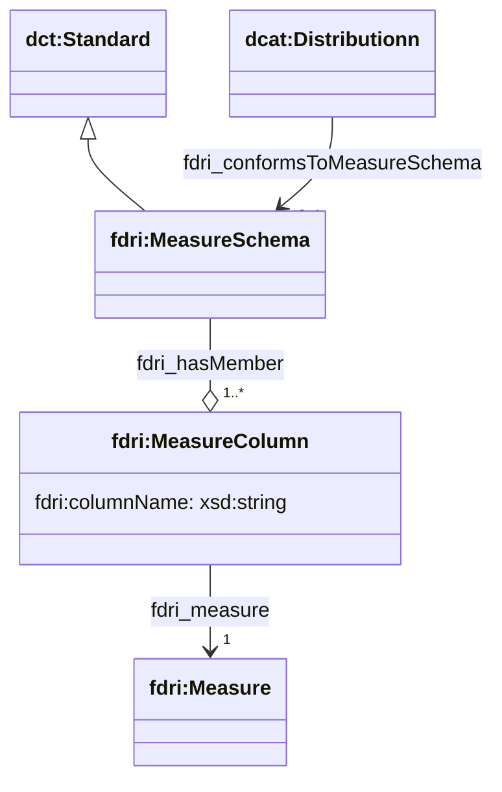

## Dataset Distributions

A dataset distribution provides access to the content of the dataset either as a direct download or via a download service. A dataset may have multiple distributions - e.g. when the data is available in multiple formats or from multiple mirrors.

The FDRI Ontology extends the DCAT ontology and supports all of the [properties described for distributions by that specification](https://www.w3.org/TR/vocab-dcat-3/#Class:Distribution).

The FDRI Schema currently supports a limited subset of the full ontology. Specifically, it currently allows the following properties on a Distribution record:

* `accessUrl` - providing the URL via which the distribution can be accessed or downloaded.
* `format` - a reference to a SKOS concept which defines the file format of the distribution.
* `hasMeasureSchema` - relates the distribution to a mapping of column/property name to the measure that is provided by that column or property in the distribution. Described in more detail below.

### Measure Schema

The FDRI ontology provides a means for mapping the measures recorded in a dataset distribution to the names of the properties/columns in the dataset distribution that provide those measures. Although formats such as ZARR and NetCDF provide such functionality in the file header structures, other formats such as CSV and parquet provide limited or no such functionality and so this structure provides a simple means to convey this useful information to the data user regardless of the format of the distribution. The following class diagram shows the Measure Schema and how it relates to Distributions.

A `dcat:Distribtion` can be optionally related to one `fdri:MeasureSchema` which defines the column/property mappings for that distribution. This uses the property `fdri:conformsToMeasureSchema` which is declared as a sub-property of `dct:conformsTo`.

An `fdri:MeasureSchema` is has one or more member `fdri:MeasureColumn` resources, each of which specify exactly one column name (as a string), and one `fdri:Measure`. `fdri:MeasureSchema` is declared as a sub-class of `dct:Standard`.

### Hive partition URLs

In the FDRI system there are datasets which are available as a partition of a larger dataset using Hive partitioning. It is recommended that the access URL for such a dataset should be the lowest level of partition that provides access to the full range of data in the dataset. The format specifier for the distribution should be the format of the data within each leaf partition.
