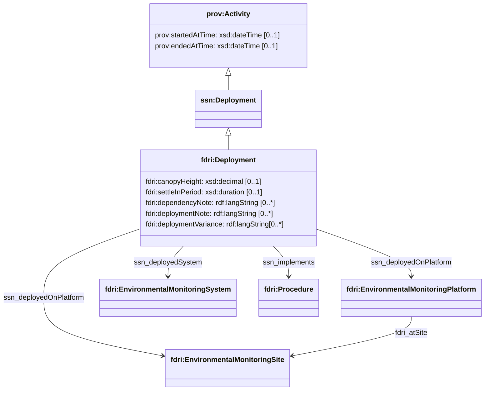
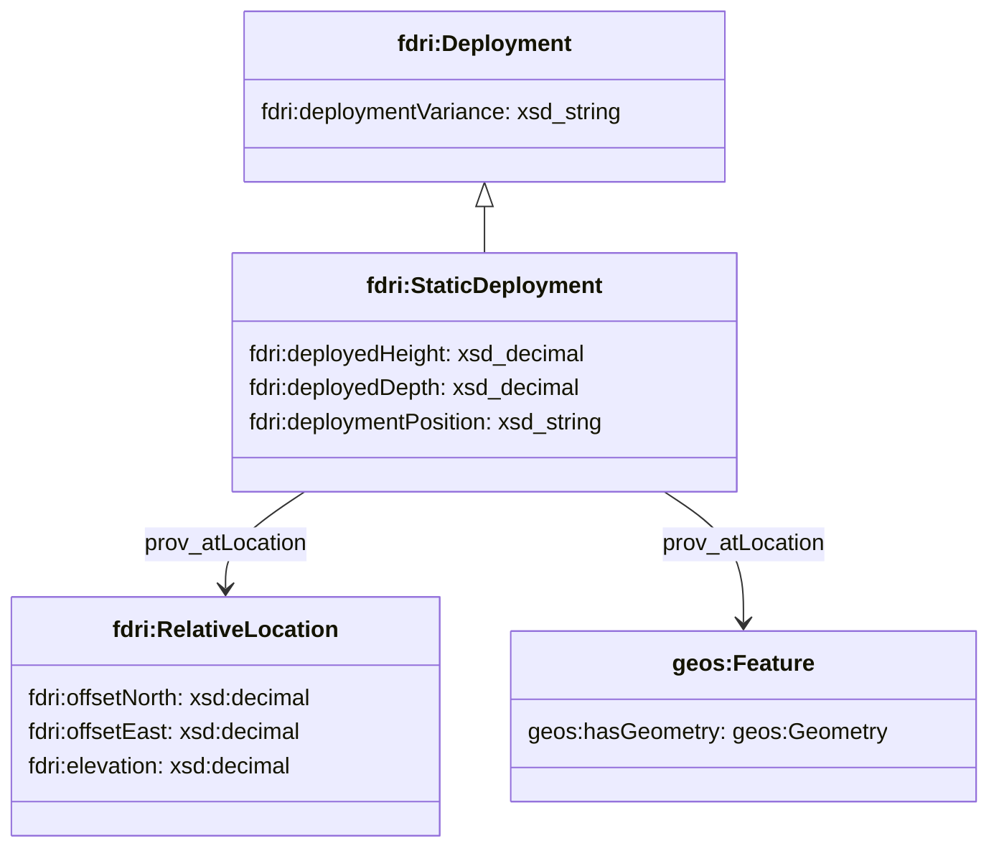
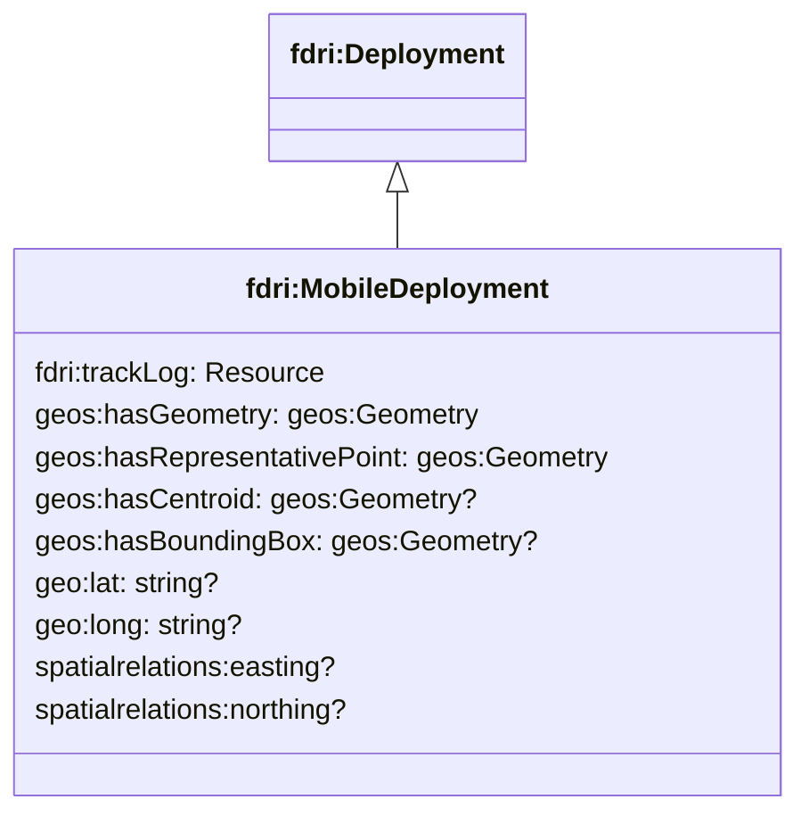

## Deployments

Deployments are used when a system (a sensor or package of sensors) is deployed in the field.

Deployments are modelled as a sub-class of `prov:Activity` and of `ssn:Deployment`.

A Deployment may have:

* a deployed system (`ssn:deployedSystem`) referencing the `fdri:EnvironmentalMonitoringSystem` that was deployed.
* a target platform (`ssn:deployedOnPlatform`) referencing the `fdri:EnvironmentalMonitoringPlatform` or `fdri:EnvironmentalMonitoringSite` on which the system was deployed. It is recommended to only record the most fine-grained level of infrastructure where the deployment took place. For example, if a site hosts several platforms or stations, record deployments at the platform/station level if that information is available.
* time bounds using `prov:startedAt` and `prov:endedAt`, and a location using `prov:atLocation`
* a monitoring regime/procedure (`fdri:Procedure`) that the deployment is intended to implement (`ssn:implements`)
* several forms of note about the deployment:
  * `fdri:deploymentVariance` to capture notes about the ways in which the deployment differs from the standard deployment expected for this system/platform combination
  * `fdri:dependencyNote` to capture notes about deployment dependencies
  * `fdri:settleInPeriod` to capture the period of settling in that the deployment requires
  * `fdri:canopyHeight` to capture the height above ground level (in metres) of the tree canopy local to the deployed position.
  * `fdri:deploymentNote` to capture notes about the deployment that are not covered by the other properties.

> **TODO**
> Clarify the notion of relative site location of sensors.
> Are individual sensors that are all attached to the same station positioned at different locations (and are those positions recorded?)
> When a station / sensor is given a relative location, exactly what is that relative to? Do we need to require an "origin" property for `EnvironmentalMonitoringSite` and/or `EnvironmentalMonitoringStation` (or indeed just on any `EnvironmentalMonitoringFacility`)?

> **QUESTION**
> Are deployments equivalent to EMF Activities? If so, do we want to include that notion in the model at all?

### Static Deployments

The class `fdri:StaticDeployment`is used to represent the deployment of a sensor or a package of sensors to a static platform such as a weather station at a monitoring site. The class carries additional properties `deployedHeight` and `deployedDepth` to capture the height above or below the ground where the sensor or sensor package was deployed.

The precise location of a static deployment may be captured either as an absolute location encapsulated as a `geos:Feature` resource, or as a location relative to an origin point defined by the `fdri:EnvironmentalMonitoringPlatform` that the deployment is on.

### Mobile Deployments

The class `fdri:MobileDeployment` is used to capture the deployment of a system to a mobile platform such as a boat or a drone. In such cases, each sortie of mobile platform with the deployed system should be recorded as a separate `fdri:MobileDeployment` (e.g. when multiple flights are made by a drone with a particular package of sensors). 

The `fdri:trackLog` property should be used to reference the detailed (possibly timed) track of the sortie, but the properties `geos:hasGeometry`, `geos:hasRepresentativePoint`, `geos:hasCentroid`, `geos:hasBoundingBox`, `geo:lat`, `geo:long`, `spatialrelations:easting` and `spatialrelations:northing` are also provided to allow the representative point location, geospatial path or the area extent of the track to be captured in a form suitable for display and/or geo-spatial query. For notes on these additional properties please refer to [Notes on Geo-spatial Resources](geospatial.md).

> **QUESTION**
> Should the range of `trackLog` be more specialised? The assumption is that we don't want to try and model a flight path, but just reference it. If we are just referencing a resource do we want to use the DCAT `Distribution` class to capture information about the track log such as its format and size? 

