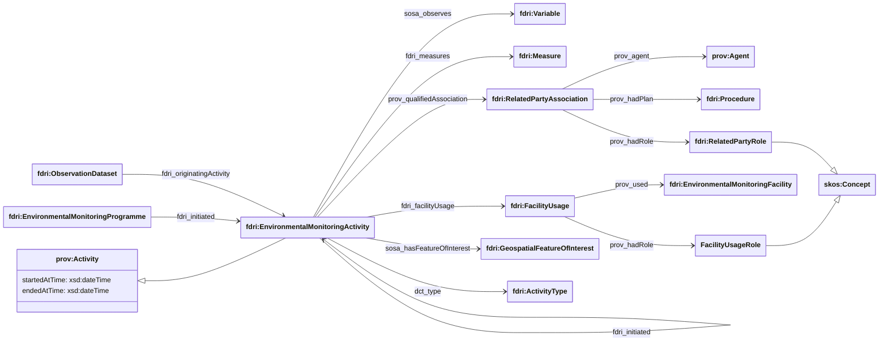

## Environmental Monitoring Activity Model

### Environmental Monitoring Activity

The class `fdri:EnvironmentalMonitoringActivity` represents some activity which is used to gather observations about some feature of interest in the environment.

An `fdri:EnvironmentalMonitoringActivity` has the following properties:

  * `dct:type` relates the activity to an `fdri:ActivityType` concept which qualifies the kind of activity (e.g. UAV survey)
  * `sosa:observes` relates the activity to one or more `fdri:Variable`s that are measured during the activity
  * `fdri:measures` relates the activity to the specific `fdri:Measures` that are used when observing the variables
  * `fdri:facilityUsage` relates the activity to a `fdri:FacilityUsage` that combines an `fdri:EnvironmentalMonitoringFacility` (via `prov:entity`) used in the activity, and an `fdri:FacilityUsageRole` (via `prov:hadRole`) that indicates the relationship between the activity and the facility (e.g. craft). Any `fdri:EnvironmentalMonitoringFacility` may be used by an activity including sites, platforms, sensor packages and individual sensors.
  * `prov:qualifiedAssociation` relates the activity to a `prov:Association` which combines:
    * An optional `fdri:Procedure` followed by any number of `prov:Agent`s in the execution of the activity (via `prov:hadPlan`).
    * Any number of `prov:Agent`s involved in the activity (via `prov:agent`)
    * An optional `skos:Concept` representing the role played by the agents in activity when they executed that procedure.
  * `prov:startedAtTime` and `prov:endedAtTime` properties may be used to capture the start and end timestamps for the activity.

An `fdri:EnvironmentalMonitoringActivity` may be initiated (`fdri:initiated`) by either an `fdri:EnvironmentalMonitoringProgramme` or by another `fdri:EnvironmentalMonitoringActivity`.

As `fdri:EnvironmentalMonitoringActivity` is a sub-class of `prov:Activity` it can also be related to entities that it generates or modifies (`prov:wasGeneratedBy`, `fdri:wasModifiedBy`). 
It is recommended that `prov:wasGeneratedBy` should be used only for those resources which are a direct result of the activity (e.g. a GPS track log for a UAV flight or a raw sensor log file).
An `fdri:EnvironmentalMonitoringActivity` generates data which contributes to any number of `fdri:ObservationDataset`s.
The property `fdri:originatingActivity` which should be used to relate an `fdri:ObservationDataset` to the `fdri:EnvironmentalMonitoringActivity` (or activities) which produced the data contained in the dataset.

### Example: UAV dataset using Environmental Monitoring Activities

As an example of the use of `fdri:EnvironmentalMonitoringActivity`, take the case of a dataset derived from a survey performed using a drone. The drone is piloted over a site, taking readings of the concentration of nitrogen oxide (NOx) in the atmosphere. The survey consists of multiple individual sorties, and the data from each of the sorties is then combined into a single dataset.

#### Survey and Sorties as nested activities

Both the survey, and each sortie in the survey can be modelled as an `fdri:EnvironmentalMonitoringActivity`. With the sortie activities being intiated by the survey activity, and the survey activity being initiated by the `fdri:EnvironmentalMonitoringProgramme` that the survey is part of.

#### Site of the survey

The site over which the sorties are flown can be modelled as the feature of interest of the activities. In this case the sorties treated as having the same feature of interest as the survey and so the relationship does not need to be repeated.

As the site is an `fdri:GeospatialFeatureOfInterest` it can have geospatial co-ordinates and/or boundaries associated with it to locate the survey in geospatial terms. In this case only the latitude and longitude of a representative point for the survey site is given.

> **NOTE:**
> This is a very simple example of providing geospatial information for an activity. In more detailed modelling it would be possible to use `sosa:hasFeatureOfInterest` to denote the geometry of each individual sortie as well as the bounding geometry of all sorties at the survey level.

#### Platform and Sensor Usage

The drone used in the survey is an `fdri:EnvironmentalMonitoringPlatform` that is used in the role of `PilotedCraft`

There is an `fdri:Deployment` of the sensor to the drone for the duration of the survey. In some cases a sensor or package of sensors may be more permanently affixed to a craft, in which case the time span for the `fdri:Deployment` may be much broader than the time span of any `fdri:EnvironmentalMonitoringActivity` that makes use of the drone.

As the same drone is used for the same purpose in each survey, the metadata about the use of the drone can be captured at the survey level.

#### Piloting of the drone

The pilot of the drone is an `fdri:Agent` who follows an `fdri:Procedure` in the execution of each sortie. In this case the procedure used relates to the piloting of the craft on a single sortie and so the relationship is expressed against each of the sortie activities as an `fdri:RelatedPartyAssociation`.

#### Outputs generated by each sortie

A raw flight log is produced for each sortie. These are the directly generated data files which are then processed in conjunction with the sensor logs to produce the dataset. These files could be modelled as `prov:wasGeneratedBy` each sortie.

#### Dataset created from the survey

The survey data is compiled into a gridded dataset. The metadata for this dataset uses `fdri:originatingActivity` to reference the survey activity, `fdri:originatingFacility` to reference the drone used in the survey, and `sosa:observes` to reference the variable measured.

