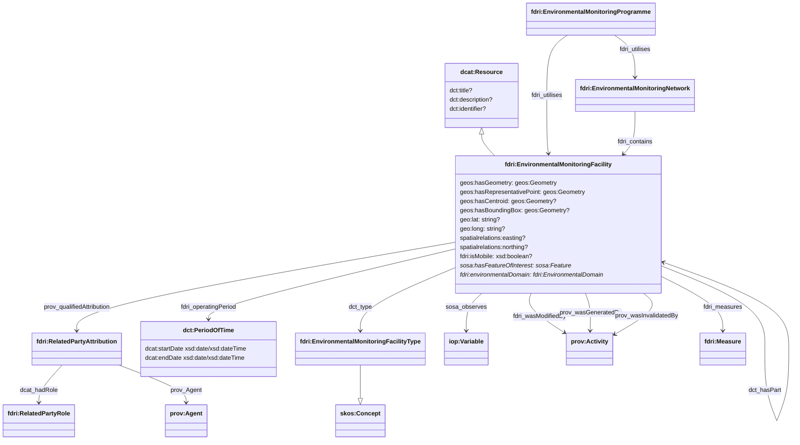
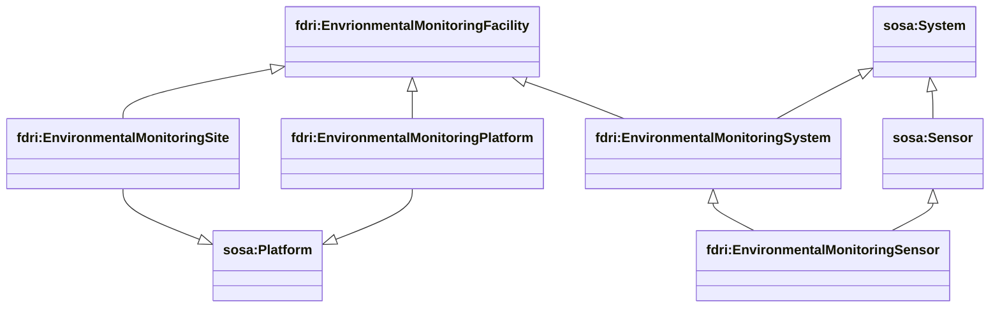
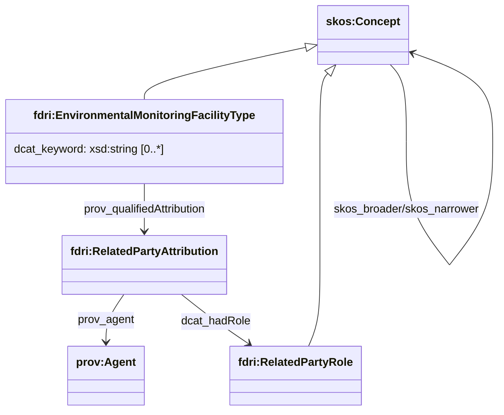
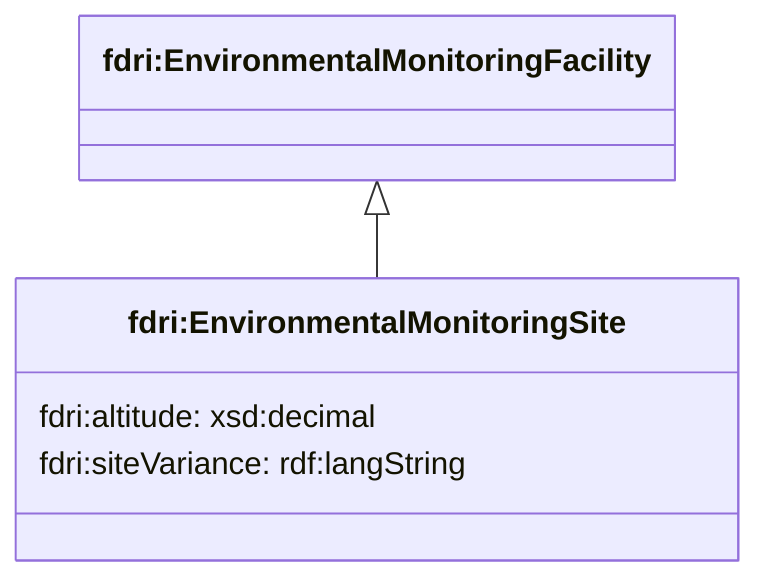
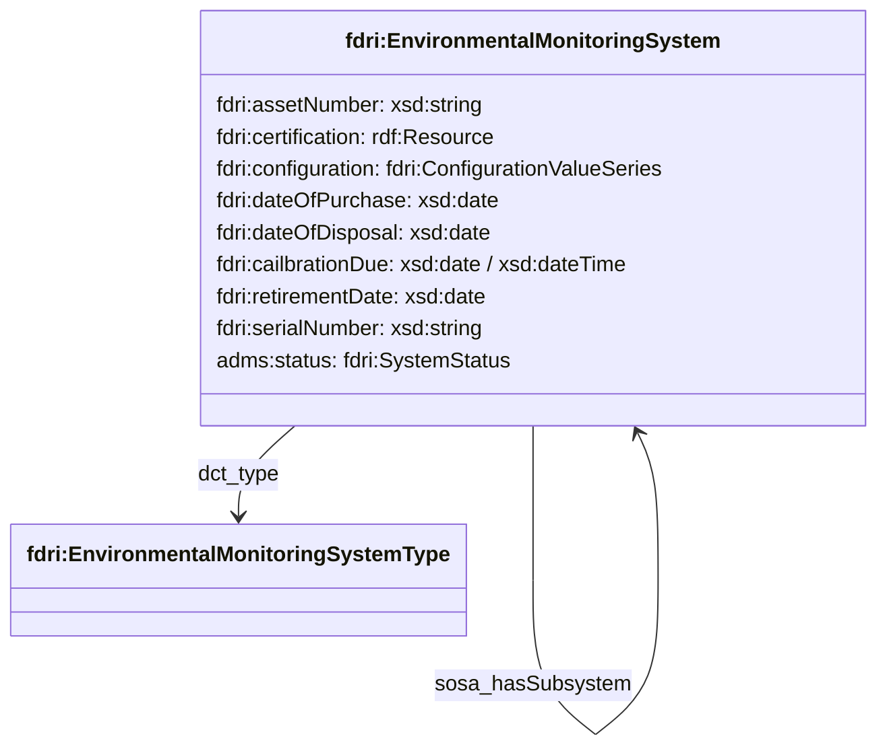
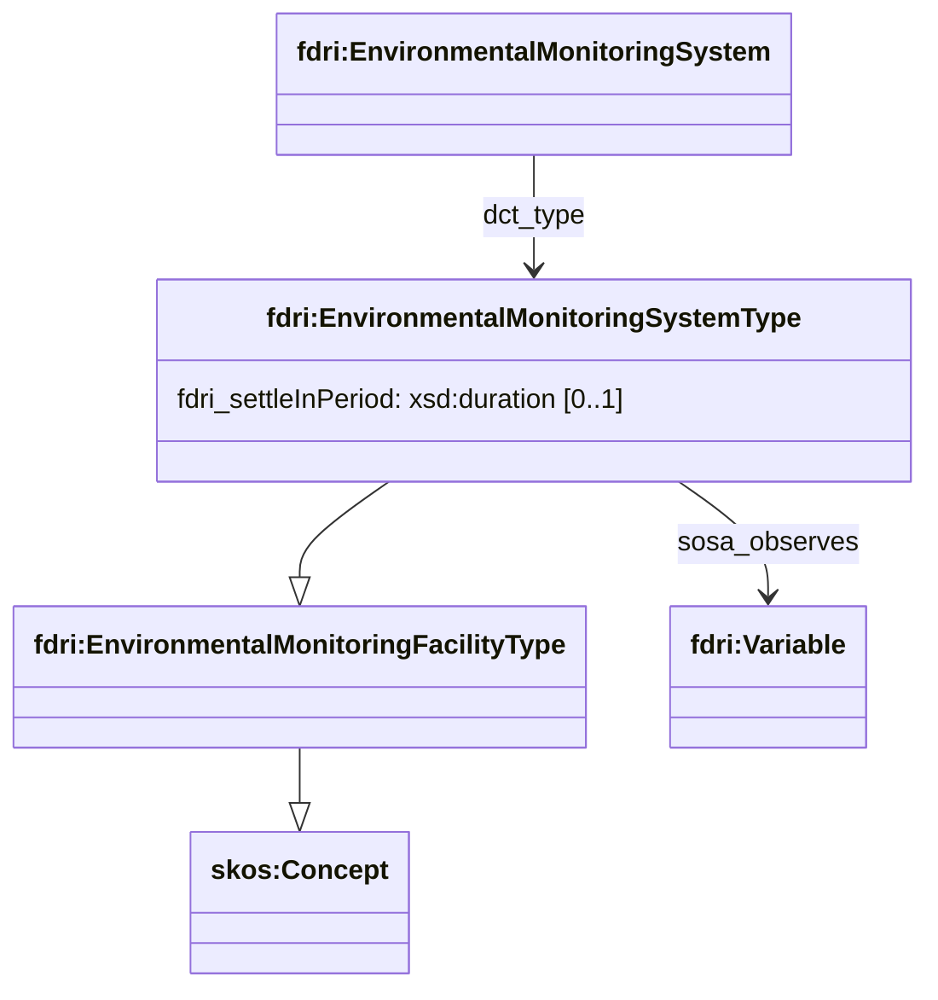
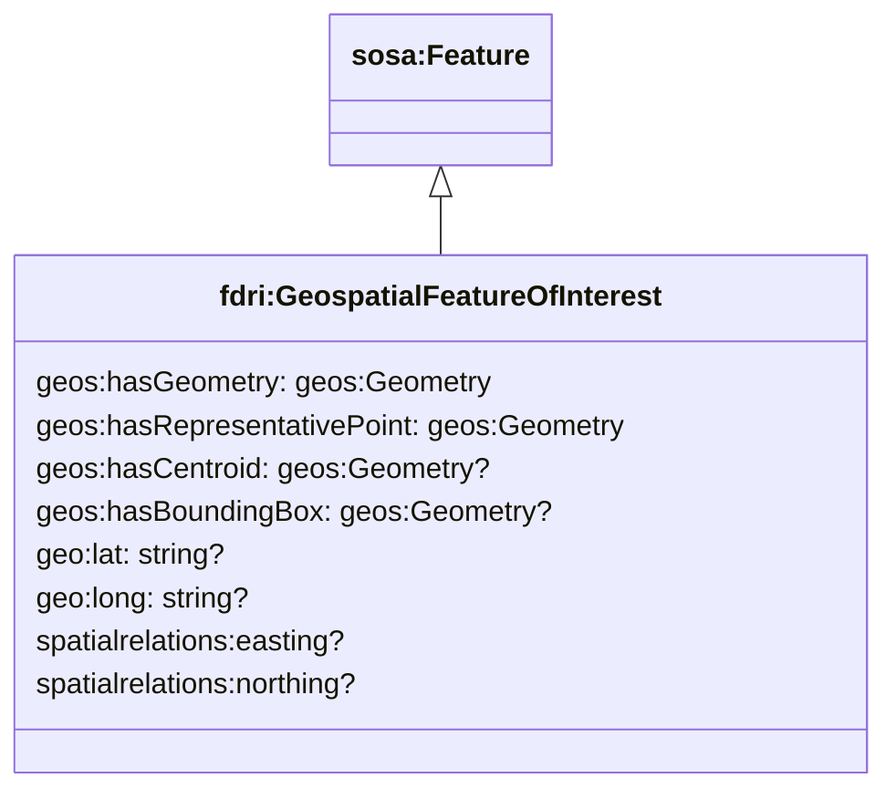
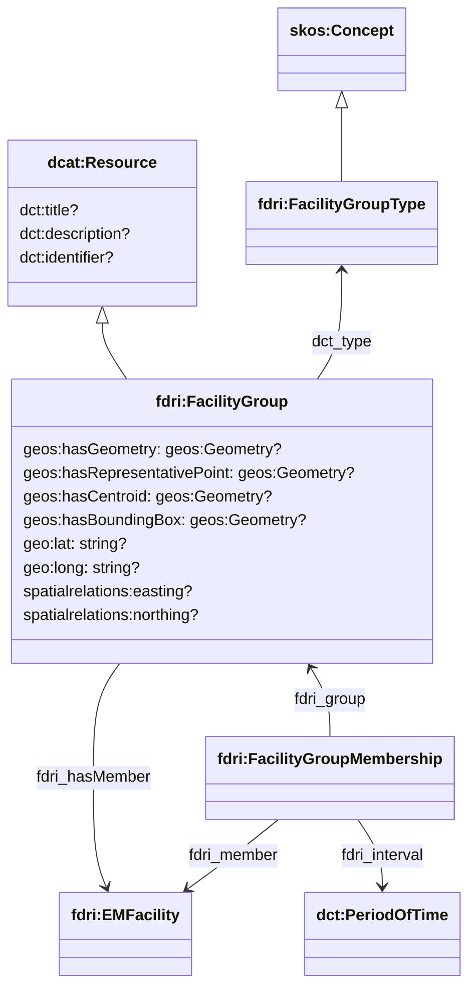

## Environmental Monitoring Facility Model

### Programme, Network and Facility

Based on the [INSPIRE Environmental Monitoring Facility Technical Guidelines framework](https://inspire-mif.github.io/technical-guidelines/data/ef/dataspecification_ef.pdf), the catalog models  reference information about infrastructure such as sites, stations, and drones using the `fdri:EnvironmentalMonitoringFacility` class.

An `fdri:EnvironmentalMonitoringFacility` may have:

* A type (an `fdri:EnvironmentalMonitoringFacilityType`) indicating the class of facilities that the instance belongs to. This can be used on subclasses to distinguish between different kinds of platform, or to indicate the class of device that a sensor belongs to.
* An optional identifier (`dct:identifier`) which can be used to capture the identifier assigned to a facility by a programme (e.g. `SHEEP` for the Sheepdrove site in the COSMOS network).
* Any number of parts, each of which is another `fdri:EnvironmentalMonitoringFacility`, enabling the construction of a part-whole hierarchy (e.g. a site hosts one or more stations, and each station has one or more platforms on which sensors may be deployed).
* A flag that indicates that the facility is a mobile platform.
* A range of geo-spatial properties for specifying the location, boundary or bounding box of a static facility. These properties are described in more detail in [Notes on Geo-Spatial Resources](geospatial.md)
 * A specified period of operation
 * Any nubmer of related parties. Each related party is a person or organsiation with some form of responsibility for the facility. The nature of that responsibility is conveyed by the `fdri:RelatedPartyRole`
* Any number of related `fdri:EnvironmentalDomain` concepts listing the domains of the environment monitored by the facility.
* Any number of related `iop:Variable`s listing the specific variables observed by the facility.
* Any number of related `sosa:Feature`s listing the environmental features monitored by the facility.

Activities which affect the facility

An `fdri:EnvironmentalMonitoringNetwork` is a collection of `fdri:EnvironmentalMonitoringFacility` instances which are used for some common monitoring purpose.

An `fdri:EnvironmentalMonitoringProgramme` is a programme of work which makes use of one or more `fdri:EnvironmentalMonitoringNetwork` and/or `fdri:EnvironmentalMonitoringFacility` instances to deliver its outcomes.

Typically a dataset will be related to the `fdri:EnvironmentalMonitoringProgramme` under which the dataset was created as well as one or more `fdri:EnvironmentalMonitoringFacility` from which the data was sourced.

`fdri:EnvironmentalMonitoringFacility` is defined as a subclass of `dcat:Resource`, meaning it is an item with an entry in the catalog and so can be the subject of a `dcat:CatalogRecord`. The `dcat:Resource` class aslo defines a number of useful properties which can be used to capture many of the properties of an `fdri:EnvironmentalMonitoringFacility` such as title, description, modified date and themes (keywords). Although not shown here, the DCAT model also provides common relationships between resources which can be used such as `dcterms:hasPart` and `dcterms:replaces`, as well as `dcterms:qualifiedRelation` which could be used to capture any other more specialised forms of relation between facilities and other catalogued resourcers. Additional properties are defined to cover the proposed model for `fdri:EnvironmentalMonitoringFacility` in the external catalog, although it may be possible to exlude some of these from the detailed metadata catalog if the external catalog is the canonical record for these resources. 

We use the `sosa:observes` property to record a relationship between an `fdri:EnvironmentalMonitoringFacility` and the `iop:Variable`(s) it observes. This would most likely only be defined at the level of `fdri:EnvironmentalMonitoringSensor` resources, and then aggregated through query to parent facilities to avoid the need to keep multiple resources in sync as new sensors are deployed or existing sensors removed from a site. In addition to `sosa:observes` it is also possible to use `fdri:measures` to record a relatioship between an `fdri:EnvironmentalMonitoringFacility` and the `fdri:Measure`(s) it makes. An `fdri:Measure` combines an variable with additional information about the unit of measure and any statistical aggregation applied. A facility may report multiple `fdri:Measure`s for the same `fdri:Variable` that it observes (e.g. an hourly mean, and a standard deviation).

Activities which affect a facility can be related to the `fdri:EnvironmentalMonitoringFacility` by using properties `prov:wasGeneratedBy`, `prov:wasInvalidatedBy`, and `fdri:wasModifiedBy`. `prov:wasGeneratedBy` should be reserved for commissioning / manufacturing activities. `prov:wasInvalidatedBy` should be reserved for decomissioning activities. `fdri:wasModifiedBy` should be used for all other activities which affect the facility (e.g. maintenance activities).

A number of organisations or individuals may be involved in some aspect of the commission and/or maintenance of a facility. The `prov:qualifiedAttribution` property can be used to relate an `fdri:EnvironmentalMonitoringFacility` to any number of `fdri:RelatedPartyAttribution` resources. Each `fdri:RelatedPartyAttribution` specifies an `fdri:Agent` (`prov:agent`) acting in a particular `fdri:RelatedParyRole` (`dcat:hadRole`).
 

### Site, Platform, System and Sensor

The `fdri:EnvironmentalMonitoringFacility` class has several subclasses defined to aid in mapping to the SOSA/SSN concepts of Platform, System and Sensor. The diagram below shows the relationship between the FDRI types and the mapping (via subclass relationships) to the SOSA/SSN types.

#### EnvironmentalMonitoringFacilityType

`fdri:EnvironmentalMonitoringFacilityType` is used to represent a category of facility. Categories may include broad groups of facility (e.g. drone, weather station, flow monitoring station), as well as narrower ones (e.g. a specific model of sensor).

As `fdri:EnvironmentalMonitoringFacilityType` extends `skos:Concept` facility categories may be organised into a hierarchical taxonomy of terms with broader/narrower relationships between them. `skos:prefLabel` can be used to capture the preferred term to describe the category, and `skos:altLabel` can be used to capture alternate non-preferred labels for findability. In addition, `dcat:keyword` can be used to add short string "tags" to an `fdri:EnvironmentalMonitoringFacilityType` to support other search use-cases.

Where a given agent is related to all facilities of a given type (e.g. the manufacturer of a specific model of sensor), this can be represented using the `prov:qualifiedAttribiton` property with a value of an `fdri:RelatedPartyAttribution` which specifies both the agent and the role they play in relation to the category of facility.

#### EnvironmentalMonitoringSite

`fdri:EnvironmentalMonitoringSite` is used to represent a static geospatial location at which one or more pieces of monitoring infrastructure may be deployed. It is subclassed from `fdri:EnvironmentalMonitoringFacility` and so has all the same core metadata that is provided by that class, but it is also mapped through a subclass relationship to the `sosa:Platform` type from the SOSA/SSN vocabulary which means that it can be the host of a deployment of a sensor or system of sensors. 

The property `fdri:siteVariance` can be used to capture textual notes about the ways in which the layout of a site varies from the standard layout that would be expected of a site of this type (as defined by the `dct:type` property).

The property `fdri:altitude` can be used to record the altitude of the site in metres above sea-level.

> **QUESTION**
> Is site variance information available in a more structured form that makes it possible to relate the information to the sensor deployment?
> Does site variance information change over time? 

> **QUESTION**
> Should all measures such as altitude be expressed as a `schema:PropertyValue` value with units, or do we bake the assumed units into the ontology?

#### EnvironmentalMonitoringPlatform

`fdri:EnvironmentalMonitoringPlatform` is used to represent either static or mobile infrastructure on which sensors or systems of sensors may be deployed. Examples include a post in the ground at a site, or a UAV or drone. It is subclassed from `fdri:EnvironmentalMonitoringFacility` to inherit the core facility metadata, and mapped to `sosa:Platform` to allow it to be the host of deployments of sensors.

> [!NOTE]
> By mapping both `fdri:EnvironmentalMonitoringSite` and `fdri:EnvironmentalMonitoringPlatform` to `sosa:Platform`, a deployment of a sensor can be registered at the site level without having to model the detail of the physical infrastructure at the site, but that the model still has the flexibility to represent more detailed information if it is available and if deemed desireable to do so.

#### EnvironmentalMonitoringSystem

An `fdri:EnvironmentalMonitoringSystem` is a device which measures properties in the environment. As already noted, an `fdri:EnvironmentalMonitoringSystem` may be deployed either to an `fdri:EnvironmentalMonitoringPlatform` or directly to an `fdri:EnvironmentalMonitoringSite`.

An `fdri:EnvironmentalMonitoringSystem` carries several other metadata properties as shown in the diagram below.

#### EnvironmentalMonitoringSystemType

An `fdri:EnvironmentalMonitoringSystemType` defines a category of monitoring system. Such categories may be broad (e.g. a category of sensor), or narrow (e.g. a specific model of sensor). `fdri:EnvironmentalMonitoringSystemType` extends `fdri:EnvironmentalMonitoringFacilityType` and can have the same relationships to related parties such as manufacturers as outlined above.

The `fdri:settleInPeriod` property allows the capture of the typical length of time that a system of this type needs to be allowed to settle in position before readings should be taken.

The `sosa:observes` property can be used to relate the `fdri:EnvironmentalMonitoringSystemType` to any number of `fdri:Variables` that a system of this type is capable of observing. It is recommended that this property should be used only for those variables that the system in question can directly observe and to *not* include any variables that are observed by a sub-system.

#### EnvironmentalMonitoringSensor

An `fdri:EnvironmentalMonitoringSensor` is intended to represent an individual sensor and is subclassed from `sosa:Sensor` and may be deployed either to an `fdri:EnvironmentalMonitoringPlatform` or directly to an `fdri:EnvironmentalMonitoringSite`.

As `fdri:EnvironmentalMonitoringSensor` is subclassed from `fdri:EnvironmentalMonitoringSystem` it also inherits the additional metadata shown for that class and faults can be recorded against individual sensors.

### Geo-Spatial Feature Of Interest

An `fdri:EnvironmentalMonitoringFacility` monitors some set of features of the environment. Where those features are spatially located, the class `fdri:GeospatialFeatureOfInterest` may be used to represent them.

The properties of `fdri:GeospatialFeatureOfInterest` provide ways of describing the geo-spatial extent of the feature which are described in more detail in [Notes on Geo-spatial Resources](geospatial.md)

As already shown, the `GeospatialFeatureOfInterest` may also be referenced from the `Dataset` which contains observations of that feature.

### FacilityGroup

A `FacilityGroup` is an unordered collection of `EnvironmentalMonitoringFacility` instances that share some common feature. A `FacilityGroup` is treated as a `Resource` in the metadata catalog and so may have a title, provenance and publication information and so on.

The `dct:identifier` property can be used to capture the identifier(s) assigned to the group by a programme.

For simple groupings where there is no need to record historical membership or to provide a date range for a membership,
the `fdri:hasMember` property can be used. For cases where membership of a group may change over time, the class `fdri:FacilityGroupMembership`
can be used.

The `dct:type` property can be used to specify the nature of the grouping.

Where facility groupings are used to represent geospatial areas, there are optional properties to capture the geopatial extent of the grouping (e.g. the boundary of the region or catchment area that the group represents).

