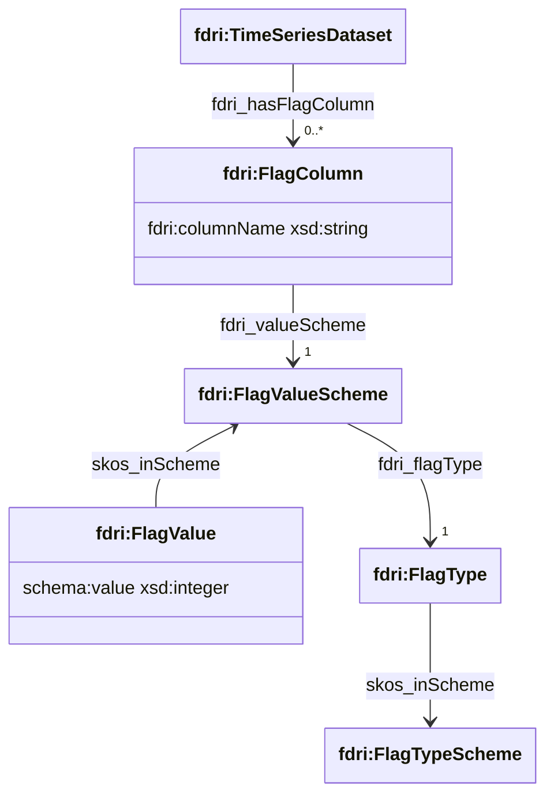

## Time-series Dataset Flag Columns

The values in a time-series dataset may have one or more flags associated with them. These flags indicate details about the derivation or processing of the value. Flag values are typically bit-wise combined integer flags. Different networks may define different types of flags, and for each type of flag the values assigned to that flag may vary across networks. The FDRI model supports an extensible notion of flag columns that combine the column name, the flag type and the controlled list of allowed values into a single definition.

An `fdri:TimeSeriesDataset` specifies any number of flag columns by using the `fdri:hasFlagColumn` property to reference an `fdri:FlagColumn` instance.

An `fdri:flagColumn` has the following required properties:

* `fdri:columnName` - the string name of the column that contains the flag value.
* `fdri:valueScheme` - a reference to the `fdri:FlagValueScheme` which is a `skos:ConceptScheme` whose members define the allowed flag values and their meaning.

An `fdri:FlagValueScheme` is a `skos:ConceptScheme` with one additional required property:

* `fdri:flagType` - a reference to the `fdri:FlagType` concept that defines the type of flag that is represented in the concept scheme. Examples of a flag type include "Error flag", "QC flag", "Infill Flag" etc.
