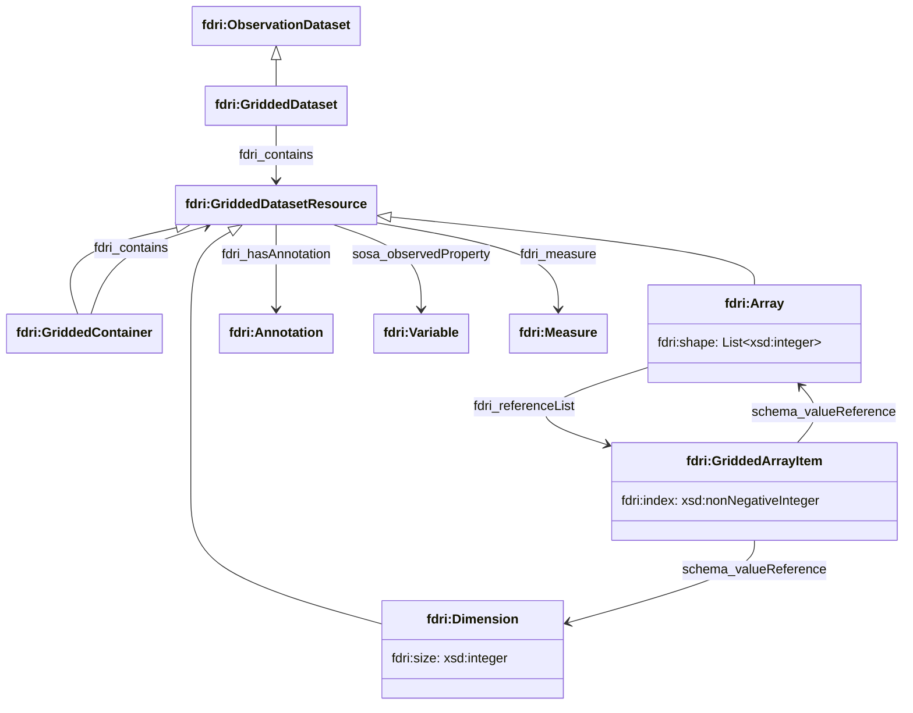

## Gridded Dataset Model

An `fdri:GriddedDataset` is an [`fdri:ObservationDataset`](time-series-dataset.md) which is distributed as multi-dimensional array data.
Formats that use this approach include netCDF and ZARR. In addition to all of the standard metadata of an `fdri:ObservationDataset`,
an `fdri:GriddedDataset` includes metadata about the structure of the multi-dimensional data.

### Gridded Dataset Structure

An `fdri:GriddedDataset` contains:
  * zero or more `fdri:GriddedContainer`s
  * zero or more `fdri:Dimension`s,
  * zero or more `fdri:Array`s, and

An `fdri:GriddedContainer` is a nested structure which may itself contain `fdri:Dimensions`, `fdri:Arrays` and other `fdri:GriddedContainer`s.

An `fdri:Dimension` can be used to provide a common definition of the extent of a dimension which is shared by many `fdri:Arrays`. The size of the dimension can be specified as an integer value using the `fdri:size` property.

An `fdri:Array` represents one multi-dimensional array in the dataset. The property `fdri:shape` can be used to define the shape of an array as an RDF list of integer values giving the size of each dimension of the array. The property `fdri:referenceList` can be used to reference the `fdri:Dimension`s and/or `fdri:Array`s that define each of the dimensions of this array. 

The value of `fdri:referenceList` is an `fdri:GriddedArrayItem` which has two properties:

  * `fdri:index` is the zero-based integer index of the item in the array
  * `schema:valueReference` is a reference to the `fdri:Array` or `fdri:Dimension` that appears at that index in the enclosing `fdri:Array`

An `fdri:Array`, `fdri:Dimension` or `fdri:GriddedContainer` may reference the `fdri:Variable`(s) it provides values for using the `sosa:observedProperty` property, or the `fdri:Measure`(s) it provides values for using the `fdri:measure`. 
All of these types also allow annotations to be referenced using `fdri:hasAnnotation`. Annotations are the recommended way to capture additional metadata that may be encoded in the dataset such as unit of meaure, coordinates, methods used etc.

