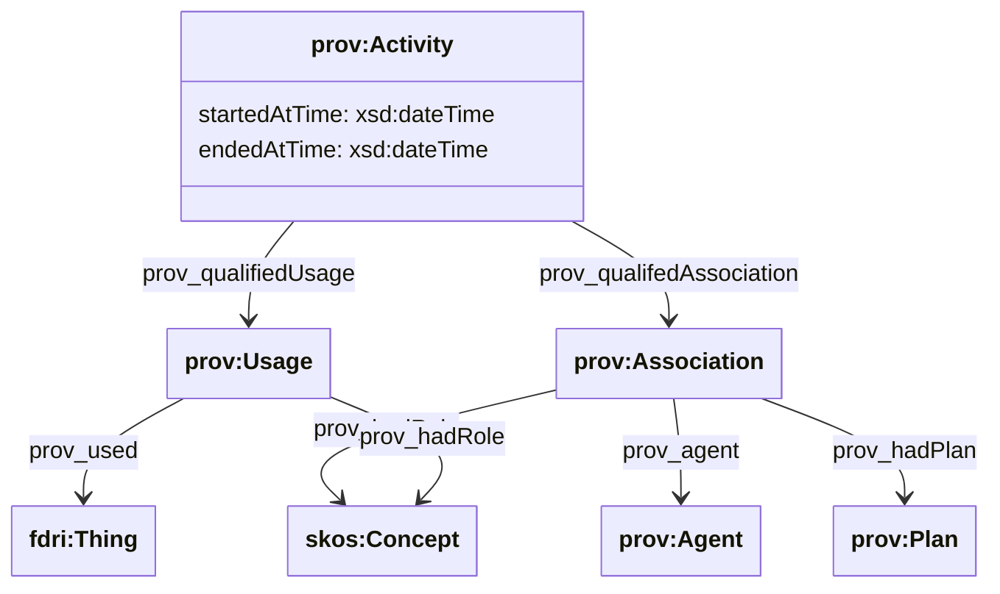
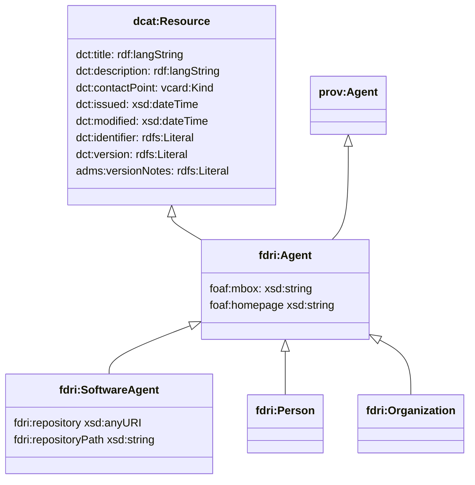

## Provenance and Activity Model

The FDRI model uses the PROV-O ontology to record details of activities, their inputs and their outputs.
Activities related to datasets would include processes such as data ingestion, quality checking, quality improvement, statistical derivation and so on. Activities can also be related to other assets, e.g. the installation of an sensor at a site, the repair or replacement of an instrument, the decommissioning of a monitoring platform and so on.

PROV-O allows activities to be related to the entities involved in the activity either through a "qualified" or an "unqualified" relationship. An unqualified relationship is represented as a direct property on the activity that references the entity - e.g. `prov:used` indicates that the entity that is the object of the statement was used in some way during the execution of the activity that is the subject of the statement.
A qualified relationship is a separate resource that represents the relationship itself. The primary advantage of a qualified relationship is that detailed information about the nature of the relationship can be captured. For example, in what way the entity was used by the activity.

Given that supporting multiple forms of representation can lead to some complex queries, we recommend using the qualified relationship approach at all times. To this end, the schema version of the FDRI model supports only the `prov:qualifiedUsage` and `prov:qualifiedAssociation` properties on an Activity.

The diagram below shows the structure for activities that is supported by the FDRI schema.

> **NOTE**
> In situations where the ingest is streaming/near-realtime it might make sense to have an open-ended Derivation and Ingest Activity which are only ended when the stream is closed or the ingest software agent updated. If so then it might be worth adding a notion of a run log (timestamp and log pointer) structure that can be appended to an open activity for each run instance.

### PROV-O extension properties

PROV-O defines entity to activity relations only for generation(`prov:wasGeneratedBy`) and invalidation(`prov:wasInvalidatedBy`). To model the case where an activity extends or otherwise modifies an existing dataset without creating a new dataset instance, we add `fdri:wasModifiedBy` as a sub-property of `prov:wasInfluencedBy`.

### Model for Agents

The model for agents is deliberately kept simple and inherits from `dcat:CatalogResource`. By implication, the metadata catalog will track individual agents that are involved in activities that update catalog resources.

> **QUESTION**
> The assumption made here is that the metadata store is required to track information for both software agents *and* people and organisations and that this will be done by treating all such agents as resources in the metadata catalog. Is this a valid assumption, or do we in fact only need to track software agents as catalog resources - in which case we can use prov:Person and prov:Organisation directly and don't need the `fdri` namespaced types.

Note that `dcat:Resource` already has a property (`dct:contactPoint`) which can be used to capture contact details for `prov:Person` and `prov:Organization` resources.

`dcat:Resource` also provides a `dct:version` property which can be used to capture the version of a software agent as well as `dct:issued` and `dct:modified` for tracking when a software release was made, and `adms:versionNotes` for capturing software release notes. We add the `fdri:repository` property to provide an explicit property for capturing a link to a version control repository.

If additional software agent metadata should be captured, this model could be extended but it should be noted that each additional piece of metadata will need to be reported through to the metadata system by the workflow system, and assuming an appropriate version control system is already in place for managing software versions and releases, we should not be seeking to replicate all of that metadata in the FDRI catalog.

### Model for Software Agent Configuration

The configuration used by an agent for an activity is captured by the `prov:hadPlan` property on the `prov:Association` resource. The modelling for software agent configurations is discussed in more detail in [Data Processing Configurations](data-processing-configurations.md).