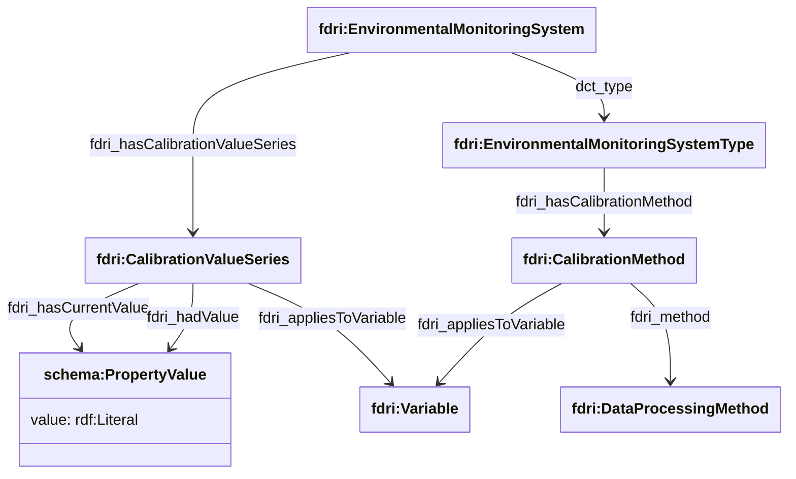

## System Calibration Methods and Coefficients

To convert the raw values reported by a sensor or other monitoring system into values in the units being reported in 
the processed observations, it may be necessary to apply a calibration coefficient to the data. The method by which
the calibration coefficient is applied to the data may vary from one make/model of system to another. The FDRI model
provides a means to record the data processing method used to apply a coefficient against an 
`fdri:EnvironmentalMonitoringSystemType`, and the calibration coefficients against each `fdri:EnvironmentalMonitoringSystem`.

As a system may report values for many different variables, each with their own calibration coefficients and/or 
correction methods, each of these pieces of information can be scoped by one or more `fdri:Variable`s that the calibration 
applies to.

As the calibration coefficients for a sensor may vary over time (e.g. as the sensor is recalibrated), coefficients are modelled as a series of values with a current value and any number of previous values.

