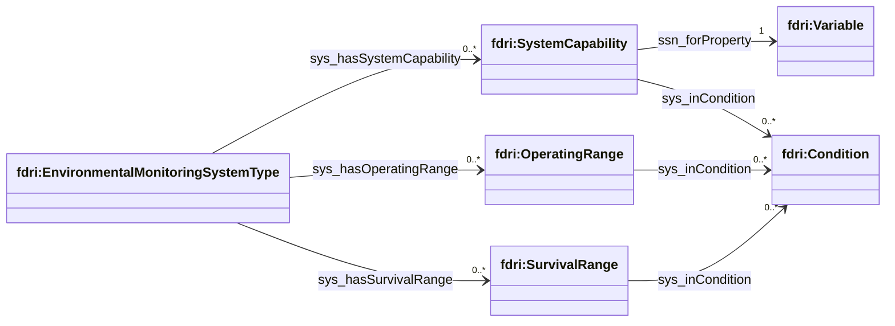
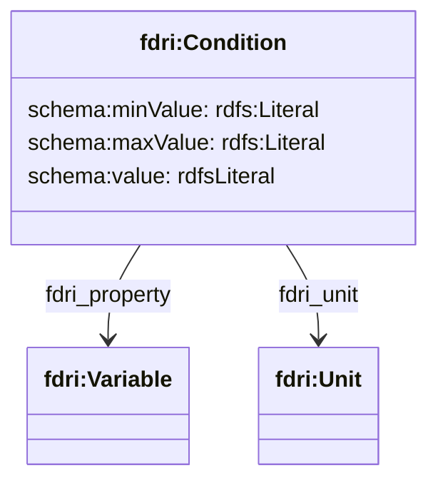
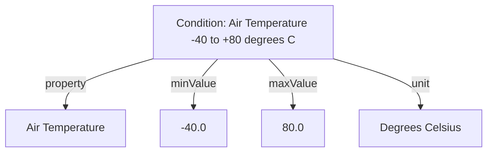
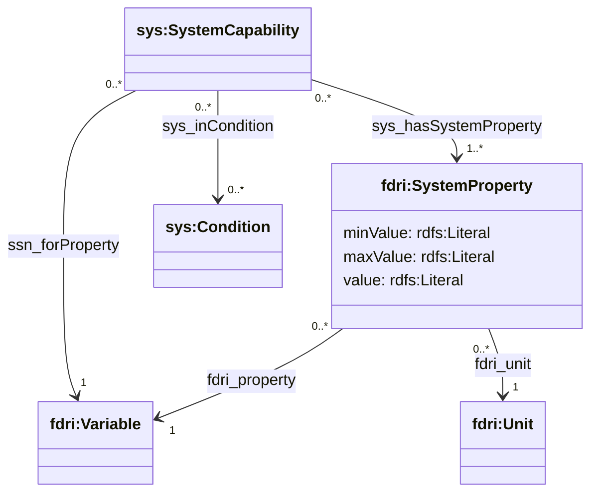
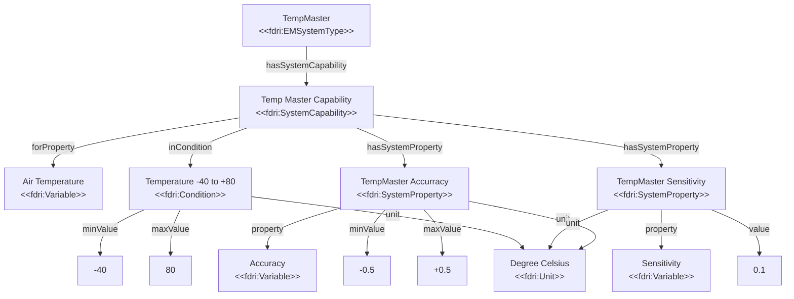
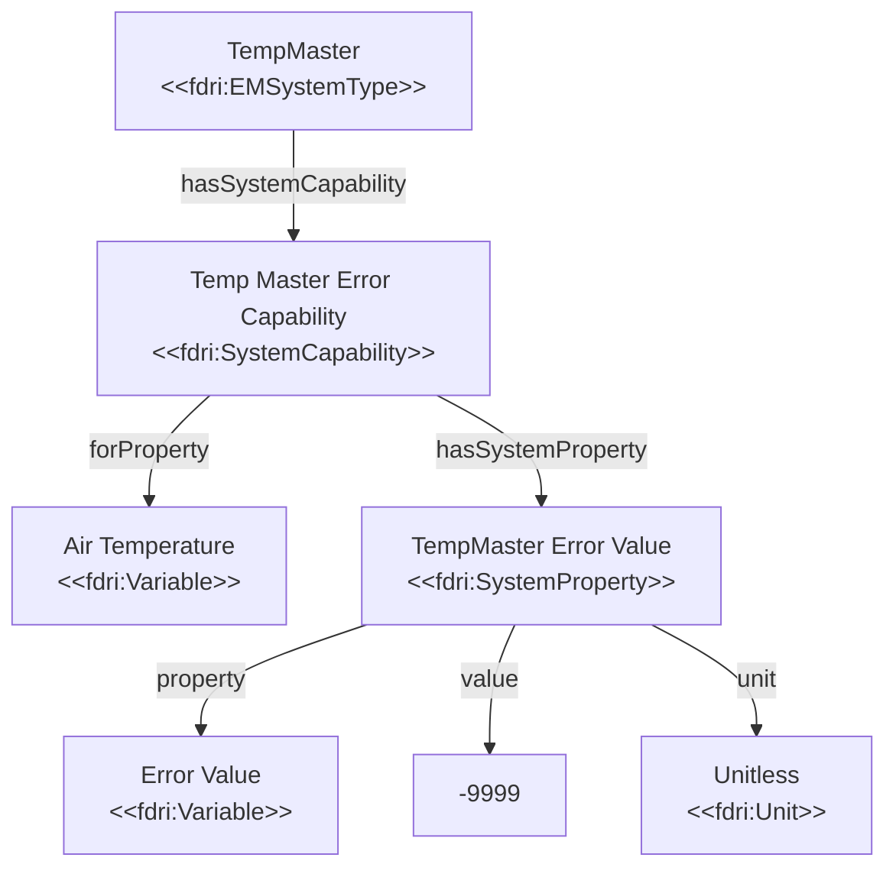
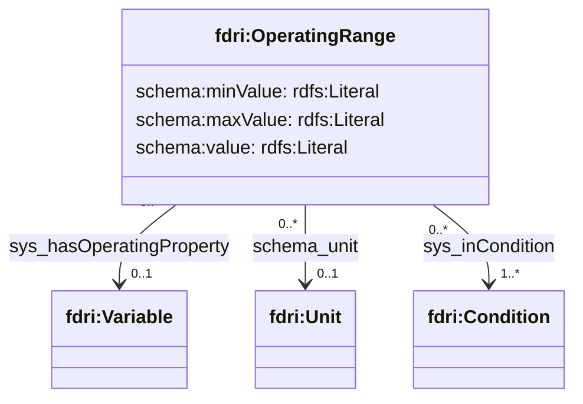
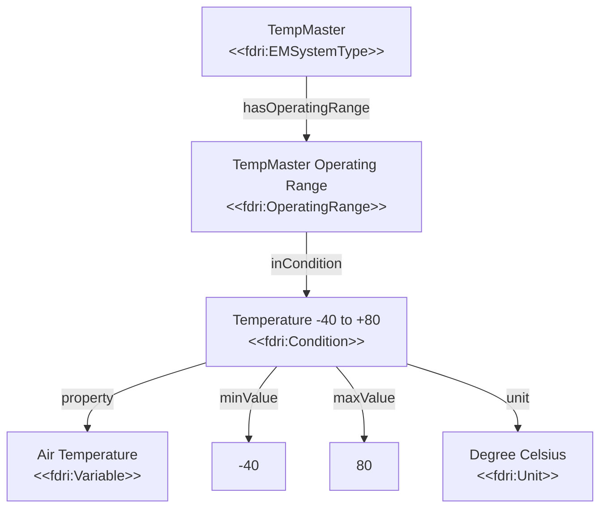
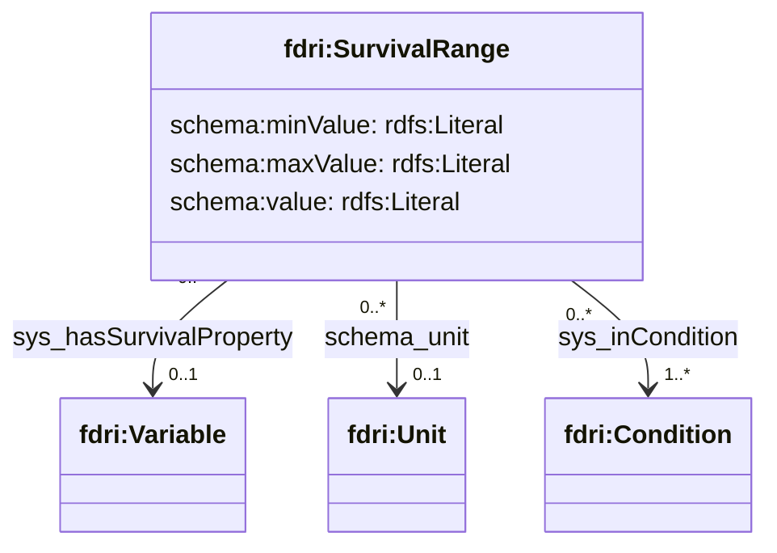
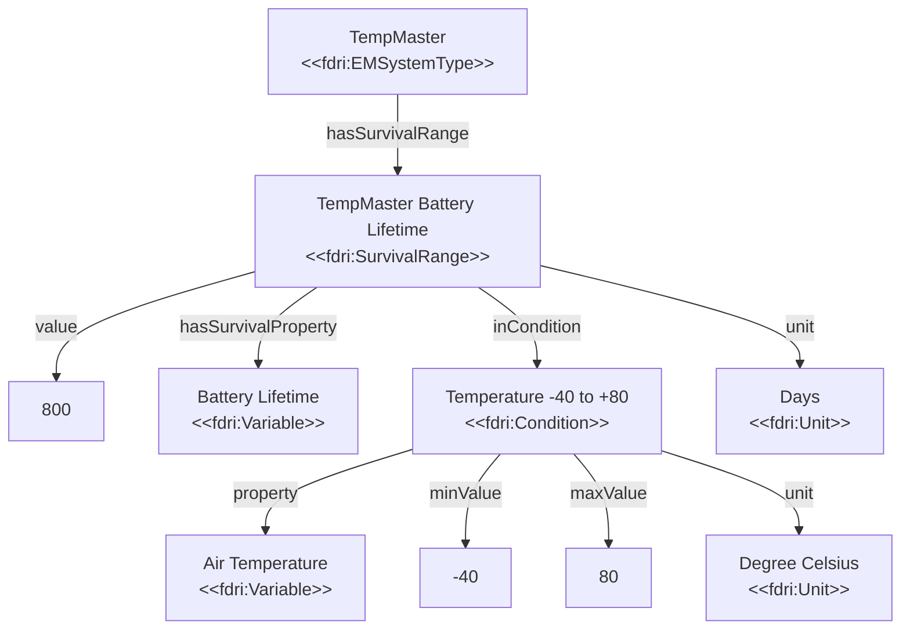

## System Capabilities and Ranges

The FDRI data model extends the [SOSA/SSN System Capabilities Module](https://www.w3.org/TR/vocab-ssn/#System-capabilities) to provide a way to capture information about the range of conditions under which a sensor can be operational, and to associate sensor-related operational properties such as sensitivity, accurracy and frequency with those operational ranges. Typically this model will be used to record the manufacturer's specification of the operational properties of a make/model of sensor under a manufacturer-defined "normal" operating condition.

### Conditions

Conditions define constraints on the environment in which a sensor operates and are used to set out the environmental conditions under which a given `fdri:SystemCapability`, `fdri:SurvivalRange` or `fdri:OperatingRange` apply.

An `fdri:Condition` has the following properties:

* `fdri:property` references an `fdri:Variable` which specifies the observed property of the environment for the condition.
* `schema:value`, `schema:minValue`, `schema:maxValue` - a single value or, more typically, a value range for the property
* `fdri:unit` - an `fdri:Unit` specifying the unit of measure of the value or value range.

For example, a condition of an air temperature between -40&deg;C and +80&deg;C can be represented as shown in the diagram below:

### System Capability

A `sys:SystemCapability` provides a specification of the capability of a system to perform its primary purpose. For sensors, this primary purpose is the observation of some `fdri:Variable`. 

A `sys:SystemCapability` may be associated with either an `fdri:EnvironmentalMonintoringSystemType`, or with an `fdri:EnvironmentalMonintorigSystem` using the property `sys:hasSystemCapability`. In the former case, the capabilities are interpreted as applying to all systems of that type, and in the latter case as applying only to that specific system instance. 

`sys:SystemCapability` has the following properties:

* `ssn:forProperty` references an `fdri:Variable` which defines the environmental variable measured by the sensor that this capability applies to.
* `sys:inCondition` references any number of `fdri:Condition` which specify the environmental conditions under which the given value of the capability characteristics will apply.
* `sys:hasSystemProperty` property references one or more `fdri:SystemProperty` resources each of which provides values for one of the characteristics of the sensor for the specified variable, under the specified conditions.

An `fdri:SystemProperty` provides the value of one capability characteristics. It has the following properties:

* `fdri:property` references an `fdri:Variable` which defines the sensor characteristic (e.g. accuracy, sensitivity, repeatablility).
* `schema:value`, `schema:minValue`, `schema:maxValue` - a single value or, more typically, a value range for the characteristic,
* `fdri:unit` - an `fdri:Unit` specifying the unit of measure of the value or value range.

The example below shows an imagined air temperature sensor and its capability. In this example the sensor under its normal operating range has an accuracy of +/- 0.5 degrees celsius, and a sensitivity of 0.1 degrees celsius.

#### Capturing Sensor Error Codes as System Capability

The `fdri:SystemCapability` structure can also be used to capture the value(s) that a sensor reports under error conditions. By using a property representing the concept of an error value, and either a value range or a single value depending on how errors are reported.

`fdri:Condition`s may be attached to contextualize the conditions under which the error code is reported if this is known.

> **NOTE**
> This capability is not intended to capture the separate error flags channel that some sensor systems provide, but only to capture the case where the measure channel can report an error value rather than a normal reading.

> **TODO**
> Define the vocabulary for System Capability properties and include the IRI for the error code property here.

For example, if our fictional sensor is in an error state it will report a value of -9999. As this value is not a temperature reading, we encode it as a unitless value. This value may be reported under any condition and so no `fdri:Condition` is attached to the `fdri:SystemCapability`. For this reason this capability is recorded separately from details such as the accuracy and sensitivity of the sensor, which are values that apply only under normal operating conditions. This can be represented as shown in the diagram below.

### Operating Range

An `fdri:OperatingRange` specifies the operational characteristics of a system. It can be used either to specify quality values for specific operational characteristics such as "maintenance schedule" or "operating voltage range", or it can be used without any such characteristics. If no operational characteristics are defined on an `fdri:OperatingRange`, then the resource is interepreted as specifying the conditions under which the system will operate normally. When conditions go beyond the specified ranges, a system is considered to be operating "out of range", which may affect the quality of its observations.

`fdri:OperatingRange` has the following properties:
* `sys:hasOperatingProperty` optionally references the `fdri:Variable` which defines the operational characteristic that this operating range provides a value for.
* `sys:inCondition` references the `fdri:Condition` resources that define the environmental conditions for this operating range.
* `schema:value`, `schema:minValue`, `schema:maxValue` - a single value or, more typically, a value range for the characteristic (if one is provided).
* `fdri:unit` - an `fdri:Unit` specifying the unit of measure of the value or value range (if one is provided).

The example below shows a statement that the fictional "TempMaster" sensor is expected to operate normally under a temperature range of -40&deg;C to 80&deg;C.

### Survival Range

An `fdri:SurvivalRange` specifies operational lifetime characteristics of a system under certain environmental conditions. It can be used either to provide values of specific lifetime characteristics (e.g. battery lifetime), or it can be used without any characteristics. If used without any characteristics, the `fdri:SurvivalRange` specifies the environmental conditions under which a system remains undamaged. When those conditions are exceeded, the system is considered damaged in some way and in need of maintenance or replacement.

The structure of `fdri:SurvivalRange` is similar to that of `fdri:OperatingRange`:
* `sys:hasSurvivalProperty` optionally references the `fdri:Variable` which defines the lifetime characteristic that this survival range provides a value for.
* `sys:inCondition` references the `fdri:Condition` resources that define the environmental conditions for this survival range.
* `schema:value`, `schema:minValue`, `schema:maxValue` - a single value or, more typically, a value range for the characteristic (if one is provided).
* `fdri:unit` - an `fdri:Unit` specifying the unit of measure of the value or value range (if one is provided).

The following example shows a battery lifetime of 800 days for an imaginary "TempMaster" sensor under its normal operating conditions of -40&deg;C to +80&deg;C.

### Note on SOSA/SSN Systems Module Mapping

 The modelling for `fdri:Condition` extends the SOSA/SSN `sys:Condition`. Under the SOSA/SSN model the class `sys:Condition` is declared as a subclass of `ssn:Property`. This is still true in the FDRI model, but rather than the condition property being inferred by the class of the condition, the property is explicitly stated using the `fdri:property` property. We believe this gives greater clarity and flexibility as it allows condition properties to be drawn from a controlled vocabulary of `fdri:Variable` instances rather than requiring new classes to be defined for each condition property.
 
The same approach has been taken for including `sys:SystemProperty` (extended as `fdri:SystemProperty`).

The FDRI model also makes explicit the use of properties from the domain of `schema:PropertyValue` to capture values and ranges of values on the classes `fdri:SurvivalRange` (derived from `sys:SurvivalRange`), `fdri:OperatingRange` (derived from `sys:OperatingRange`), and `fdri:Condition` (from `sys:Condition`).