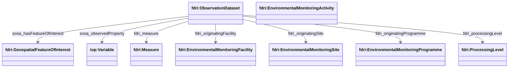
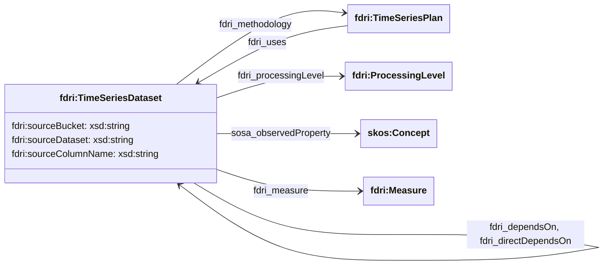
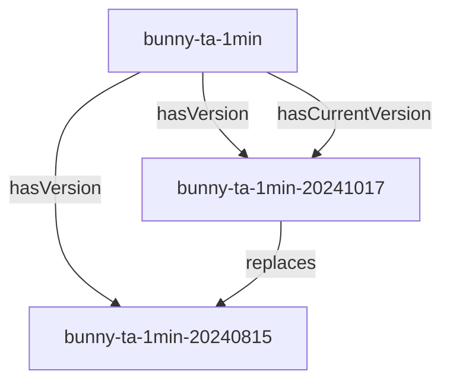

## Observation Dataset Model

`fdri:ObservationDataset` is defined as a subclass of `dcat:Dataset` and is intended to represent the class of datasets providing environmental observations.

`fdri:ObservationDataset` has the following properties:

* `sosa:hasFeatureOfInterest` relates the dataset to the feature(s) in the environment that the dataset provides observations on.
* `sosa:observedProperty` relates the dataset to the variable(s) that the dataset provides values for.
* `fdri:measure` relates the dataset to the description of the measurements that the dataset contains. A Measure is a combination of `Variable`, unit of measure, and aggregation and time period where appropriate.
* `fdri:originatingActivity` relates the dataset to the activity or activities that contributed some or all of the measurements recorded in the dataset.
* `fdri:originatingFacility` relates the dataset to the facility or facilities that contribute some or all of the measurements recorded in the dataset.
* `fdri:originatingSite` relates the dataset to the monitoring site (or sites) that contribute some or all of the measurements recorded in the dataset. Note: Although the model states that `fdri:EnvironmentalMonitoringSite` is a subclass of `fdri:EnvironmentalMonitoringFacility`, this more restrictive property is useful for grouping datasets specifically at the most commonly used facility level.  
* `fdri:originatingProgramme` relates the dataset to the monitoring programme or programmes that contribute some or all of the measurements recorded in the dataset (this may be indirectly, via some facility which is part of the programme).
* `fdri:processingLevel` specifies the level of data processing that has been carried out on the data in the dataset.

## Time-Series Dataset Model

An `fdri:TimeSeriesDataset` is defined as a subclass of `fdri:ObservationDataset` and has some additional properties relating to the processing and/or derivation of the time series.

An `fdri:TimeSeriesDataset` represents a dataset that consists of a time-series of observations of a single variable by some `fdri:EnvironmentalMonitoringFacility`.

The following additional properties are defined for an `fdri:TimeSeriesDataset`.

* `fdri:methodology` a reference to the `fdri:TimeSeriesPlan` which documents the method by which the dataset is produced. Where a time series is produced by derivation from one or more input time series, the `fdri:uses` relation relates the `fdri:TimeSeriesPlan` to the input time series, either by direct reference to the `fdri:TimeSeriesDataset` or to the `fdri:TimeSeriesDefinition` that types the input dataset.
* `fdri:sourceBucket` specifies the top level container (an S3 bucket) in which the data that is processed to produce time series datasets is stored.
* `fdri:dataset` specifies the specific partition of the top level container in which the data is stored.
* `fdri:columName` specifies the column within the partition where the values that produce the time series dataset(s) is stored.
* `fdri:dependsOn` and `fdri:directDependsOn` express processing dependencies between TimeSeriesDatasets. `fdri:directDependsOn` should be used only for direct dependencies and `fdri:dependsOn` may be used to capture the transitive closure of `fdri:directDependsOn`. The precise nature of the dependency between datasets should be captured by the `fdri:TimeSeriesPlan` associated with the dataset.

> **NOTE**
> The datasets for different sites are saved in separate folders within the same path structure within the bucket. This is expected to be the case for other projects processed through the DRI pipeline, and so site specific paths are not currently specified in the time series definition metadata.

### Time-Series Dataset Versioning

For each time-series, there is a dataset resource representing the time-series (the "versioned dataset") and a separate resource for each version of the time-series (the "dataset version"). A new version is created whenever a new processing pipeline is applied to the raw data and each version of the time series will have a different DOI.

> **QUESTION**
> Does this proposal align with the processing architecture?
> What context does a processing agent have when it processes the upstream dataset.

> **QUESTION**
> What metadata is strictly consistent across versions? This might be metadata that is stated only on the versioned dataset and not restated on each dataset version.

> **QUESTION**
> Are raw datasets treated as versioned datasets or just as a single unversioned dataset that is monotonically increasing in size?

> **QUESTION**
> DCAT is relatively relaxed about version relationships and so we can have one TimeSeriesDataset as a version of another. However this could potentially get confusing and makes it slightly harder to filter a query to only return the top level versioned datasets (though these would be the only dataset resources with a `hasCurrentVersion` property on them). Should we consider adding `TimeSeriesDatasetVersion` to represent the dataset versions and introduce additional constraints so that a `TimeSeriesDatasetVersion` resource cannot itself have versions.

### Time-Series Dataset Annotations

Annotations may be used to assert quality metrics about Time-Series Datasets. The values for these metrics may be 
qualified with a value giving the date range of observations that the annotation applies to (qualifier property 
`http://fdri.ceh.ac.uk/ref/common/cop/observation-period`) to specify metrics that apply to a range of observations
in the time-series. An annotation value that is not qualified with an observation period, is assumed to be providing
a metric about the dataset as a whole.

The currently defined metrics annotation properties are:

* Time-Series Completeness (Percent) `http://fdri.ceh.ac.uk/ref/common/cop/timeseries-completeness-percent` - the percentage of observations in the period for which a value is provided in the time-series
* Time-series Suspect Observations (Percent) `http://fdri.ceh.ac.uk/ref/common/cop/timseries-flagged-suspect-percent` - the percentage of observations in the period which are flagged as being suspected to be inaccurate.

Additional metrics annotation properties may be defined as needed. It is recommended that all such properties should be
defined with an `iop:hasObjectOfInterest` property with the value `fdri:TimeSeriesDataset` if the metric specifically applies to time-series data.