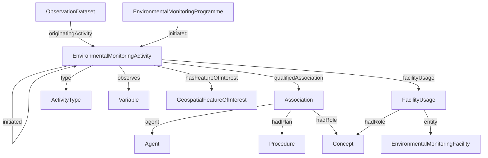
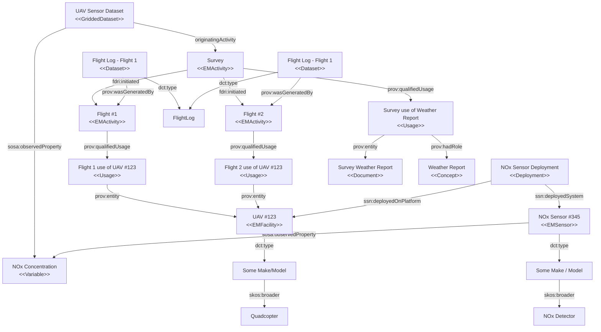

# Proposal for UAV Dataset Metadata

# High-level requirements

Datasets generated from UAV flights can be thought of more generally as being datasets generated from a monitoring activity. 

A monitoring activity may use some monitoring facilities (e.g. a drone). An agent may be related to an activity in some role, and may follow some procedure.

A monitoring activity should have a start and end date/time and may consist of a number of sub-activities each with their own separate start and end date/time and other metadata. e.g. a survey activity may consist of several drone flights across the survey area.

The datasets which result from an activity should be related to the activity in a similar way to which datasets from a monitoring facility are related to the facility. In addition to the datasets managed under the DRI system, activities may also produce other artefacts which may not be treated as datasets but which are nevertheless important to downstream users of the datasets - e.g. flight track logs.

The majority of sensor and platform related information which is required by users of drone data is already covered by the metadata that can be collected on static facilities - e.g. sensor deployment, sensor configuration and calibration. It is noted that the way in which sensors are mounted on vehicles has some additional nuances which might be better captured in structured data rather than as commentary notes - e.g. the orientation and relative positioning of a sensor on a drone.

# Proposed modelling approach

* Add EnvironmentalMonitoringActivity (subclass prov:Activity)
* Add `originatingActivity` property to `ObservationDataset` to relate the dataset to the EnvironmentalMonitoringActivity(ies) that give rise to the data.
* Use `prov:Usage` to relate activity to facility/ies used in the activity
* Use `prov:Association` to relate activity to a procedure and/or agent and role
* Use `sosa:observes` to relate an activity to the Variable(s) observed by the activity.

* A UAV is modelled as an `EnvironmentalMonitoringPlatform`
* The installation of sensors on the UAV are modelled as Deployments
* A survey is an `EnvironmentalMonitoringActivity` and each flight undertaken is a sub-activity
  

## Analysis of UAV Dataset Metadata Recommendations

### The UAV platform and its sensor type 

| Metadata Field | Supported? | Comments
|----------------|------------|-----------|
RPAS Type | Y | Captured as the broader concept of the concept that denotes the make/model of the EnvironmentalMonitoringFacility (or indirectly via skos:broader)
RPAS Make/Model | Y | Captured using dct:type on EnvironmentalMonitoringFacility
RPAS Payload Types | N | **TODO** - need to qualify what this refers to. If it refers to a pre-defined sensor package type, then this is just a reference to a concept used to type an EnvironmentalMonitoringSystem.
Camera Type/Model, Sensor Type/Model | Y | The sensors/sensor systems installed on the UAV are captured via Deployment(s). The types of those sensors/systems are captured via the dct:type property of the sensor/system resource. 
Sensor Calibration Specification | Y | Sensor calibration can be captured as an Activity that uses the sensor and generates a calibration specification.
Sensor Sampling Rate & Sensor Measurement Capability | Requires changes | These properties of a sensor can be captured using the SOSA System Capabilities module. This is currently included in the OWL version of the FDRI model but has not yet been added to the FDRI schema.
Sensor Location on Drone | May require Changes | See notes below
Sensor mount and orientation | May require changes | See notes below
Sensor firmware and version | Y | These are already captured as configuration information for the sensor.

**Sensor Location, Mount, and Orientation**

All three of these properties could be captured simply as part of the comments field already present on the Deployment type. This may be sufficient for reqiurements if it is only needed to allow an interested user to understand detailed information about how the data was captured.

If these fields are required for reporting, aggregation or filtering then a more structured approach would be required, and there are two potential options.

The first option would be to provide specific (optional) text fields for this information on the Deployment class (possibly in a subclass). This provides some more limited text search options but unless there is a structured approach to data entry the fields would still provide little benefit for filtering, reporting or aggregation.

The second option would be to define controlled vocabularies to use for these properties. It may also be the case that sensor location and orientation could be defined as coordinates and rotation/pitch relative to an origin coordinate on the body of the drone.

The third option would be to provide a detailed model of each drone's mounts, modelling the mount as a sub-platform of the drone. These mounts would still require relative positioning information (which can be captured using the existing model) as well as orientation details (which would still need to be added to the model).

It should be noted that in the survey in the [NERC report](https://nora.nerc.ac.uk/id/eprint/536398/) although there was a sizeable minority of users who expressed a desire to see this metadata (as a MUST or SHOULD), there is not any detail in that report as to how the information might be used. It should also be noted that a majority of respondents see this data as optional or irrelevant.

### The UAV survey 

| Metadata Field | Supported? | Comments
|----------------|------------|-----------|
| Geographic extent | Requires Changes | Would be supported by adding a spatialExtent property to EnvironmentalMonitoringActivity. Note that this property is intended to capture the size of the area covered so should be an Area or Volume property.
| Flight pattern type | Requires Changes | Requires a property and controlled vocabulary for values. Could be made more generic so as to refer to any sortie pattern rather than specifically to flights.
| Weather report | Y | A weather report can be captured as a document or data entity which is related to the activity by a prov:qualifiedUsage with the role of "weather report"
| Flight date and time | Y | Assuming that individual flights are modeled as spearate activities, flight time can be recorded as the activity start and end time.
| Sensing target | Y | The information about which observable property (in FDRI terms "Variable") is measured by a survey is captured as the sosa:observes of the EnvironmentalMonitoringActivity.
| Mission planning software | Y | The software used for mission planning can be captured as an entity related to the activity by a prov:qualifiedUsage with the role of "mission planning software"

### The sortie

| Metadata Field | Supported? | Comments
|----------------|------------|-----------|
flight log | Partial | A flight log file can be associated with a flight activity as an entity generated by the EnvironmentalMonitorinActivity that represents the flight. It is assumed that the details of the flight log such as duration and individual points in the flight log would not be accessible directly via the metadata store. 

**QUESTION** Are there flight log formats that should be captured as metadata? 

**QUESTION** Is there any value in capturing the duration of the flight log?

**NOTE** Currently the FDRI model does not have a generic "Document" resource type with associated Distributions. This sort of model might be useful not only for providing a means to associate metadata with a flight log, but also for specifying distribution formats and locations for other files (e.g. sensor certifications)