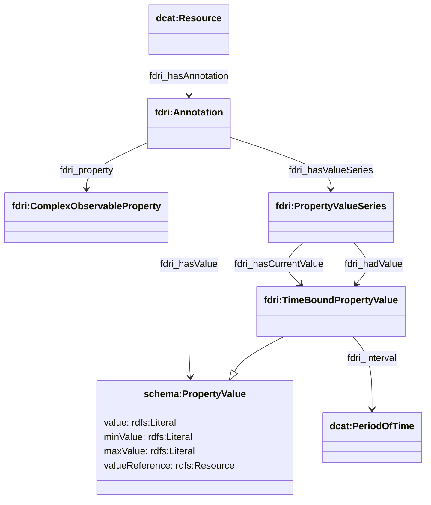
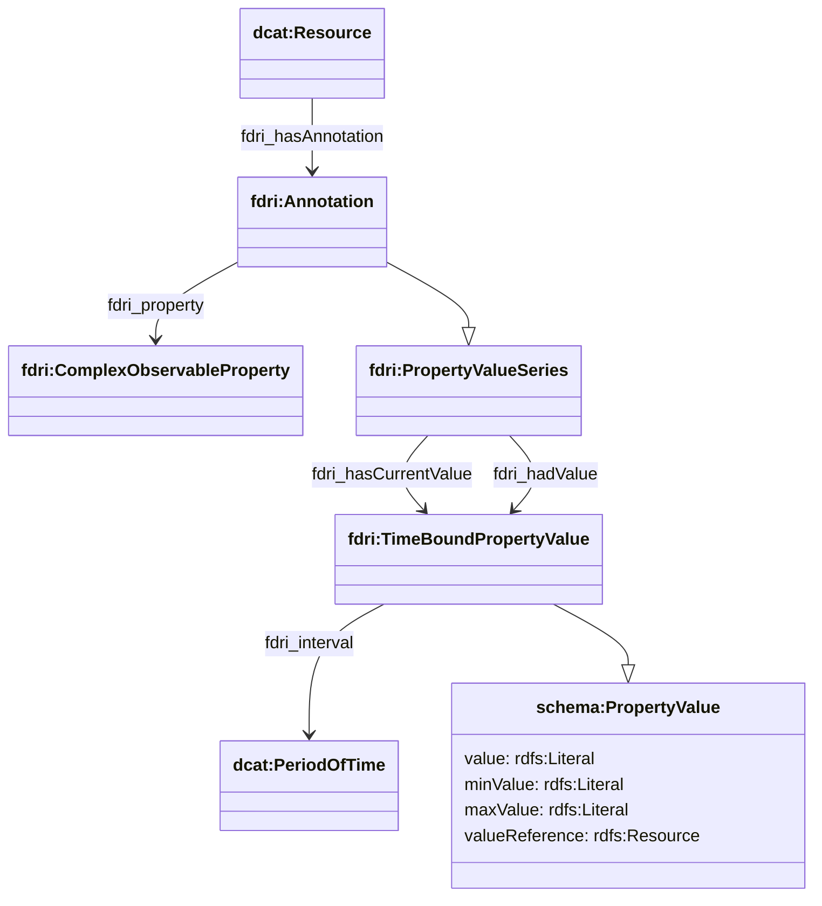

## Annotations

Annotations provide an extension point in the model where different kinds of annotation may be added to a catalogued resource.

The annotation property is defined as a complex observable property which allows for the ability to specify units of measurement etc.

### OPTION 1

Annotations have:
* an annotation property (`fdri:property`) which is a [complex observable property](observations-observable-properties.md) drawn from a controlled list defined by the parent catalog of the annotated resource
* an annotation value which may be either a `schema:PropertyValue` (`fdri:hasValue`), or an `fdri:PropertyValueSeries` (`fdri:hasValueSeries`). The latter should be used when the value of an annotation may change over time. 

NOTE: This approach means that there are two different query patterns needed to retrieve the set of current annotations on a resource. Option 2 would simplify this. 

### OPTION 2

In this option, all annotations are treated as property value series, which potentially simplifies query. However, `fdri_interval` is currently required on `TimeBoundPropertyValue` which means at a minimum an interval with a start date is required even for "static" annotations.

