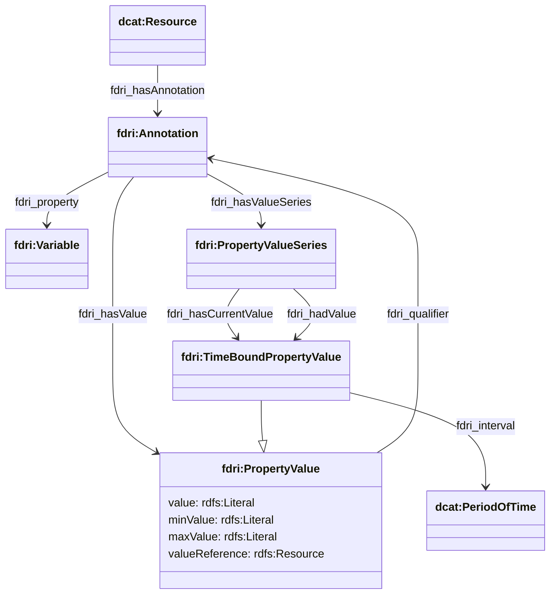

## Annotations

Annotations provide an extension point in the model where different kinds of annotation may be added to a catalogued resource.

The annotation property is defined as a complex observable property which allows for the ability to specify units of measurement etc.

An annotation can also be used to qualify a property value. For example when a measurement applies to some percentage of the observed entity, that percentage value can be captured as an annotation of the property value using the `fdri:qualifier` relation.

Annotations have:
* an annotation property (`fdri:property`) which is a [complex observable property](observations-observable-properties.md) drawn from a controlled list defined by the parent catalog of the annotated resource
* either
  * an `fdri:hasValue` property whose value is a single `fdri:PropertyValue` providing the static value of the annotation or
  * an `fdri:hasValueSeries` property whose value is an `fdri:PropertyValueSeries` providing a series of values for the annotation that changes over time. 

An `fdri:Annotation` can also be used as the value of an `fdri:qualifier` property on a `fdri:PropertyValue` or `fdri:TimeBoundPropertyValue`, to provide additional contextual qualification to a property value.
 

