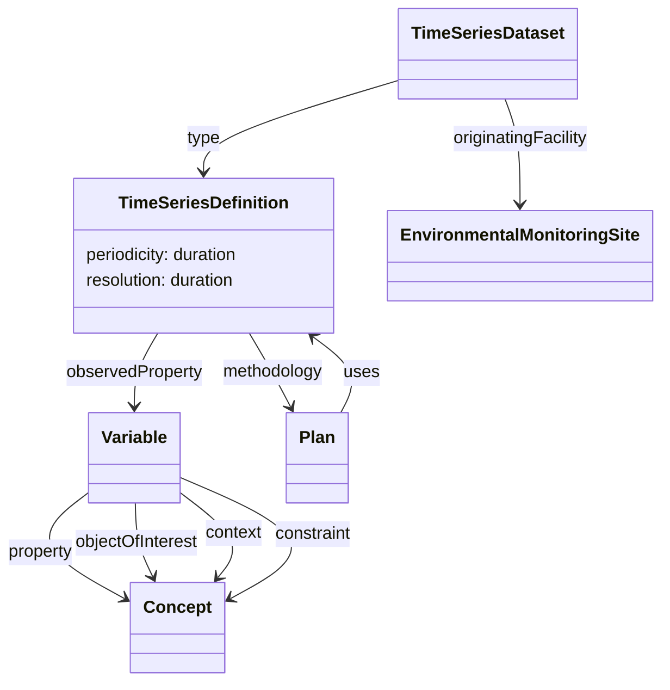

# High Level Overview

Each `Time Series Dataset` is an instantiation of a `Time Series Definition`.

Each `Time Series Definition` specifies:
  * the variable captured by the time series
  * the resolution of the variable measurement
  * the periodicity of the time series
  * the level of data processing applied
  * the method by which the time series is captured or derived
    * for all time series definitions, some documentation of the methodology as direct text and/or as links to documentation 
    * for definitions of derived time series, links to the time series definitions for the input time series
    * for 

Each `Variable` (I'm proposing we rename `Complex Observable Property` to make the alignment the Variable concept clearer) will specify:

  * The abstract property being measured (e.g. temperature)
  * The object of interest (e.g. air)
  * The context within which the observation is made
  * The constraints placed on the observation (e.g. 2m above ground level)
  * The unit of measurement

The following **variables** are distinct under this scheme:
  * soil temperature at 2cm below ground level
  * soil temperature at 20cm below ground level
  * incoming longwave radiation (corrected)
  * incoming longwave radiation (uncorrected)
  * outgoing longwave radiation
  * volume of precipitation captured by a rainguage
  * volume of precipitation captured by a tipping bucket

**NOTE**: The last two are proposed to be distinct based on the fact that the COSMOS TIMESERIES.csv file lists different PARAMETER_ID values for time-series originating from a tipping bucket from those originating from a rain guage. I'd look to a domain expert to provide guidance on whether these are truly distinct variables.

The following time series may be defined which all share the same variable:

  * incoming long-wave radiation (corrected), raw, mean, 30m
  * incoming long-wave radiation (corrected), raw, std dev, 30m
  * incoming long-wave radiation (corrected), level 2, total, 1 day
  * incoming long-wave radiation (corrected), level 3, mean, 30m
  

**NOTES**:

`Plan` is a relatively generic type from the W3C Provenance ontology, and there may need to be a specific `TimeSeriesDerivationProcedure` type

The `type` relation between `TimeSeriesDataset` and `TimeSeriesDefinition` could be a more specific `hasDefinition` relationship if preferred.

The relationship between a derived time series definition and the input time series definitions could be a more direct property rather than going via a `Plan` if preferred. This would then maybe require any description or documentation of the methodology to also migrate from `Plan` to `TimeSeriesDefinition`.