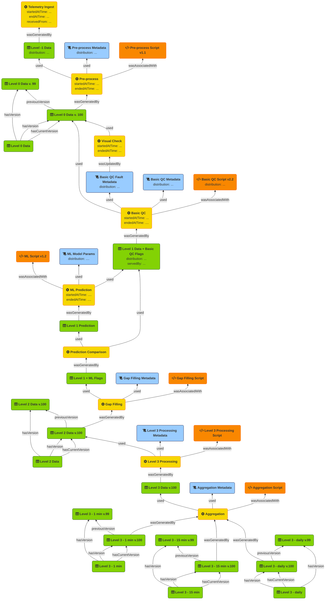

The diagram below attempts to illustrate how PROV-O Activities can be use to track the progress of processing data through a typical FDRI data pipeline. In this case the data pipeline is based on the existring data transformations which may be modified or streamlined in future, but which are assumed to be broadly representative of a future-state data processing pipeline.

In the diagram, the yellow boxes represent **Activities**, green boxes represent  **Datasets**, blue boxes represent **Configuration**, and orange boxes represent **Scripts**.

Activities generate or modify resources (typically datasets in this processing pipeline), and make use of configuration files. The execution of a scripted activity is assocaiated with the specific version of the script that is run.

In most cases, an activity will result in the generation of a *new version* of an existing datataset. Using DCAT it is possible to separate out the record for each version of a dataset from the record for the enduring dataset. It is not clear from the information we have whether it is currently the case or whether it would be desirable for it to be the case that each distinct version of a dataset corresponds to one or more physical resources (e.g. files in cloud storage), but the structure of dataset versions here makes it possible to record the location of the data for specific versions, or for the enduring dataset.

It is also possible to treate metadata as versioned using the same mechanism (in fact we would recommend considering metadata for activities to also be cataloged resources in the data catalog), so a record of an activity would then be recording that version A of the output dataset was generated from version X of the input dataset, by version Y of the script running with version Z of the configuration metadata.

The diagram below shows a discrete Activity and Dataset Version being recorded for each run of a data pipeline. Over 
time this would result in the detailed metadata store being populated with a very large number of version records, which
may become a performance issue and would certainly be difficult to manage in a meaningful way. There are therefore some
design decisions to be made regarding this approach. One simplification would be to only record a new activity and a 
new dataset version when there are changes either to the script or to the configuration metadata used to run the script.
The design decision could be different for different stages of the processing pipeline, although this then also incurs
a bit of cognitive overhead in system users if versioning is not consistently modelled through the pipeline. We could
possibly be guided by considering the persistent artefacts generated at each stage of the pipeline, and only to create
dataset versions (and by extension discrete activity records) when there is a persistent artefact produced. Finally,
it is also possible to consider approaches to periodically compressing or archiving portions of the version history as
a means of reducing the processing burden on the metadata store. 

NOTE: For simplicity in this diagram I have assumed that a single aggregtation script run produces all three aggregate forms of level 3 data. I realise that this might not actually be the case and that there would be a separate activity for each aggregate form of the level 3 data, but hopefully it is clear from this diagram that accomodating that within the proposed design would be completely straightforward.

