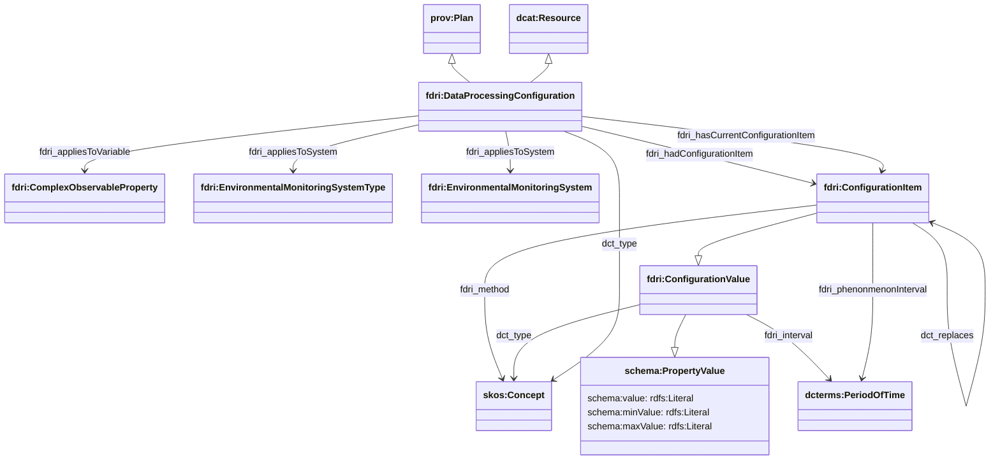
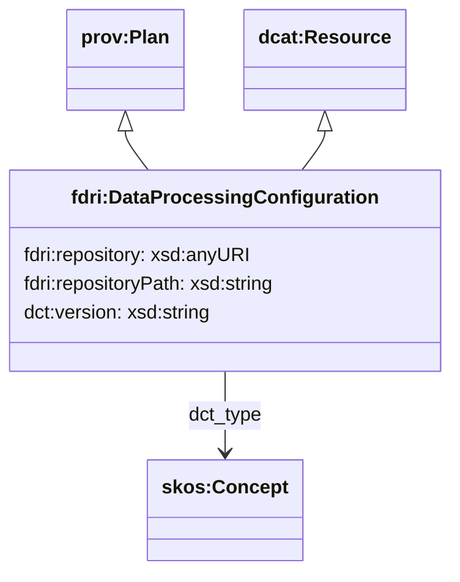

## Data Processing Configurations

To model data processing configurations, there are two broad options to consider depending on how such configuration information is mastered. If the configuration information is mastered and managed in the metadata store, then a structure is needed to represent individual configuration properties and their values. If the configuration is mastered and managed in an external system such as a source control repository, then it would be more sensible to only record a link to (a version of) that configuration rather than to try and reflect its content in the metadata store.

### Data Processing Configiration Mastered in the Metadata Store

A `fdri:DataProcessingConfiguration` is used to capture a collection of configuration items that apply to part of the data processing pipeline. As a `dcat:Resource`, this resource supports "soft" typing through `dct:type` which can be used to specify the particular type of processing activity configuration it represents (e.g. Raw data correction, QC, infill etc.). An `fdri:DPConfig` is aslo  a `prov:Plan`, which means it can be specified as part of the procedure for `prov:Activity`.

The relation `fdri:appliesToSystem` relates a `fdri:DataProcessingConfiguration` to the `fdri:EnvironmentalMonitoringSystem` or `fdri:EnvironmentalMonitoringSystemType` whose measurements are affected by the configuration. The relation `fdri:appliesToVariable` relates an `fdri:DataProcessingConfiguration` to the variable affected by the configuration.

The relation `fdri:hasCurrentConfigurationItem` relates an `fdri:DataProcessingConfiguration` to one or more `fdri:ConfigurationItem`s, which provide the current set of configuration values for the processing. Each `fdri:ConfigurationItem` specifies a method (e.g. multiply, spike etc.); a property value (which may be a specific value or a min/max range); a `fdri:phenomenonInterval` which indicates the date range of the observations to be affected by the configuration item; and an `fdri:interval` which specifies the interval during which the configuration item applies. If `fdri:phenomenonInterval` is omitted, the configuration would be treated as applying to all observations processed during the `fdri:interval`

The relation `fdri:hasConfigurationItem` relates an `fdri:DataProcessingConfiguration` to the configuration items which were historically used by the configuration. The `dct:replaces` property can be used to create a chain of references from each current configuration item to each of the preceding configuration items that it replaced.

> **QUESTION**
> Is phenomenonInterval required? The intuition is that there might be different infill methods applied for different sensor fault situations and so it might be useful to be able to limit certain configurations to only a given range of observations, but if that is not useful then we can just have a single `fdri:interval` property which indicates the time span when the configuration applies (and applies to all observations processed during that time span).

> **QUESTION**
> Is configuration history managed at the individual configuration property level or at the whole configuration level?

### Data Processing Configuration Mastered Externally

When configuration information is mastered externally, the model for the configuration captures only the URI of the external repository that contains the configuration, the path within that repository to the configuration, and a version identifier that identifies the specific version of the configuration resource (e.g. a git commit hash or a tag if tag-based deployment is used). The `dct:type` property can be used to provide a more specific configuration type drawn from a SKOS concept scheme may be useful when processes use multiple configuration files for different purposes.