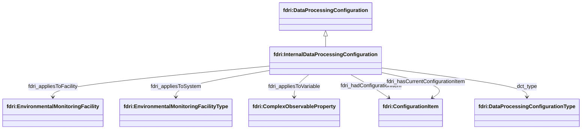

## Data Processing Configurations

To model data processing configurations, there are two broad options to consider depending on how such configuration information is mastered. If the configuration information is mastered and managed in the metadata store, then a structure is needed to represent individual configuration properties and their values. If the configuration is mastered and managed in an external system such as a source control repository, then it would be more sensible to only record a link to (a version of) that configuration rather than to try and reflect its content in the metadata store.

### Data Processing Activities and Data Processing Configurations

An `fdri:DataProcessingConfiguration` may be soft-typed with an `fdri:DataProcessingConfigurationType` which is a concept drawn from a data processing configuration type controlled vocabulary.

There are two subclasses defined for `fdri:DataProcessingConfiguration`. `fdri:InternalDataProcessingConfiguration` resources store configuration properties and their values in the metadata store. `fdri:ExternalDataProcessingConfiguration` resources refer to a configuration file stored in a source control repository.

### Internal Data Processing Configuration

The `fdri:InteralDataProcessingConfiguration` class provides a structure for keeping a complete historic record of the data processing methods applied to a data set. The configuration is modelled as a collection of items, each item representing a data processing method that is applied along with the arguments passed into that method. Methods and their parameters are modelled as SKOS concepts with the method concept having an additional property to relate the method to the parameters that it accepts.

An `fdri:InternalDataProcessingConfiguration` is used to capture a collection of configuration items that apply to part of the data processing pipeline.

The relation `fdri:appliesToFacility` relates a `fdri:DataProcessingConfiguration` to the `fdri:EnvironmentalMonitoringFacility` or `fdri:EnvironmentalMonitoringFacilityType` whose measurements are affected by the configuration. The relation `fdri:appliesToVariable` relates an `fdri:DataProcessingConfiguration` to the variable affected by the configuration.

The relation `fdri:hasCurrentConfigurationItem` relates an `fdri:DataProcessingConfiguration` to one or more `fdri:ConfigurationItem`s, which provide the current set of configuration values for the processing. Each `fdri:ConfigurationItem` specifies a method (e.g. multiply, spike etc.); a property value (which may be a specific value or a min/max range); a `fdri:phenomenonInterval` which indicates the date range of the observations to be affected by the configuration item; and an `fdri:interval` which specifies the interval during which the configuration item applies. If `fdri:phenomenonInterval` is omitted, the configuration would be treated as applying to all observations processed during the `fdri:interval`

The relation `fdri:hadConfigurationItem` relates an `fdri:DataProcessingConfiguration` to the configuration items which were historically used by the configuration.

#### Configuration Item Strucutre

An `fdri:ConfigurationItem` resource has:
* a required `fdri:method` property which specifies the configuration method
* a required `fdri:interval` property which specifies the processing data range during which the configuration item applies
* an optional `fdri:observationInterval` property which specifies the date range of the observations to which the configuration item applies
* zero or more `fdri:argument` properties that specify the arguments passed to the configuration method.
* an optional `dct:replaces` property which relates the `fdri:ConfigurationItem` to the preceding `fdri:ConfigurationItem` which it replaces

An `fdri:ConfigurationArgument` resource has:
* a required `fdri:parameter` property which specifies the configuration parameter that the argument provides a value for.
* a required `fdri:hasValue` property which specifies the value of the argument.

Both `fdri:DataProcessingMethod` and `fdri:ConfigurationParameter` are subclasses of skos:Concept. 

`fdri:DataProcessingMethod` also has:
* an optional, repeatable property `fdri:hasParameter` which relates the method to the parameters that may be passed to the method.

> **QUESTION**
> Is configuration history managed at the individual configuration property level or at the whole configuration level?

### External Data Processing Configuration

When configuration information is mastered externally, the model for the configuration captures only the URI of the external repository that contains the configuration, the path within that repository to the configuration, and a version identifier that identifies the specific version of the configuration resource (e.g. a git commit hash or a tag if tag-based deployment is used). The `dct:type` property can be used to provide a more specific configuration type drawn from a SKOS concept scheme may be useful when processes use multiple configuration files for different purposes.