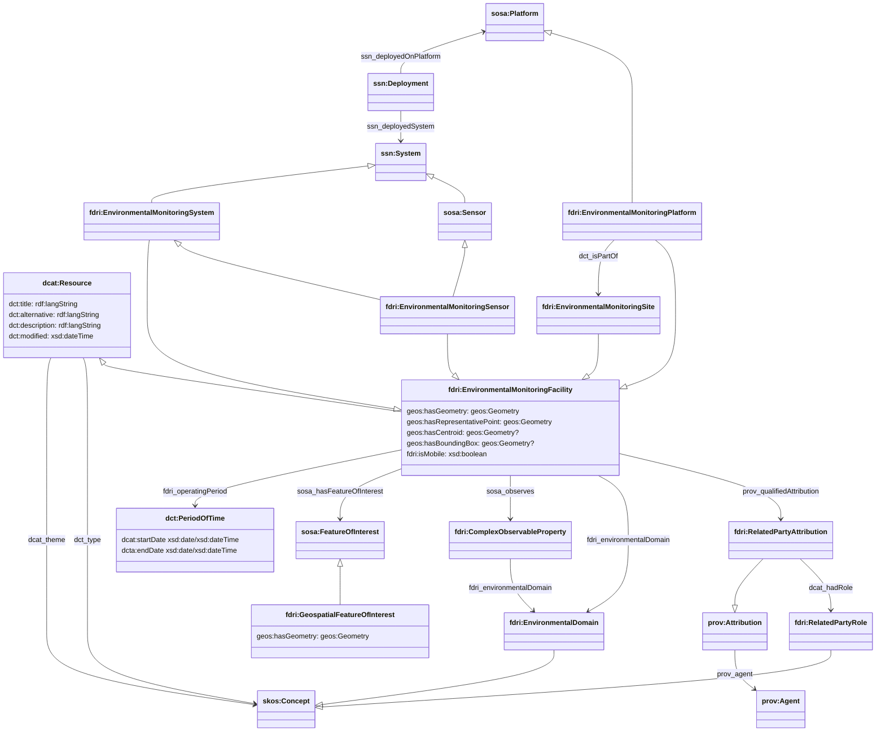
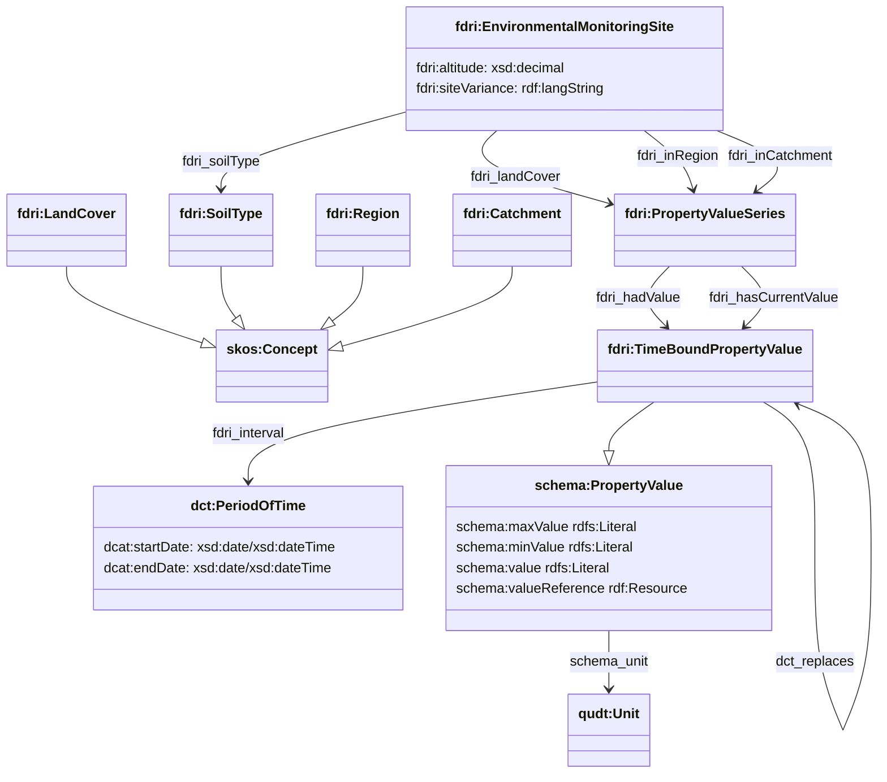

## Environmental Monitoring Facility Model

Based on the INSPIRE framework, the external data catalog proposes to maintain reference information about sites and stations in the FDRI network using the `EnvironmentalMonitoringFacility` class defined by INSPIRE. This class includes soft-typing to distinguish between site, platform and sensor. Some of these soft types (platform, sensor) have direct equivalents in SOSA/SSN, and to map these classes, we define concrete subclasses `EnvironmentalMonitoringSite`, `EnvironmentalMonitorigSystem`, `EnvironmentalMonitoringPlatform` and `EnvironmentalMonitoringSensor`.

`EnvironmentalMonitoringSystem` is also a subclass of `sosa:System`;`EnvinronmentalMonitoringSensor` is also a subclass of both `sosa:Sensor` and `EnvironmentalMonitoringSystem`;
 and `EnvironmentalMonitoringPlatform` is a subclass of `sosa:Platform`.

As in SOSA/SSN an `EnvironmentalMonitoringSystem` is an abstraction that represents both packages of sensors as well as individual sensors (via the `EnvironmentalMonitoringSensor` sublcass). Such packages may include a standard "Weather Station" sensor package, for example.

The SOSA/SSN class of `Deployment` represents the time-bound deployment of some `System`s.

`GeospatialFeatureOfInterest` represents a geo-spatially located feature of which is in the context of one or more `EnvirionmentalDomain`s. It has properties `geos:hasGeometry`, `geos:hasCentroid`, `geos:hasBoundingBox`, and `fdri:hasRepresentativePoint` to represent its spatial bounds/location.

> [!NOTE]
> The property `geos:hasGeometry` shall be made mandatory in the schema for this ontology, and the system shall generate a value for `fdri:hasRepresentativePoint` if one is not provided. These two properties will be the ones used for spatial indexing and query purposes.

 Instances of `GeospatialFeatureOfInterest` may be referenced by an `EnvironmentalMonitoringFacility` (this should be used only for a statically deployed `EnvironmentalMonitoringSite` or static `EnvironmentalMonitoringPlatform`). A `GeospatialFeatureOfInterest` may also be referenced from a `Dataset` using the `dct:spatial` property to indicate that the dataset contains one or more observations of the feature of interest.

As already shown, the `GeospatialFeatureOfInterest` may also be referenced from the `Dataset` which contains observations of that feature.

### EnvironmentalMonitoringFacility

`EnvironmentalMonitoringFacility` is defined as a subclass of `dcat:Resource`, meaning it is an item with an entry in the catalog (and so can be the subject of a `dcat:CatalogRecord`).
The `dcat:Resource` class aslo defines a number of useful properties which can be used to capture many of the properties of an `EnvironmentalMonitoringFacility` such as title, description, modified date and themes (keywords). Although not shown here, the DCAT model also provides common relationships between resources which can be used such as `dcterms:hasPart` and `dcterms:replaces`, as well as `dcterms:qualifiedRelation` which could be used to capture any other more specialised forms of relation between facilities and other catalogued resourcers. Additional properties are defined to cover the proposed model for `EnvironmentalMonitoringFacility` in the external catalog, although it may be possible to exlude some of these from the detailed metadata catalog if the external catalog is the canonical record for these resources. We use the `sosa:observes` property to record a relationship between an `EnvironmentalMonitoringFacility` and the property/ies it observes. This would most likely only be defined at the level of `EnvironmentalMonitoringSensor` resources, and then aggregated through query to parent facilities. 

An `EnvironmentalMonitoringPlatform` may be statically located at an `EnvironmentalMonitoringSite` (this would be the case for all static platforms in the FDRI network). It `hosts` one or more `EnvironmentalMonitoringSensor`s. This hosting relationship is qualified by an `ssn:Deployment` which can be used to specify the time-bounds of the deployment (e.g. when one sensor is replaced by another).

It should be noted that the SOSA/SSN model also allows for the modelling of packages of sensors as a `System`, but there is currently no direct equivalent for this in the EMF modelling, so it is assumed that there will be a separate `ssn:Deployment` for each sensor at a station, and indeed this would make sense given that sensors may be individually replaced or upgraded over time.

It is also worth noting that while there are some draft INSPIRE guidelines for representing INSPIRE data in RDF, these have not been followed in the modelling above and it is assumed that adherence to such guidelines is not a requirement and is less of a priority than maintaining a small number of consistently used RDF namespaces for FDRI data.

### Environmental Monitoring Site

Several properties of an `EnvironmentalMonitoringSite` may change over time. To capture the historic as well as the current values of these properties we introduce the `fdri:PropertyValueSeries` and `fdri:TimeBoundPropertyValue` types.

`fdri:TimeBoundPropertyValue` represents a property value with an assocaited interval during which the value is valid. The value part is represented with the `schema:PropertyValue` structure from the schema.org vocabulary and can be either a literal value using the `schema:value` property, a range using the `schema:minValue` and `schema:maxValue` properties, or a reference to a concept or structured value using `schema:valueReference`. The property `dct:replaces` can be used to relate one `fdri:TimeBoundPropertyValue` to the previoud `fdri:TimeBoundPropertyValue` that it provides an updated value for.

`fdri:ProperyValueSeries` represents a collection of `fdri:TimeBoundPropertyValues` providing values for the same property over different intervals. The property `fdri:hadValue` relates the `fdri:PropertyValueSeries` to all of the `fdri:TimeBoundPropertyValue`s that the property had over time (excluding the current value). The property `fdri:hasCurrentValue` relates the `fdri:PropertyValueSeries` to the `fdri:TimeBoundPropertyValue` that provides the current value of the property. For a property which is currently being monitored, it would be expected that `fdri:hasCurrentValue` has a value that is an `fdri:TimeBoundPropertyValue` with no `dcat:endDate` specified for its interval. 

> **QUESTION**
> Is site variance information available in a more structured form that makes it possible to relate the information to the sensor deployment?
> Does site variance information change over time? 
> If site variance information is captured as text, should this really be a language tagged string rather than a simple string ?

> **QUESTION**
> Should all measures such as altitude be expressed as a `schema:PropertyValue` value with units, or do we bake the assumed units into the ontology?
