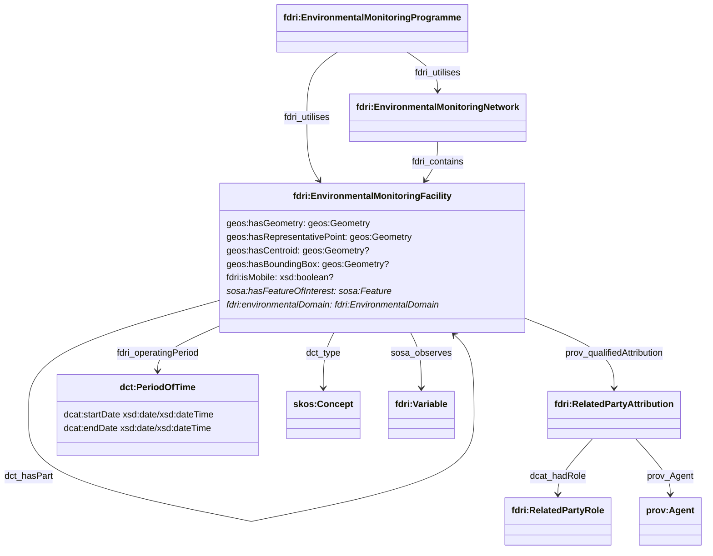
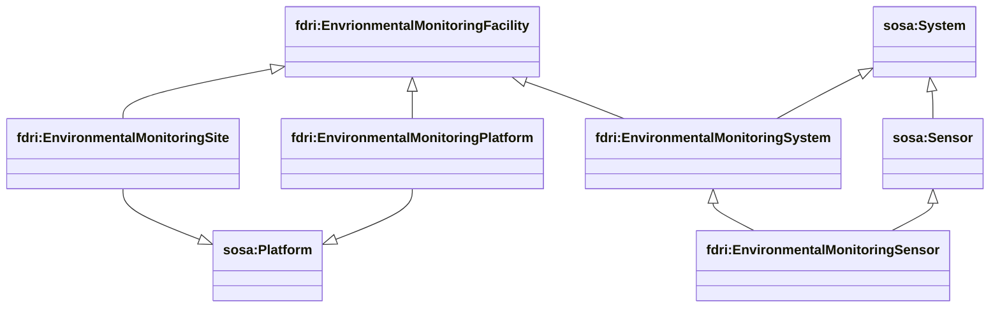
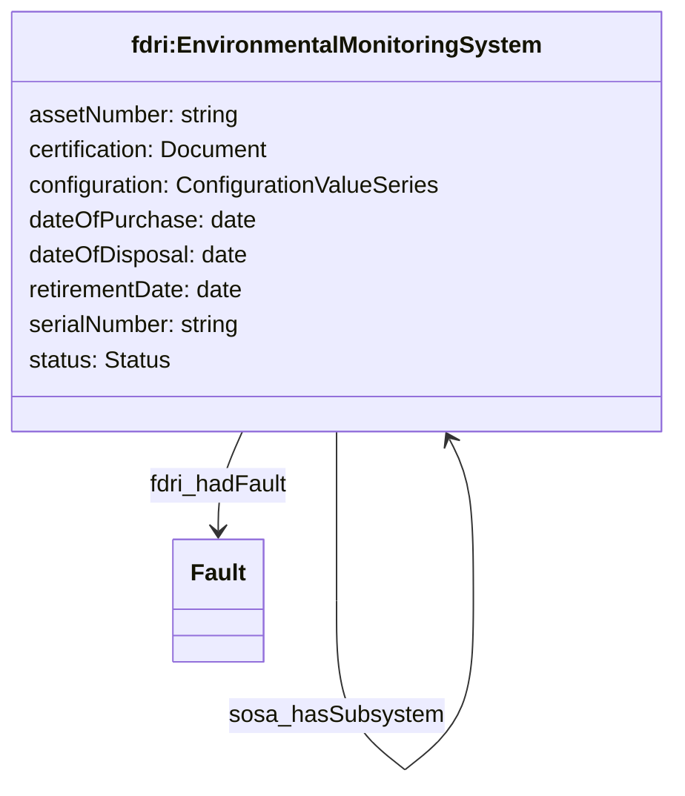
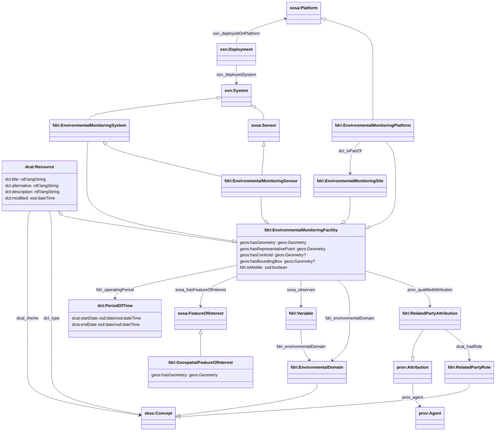
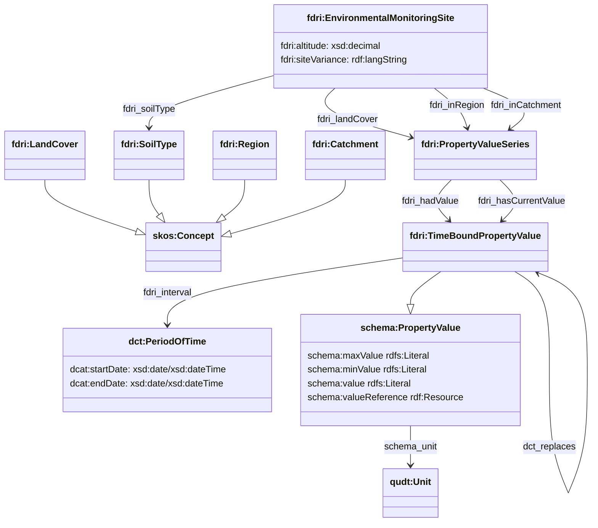

# Environmental Monitoring Facility Model

## Programme, Network and Facility

Based on the [INSPIRE Environmental Monitoring Facility Technical Guidelines framework](https://inspire-mif.github.io/technical-guidelines/data/ef/dataspecification_ef.pdf), the catalog models  reference information about infrastructure such as sites, stations, and drones using the `fdri:EnvironmentalMonitoringFacility` class.

An `fdri:EnvironmentalMonitoringFacility` may have:

* Any number of parts, each of which is another `fdri:EnvironmentalMonitoringFacility`, enabling the construction of a part-whole hierarchy (e.g. a site hosts one or more stations, and each station has one or more platforms on which sensors may be deployed).
* A flag that indicates that the facility is a mobile platform.
* A range of geo-spatial properties for specifying the location, boundary or bounding box of a static facility.
 * A specified period of operation
 * Any nubmer of related parties. Each related party is a person or organsiation with some form of responsibility for the facility. The nature of that responsibility is conveyed by the `fdri:RelatedPartyRole`
* A type indicating the class of facilities that the instance belongs to. This can be used on subclasses to distinguish between different kinds of platform, or to indicate the class of device that a sensor belongs to.
* Any number of related `fdri:EnvironmentalDomain` concepts listing the domains of the environment monitored by the facility.
* Any number of related `fdri:Variable`s listing the specific variables observed by the facility.
* Any number of related `sosa:Feature`s listing the environmental features monitored by the facility.

An `fdri:EnvironmentalMonitoringNetwork` is a collection of `fdri:EnvironmentalMonitoringFacility` instances which are used for some common monitoring purpose.

An `fdri:EnvironmentalMonitoringProgramme` is a programme of work which makes use of one or more `fdri:EnvironmentalMonitoringNetwork` and/or `fdri:EnvironmentalMonitoringFacility` instances to deliver its outcomes.

Typically a dataset will be related to the `fdri:EnvironmentalMonitoringProgramme` under which the dataset was created as well as one or more `fdri:EnvironmentalMonitoringFacility` from which the data was sourced.

## Site, Platform, System and Sensor

The `fdri:EnvironmentalMonitoringFacility` class has several subclasses defined to aid in mapping to the SOSA/SSN concepts of Platform, System and Sensor. The diagram below shows the relationship between the FDRI types and the mapping (via subclass relationships) to the SOSA/SSN types.

### EnvironmentalMonitoringSite

`fdri:EnvironmentalMonitoringSite` is used to represent a static geospatial location at which one or more pieces of monitoring infrastructure may be deployed. It is subclassed from `fdri:EnvironmentalMonitoringFacility` and so has all the same core metadata that is provided by that class, but it is also mapped through a subclass relationship to the `sosa:Platform` type from the SOSA/SSN vocabulary which means that it can be the host of a deployment of a sensor or system of sensors. 

### EnvironmentalMonitoringPlatform

`fdri:EnvironmentalMonitoringPlatform` is used to represent either static or mobile infrastructure on which sensors or systems of sensors may be deployed. Examples include a post in the ground at a site, or a UAV or drone. It is subclassed from `fdri:EnvironmentalMonitoringFacility` to inherit the core facility metadata, and mapped to `sosa:Platform` to allow it to be the host of deployments of sensors.

> [!NOTE]
> By mapping both `fdri:EnvironmentalMonitoringSite` and `fdri:EnvironmentalMonitoringPlatform` to `sosa:Platform`, a deployment of a sensor can be registered at the site level without having to model the detail of the physical infrastructure at the site, but that the model still has the flexibility to represent more detailed information if it is available and if deemed desireable to do so.

### EnvironmentalMonitoringSystem

An `fdri:EnvironmentalMonitoringSystem` is a device which measures properties in the environment. As already noted, an `fdri:EnvironmentalMonitoringSystem` may be deployed either to an `fdri:EnvironmentalMonitoringPlatform` or directly to an `fdri:EnvironmentalMonitoringSite`.

An `fdri:EnvironmentalMonitoringSystem` carries several other metadata properties as shown in the diagram below. Faults can also be recorded at this level in the model (such a fault would be presumed to potentially affect all subsystems of the affected system).

### EnvironmentalMonitoringSensor

An `fdri:EnvironmentalMonitoringSensor` is intended to represent an individual sensor and is subclassed from `sosa:Sensor` and may be deployed either to an `fdri:EnvironmentalMonitoringPlatform` or directly to an `fdri:EnvironmentalMonitoringSite`.

As `fdri:EnvironmentalMonitoringSensor` is subclassed from `fdri:EnvironmentalMonitoringSystem` it also inherits the additional metadata shown for that class and faults can be recorded against individual sensors.

---

`GeospatialFeatureOfInterest` represents a geo-spatially located feature of which is in the context of one or more `EnvirionmentalDomain`s. It has properties `geos:hasGeometry`, `geos:hasCentroid`, `geos:hasBoundingBox`, and `fdri:hasRepresentativePoint` to represent its spatial bounds/location.

> [!NOTE]
> The property `geos:hasGeometry` shall be made mandatory in the schema for this ontology, and the system shall generate a value for `fdri:hasRepresentativePoint` if one is not provided. These two properties will be the ones used for spatial indexing and query purposes.

 Instances of `GeospatialFeatureOfInterest` may be referenced by an `EnvironmentalMonitoringFacility` (this should be used only for a statically deployed `EnvironmentalMonitoringSite` or static `EnvironmentalMonitoringPlatform`). A `GeospatialFeatureOfInterest` may also be referenced from a `Dataset` using the `dct:spatial` property to indicate that the dataset contains one or more observations of the feature of interest.

As already shown, the `GeospatialFeatureOfInterest` may also be referenced from the `Dataset` which contains observations of that feature.

### EnvironmentalMonitoringFacility

`EnvironmentalMonitoringFacility` is defined as a subclass of `dcat:Resource`, meaning it is an item with an entry in the catalog (and so can be the subject of a `dcat:CatalogRecord`).
The `dcat:Resource` class aslo defines a number of useful properties which can be used to capture many of the properties of an `EnvironmentalMonitoringFacility` such as title, description, modified date and themes (keywords). Although not shown here, the DCAT model also provides common relationships between resources which can be used such as `dcterms:hasPart` and `dcterms:replaces`, as well as `dcterms:qualifiedRelation` which could be used to capture any other more specialised forms of relation between facilities and other catalogued resourcers. Additional properties are defined to cover the proposed model for `EnvironmentalMonitoringFacility` in the external catalog, although it may be possible to exlude some of these from the detailed metadata catalog if the external catalog is the canonical record for these resources. We use the `sosa:observes` property to record a relationship between an `EnvironmentalMonitoringFacility` and the property/ies it observes. This would most likely only be defined at the level of `EnvironmentalMonitoringSensor` resources, and then aggregated through query to parent facilities. 

An `EnvironmentalMonitoringPlatform` may be statically located at an `EnvironmentalMonitoringSite` (this would be the case for all static platforms in the FDRI network). It `hosts` one or more `EnvironmentalMonitoringSensor`s. This hosting relationship is qualified by an `ssn:Deployment` which can be used to specify the time-bounds of the deployment (e.g. when one sensor is replaced by another).

It should be noted that the SOSA/SSN model also allows for the modelling of packages of sensors as a `System`, but there is currently no direct equivalent for this in the EMF modelling, so it is assumed that there will be a separate `ssn:Deployment` for each sensor at a station, and indeed this would make sense given that sensors may be individually replaced or upgraded over time.

It is also worth noting that while there are some draft INSPIRE guidelines for representing INSPIRE data in RDF, these have not been followed in the modelling above and it is assumed that adherence to such guidelines is not a requirement and is less of a priority than maintaining a small number of consistently used RDF namespaces for FDRI data.

### Environmental Monitoring Site

Several properties of an `EnvironmentalMonitoringSite` may change over time. To capture the historic as well as the current values of these properties we introduce the `fdri:PropertyValueSeries` and `fdri:TimeBoundPropertyValue` types.

`fdri:TimeBoundPropertyValue` represents a property value with an assocaited interval during which the value is valid. The value part is represented with the `schema:PropertyValue` structure from the schema.org vocabulary and can be either a literal value using the `schema:value` property, a range using the `schema:minValue` and `schema:maxValue` properties, or a reference to a concept or structured value using `schema:valueReference`. The property `dct:replaces` can be used to relate one `fdri:TimeBoundPropertyValue` to the previoud `fdri:TimeBoundPropertyValue` that it provides an updated value for.

`fdri:ProperyValueSeries` represents a collection of `fdri:TimeBoundPropertyValues` providing values for the same property over different intervals. The property `fdri:hadValue` relates the `fdri:PropertyValueSeries` to all of the `fdri:TimeBoundPropertyValue`s that the property had over time (excluding the current value). The property `fdri:hasCurrentValue` relates the `fdri:PropertyValueSeries` to the `fdri:TimeBoundPropertyValue` that provides the current value of the property. For a property which is currently being monitored, it would be expected that `fdri:hasCurrentValue` has a value that is an `fdri:TimeBoundPropertyValue` with no `dcat:endDate` specified for its interval. 

> **QUESTION**
> Is site variance information available in a more structured form that makes it possible to relate the information to the sensor deployment?
> Does site variance information change over time? 
> If site variance information is captured as text, should this really be a language tagged string rather than a simple string ?

> **QUESTION**
> Should all measures such as altitude be expressed as a `schema:PropertyValue` value with units, or do we bake the assumed units into the ontology?
