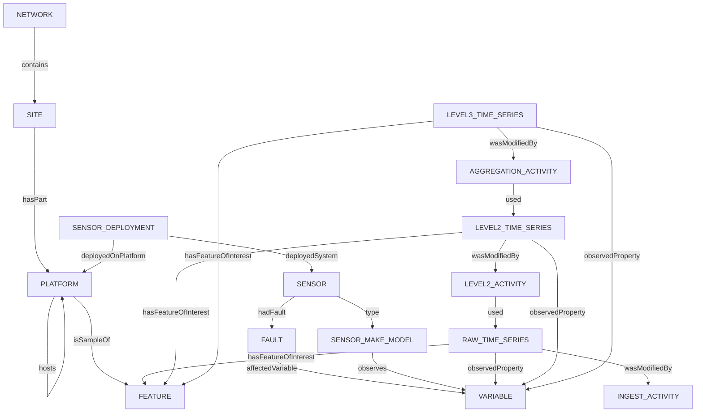
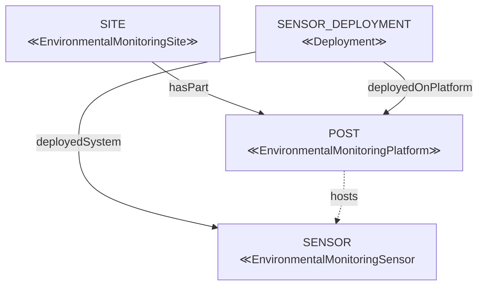
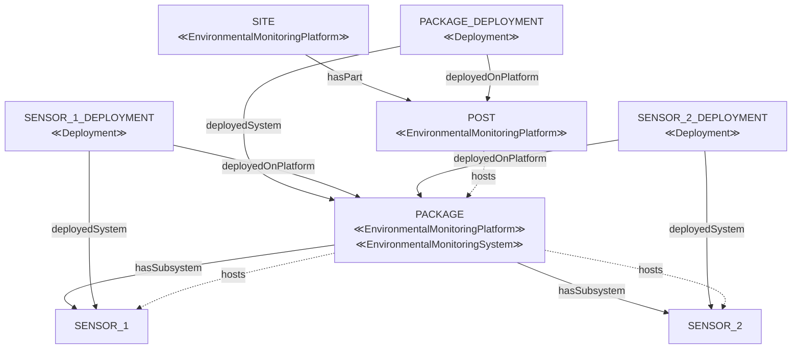
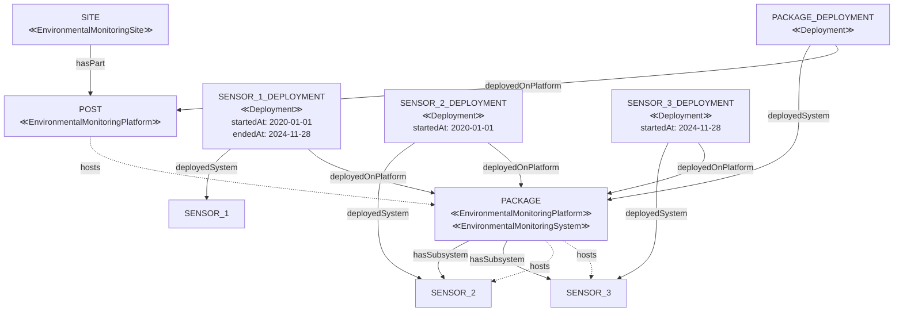
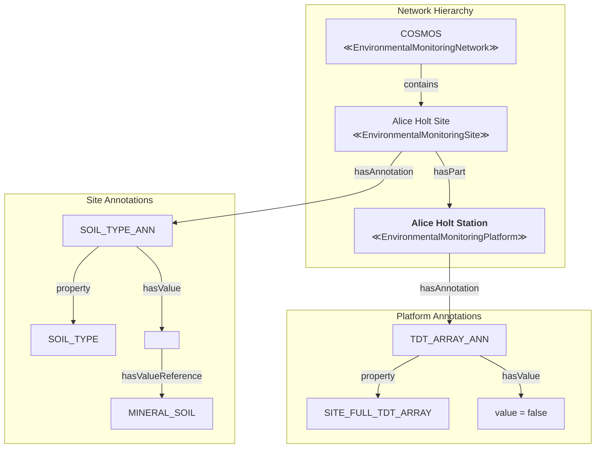
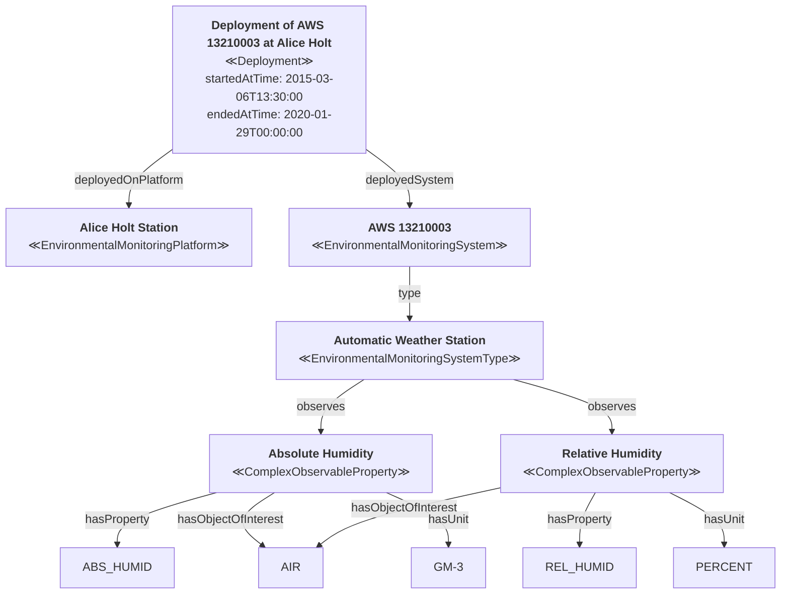
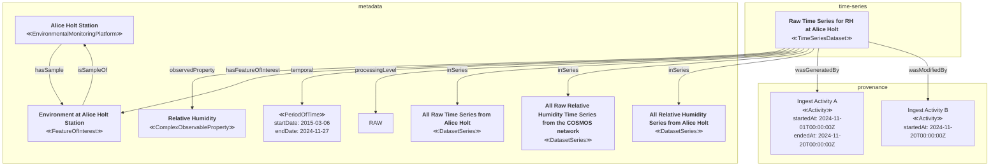
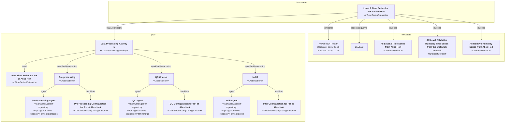

# Worked Example

## High-Level Outline

`NETWORK` - an `EnvironmentalMonitoringNetwork` such as COSMOS.
`SITE` - a single location which hosts one or more pieces of infrastructure to which sensors may be attached
`PLATFORM` - a single piece of physical infrastructure to which one or more sensors, and/or one or more other pieces of infrastructure may be attached. 
`FEATURE` - the environmental feature which is monitored by sensors on a platform.

**QUESTION**: Should the feature be attached to the `SITE` rather than the `PLATFORM`. The implication of doing that would be that we would say that the air temperature sensor on the weather post at a site and the soil temperature sensor in the ground at the same site are monitoring the same abstract notion of the "environment at the site", rather than monitoring different "environment of the weather post" and "environment of the soil monitoring station", which I think may be a level of detail too fine-grained to be useful?

## Deployments of sensors and sensor packages

### "Simple" deployment of a single sensor to a post at a site

A single sensor is affixed to a post installed at a site.
The SENSOR_DEPLOYMENT carries metadata specifying the date range of the deployment.

The `hosts` relationship is an additional, optional relationship we might include in the metadata to make discovery of all sensors which are currently deployed to the platform easier to discover.

NOTE: To accomodate projects where they may not have as much available detail about structures at a site, we could also defined `EnvironmentalMonitoringSite` to be a SOSA/SSN `Platform` which would allow it to directly host sensors and sensor packages with no intervening `EnvironmentalMonitoringPlatform`. This would also allow us to use the SOSA/SSN `hosts` relationship to relate `SITE` to `POST`, rather than `hasPart` which might make for more consistent navigation?

### "Complex" deployment of a package of sensors to a site

A package consisting of two sensors is affixed to a post installed at a site.

The POST `hosts` the PACKAGE, which in turn `hosts` the two sensors. There is a deployment record for the package of sensors, as well as separate deployment records for the sensor contained in the package.

When SENSOR_1  in PACKAGE is replaced by SENSOR_3, the deployment of SENSOR_1 ends, and the deployment of SENSOR_3 starts. The `hosts`, and `hasSubsystem` relationships between the PACKAGE and SENSOR_1 would have to be removed as it is no longer a current part of the PACKAGE, but the historic record of the use of SENSOR_1 by PACKAGE is still recorded in the SENSOR_1_DEPLOYMENT.

## COSMOS station at Alice Holt

## Automatic Weather Station at Alice Holt

An automatic weather station with serial number 13210003 was installed at Alice Holt between 06/03/2015 and 29/01/2020.

Amongst the variables the AWS reports are Absolute Humidity (Q) and Relative Humidity (RH). For clarity, other variables also reported by the system are omitted.

At the time of writing, there have been three different Automatic Weather Stations installed at Alice Holt, the most recent installation would be represented by a deployment with no `endedAtTime` value.

## Raw Absolute Humidity Time Series from Alice Holt

Each variable reported from a station is treated as a separate time series. The Raw time series represents the structured, but unprocessed observation values for the variable.

To aid in navigation of the time series datasets, the time series for this single variable is part of several dataset series:
  * all raw variable time series from the same site
  * all raw absolute humidity measures from sites in the same network
  * all absolute humidity time series from the same site (raw, infilled, aggregated)

**NOTE**: These collections are for illustrative purposes only. Other ways of partitioning the collection of datasets could be accomodated by the same model.

## Level 2 Absolute Humidity Time Series

