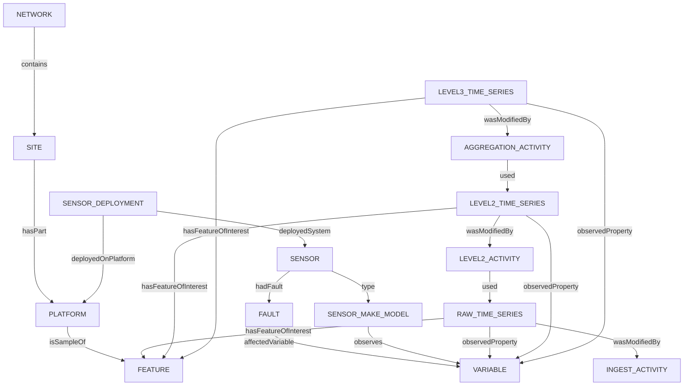

# Worked Example

## High-Level Outline

## COSMOS station at Alice Holt

## Automatic Weather Station at Alice Holt

An automatic weather station with serial number 13210003 was installed at Alice Holt between 06/03/2015 and 29/01/2020.

Amongst the variables the AWS reports are Absolute Humidity (Q) and Relative Humidity (RH). For clarity, other variables also reported by the system are omitted.

At the time of writing, there have been three different Automatic Weather Stations installed at Alice Holt, the most recent installation would be represented by a deployment with no `endedAtTime` value.

## Raw Absolute Humidity Time Series from Alice Holt

Each variable reported from a station is treated as a separate time series. The Raw time series represents the structured, but unprocessed observation values for the variable.

To aid in navigation of the time series datasets, the time series for this single variable is part of several dataset series:
  * all raw variable time series from the same site
  * all raw absolute humidity measures from sites in the same network
  * all absolute humidity time series from the same site (raw, infilled, aggregated)

**NOTE**: These collections are for illustrative purposes only. Other ways of partitioning the collection of datasets could be accomodated by the same model.

## Level 2 Absolute Humidity Time Series

