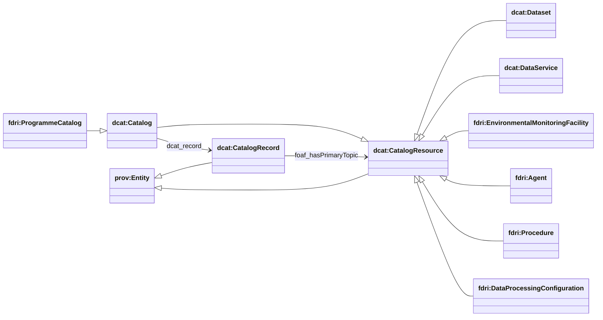
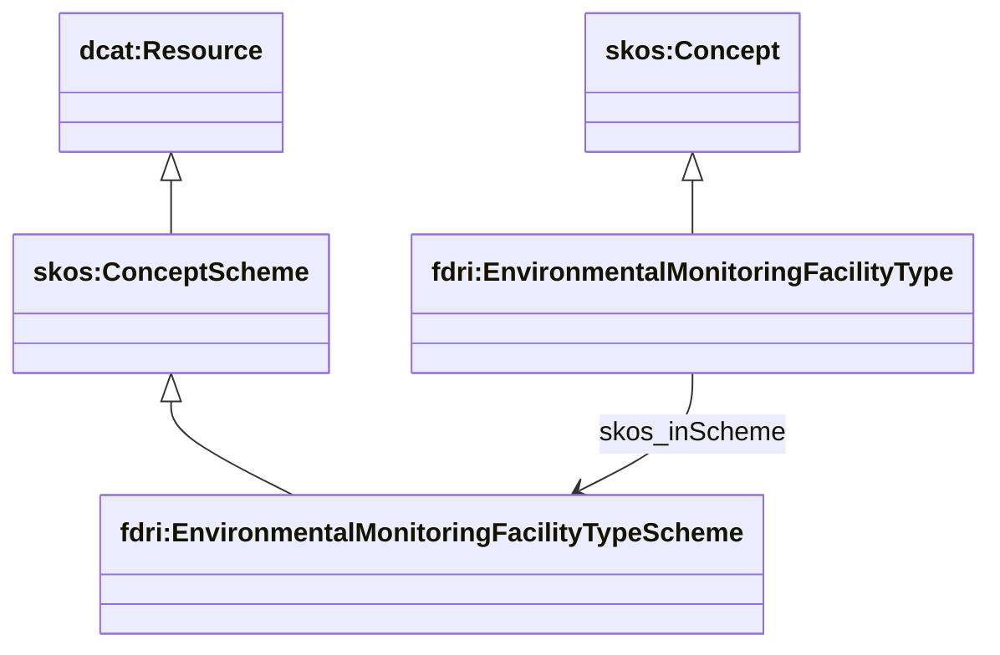
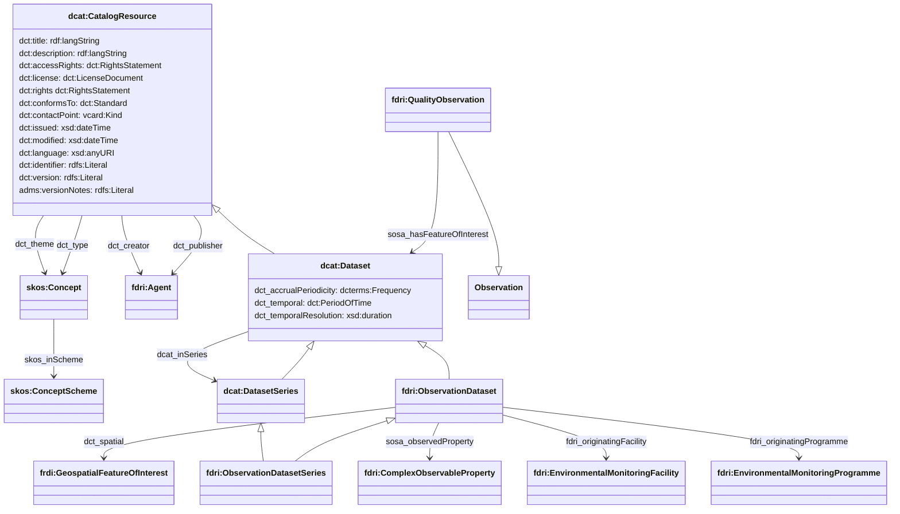

## High Level Catalog Structure

### Catalogued Items

In addition to `dcat:Dataset` and `dcat:DataService`, a subset of assets are also treated as catalog resources.
This allows a (possibly separate) cataloguing of assets such as sensors, systems (packages of sensors), platforms (e.g. vehicles, physical infrastructure on a site). Each catalogued resource has its own catalog record, which makes it possible to distinguish between activities which affect the thing from those which affect the recorded metadata about the thing.

For example an ingest process that reads a spreadsheet list of sensors would be an activity that generates/updates the *record* of the sensor; whereas an activity of maintaining a sensor would be an activity that updates the sensor itself.

> **NOTE**
> The scope of which assets are catalogued in this way is open to dicsussion.
> For example, catchment areas and regions are not currently included here as it is assumed that these might be mastered and controlled externally.

The types shown in the diagram above are just the top-level elements of the model.
More detail about these types can be found in the following sections of this document.

* `dcat:Dataset` - dataset metadata
* `dcat:DataService` - APIs for accessing data and metadata
* `fdri:EnvironmentalMonitoringFacility` - a resource which facilitates the monitoring of some aspect of the environment. Refer to [Environmental Monitoring Facility Model](emf.md) for more information.
* `fdri:Agent` - an actor which participates in activities to create, modify or use some other entities. Refer to [Provenance and Activity Model](provenance-and-activity.md) for more information.
* `fdri:Procedure` - a process that is applied to an `fdri:EnvironmentalMonitoringFaciltiy`. e.g. an installation procedure, callibration procedure or maintenance procedure.
* `fdri:DataProcessingConfigiuration` - (versioned) configuration data that applies to some portion of an FDRI data processing pipeline. See [Data Processing Configurations](data-processing-configurations.md) for more information.

### Concept Types and Concept Schemes

Reference data that is not covered by more domain-specific models (such as the EMF model) is modelled using concepts from SKOS, in particular `skos:Concept` and `skos:ConceptScheme`. We use specialisations of these two classes to denote specific types of concept and to use the model to define the appropriate place(s) where these concepts can be used.

The diagram below shows a simple example of this strucute. The type `fdri:EnvironmentalMonitoringFacilityType` is a `skos:Concept` that is used specifically to defined classes of environmental monitoring facility. The concept scheme that contains these definitions is typed as an `fdri:EnvironmentalMonitoringFacilityTypeScheme` which is a `skos:ConceptScheme` restricted to containing only `fdri:EnvironmentalMonitoringFacilityType` concepts.

For the FDRI model, a `skos:ConceptScheme` is treated as a `dcat:Resource` in a `dcat:Catalog` which provides facilities for recording additional metadata about each concept scheme.

The following table lists the subclasses of `skos:Concept` which are defined in the FDRI model.

| Concept Type | Concept Usage |
|--------------|---------------|
| `fdri:Catchment` | A catchment area under observation by some `EnvironmentalMonitoringFacility`.
| `fdri:ComplexObservableProperty` | A complex faceted type describing the properties of some `EnvironmentalDomain` which can be observed by an `EnvironmentalMonitoringSystem`. |
| `fdri:ConfigurationProperty` | A property of an environmental monitoring system which can be configured with different values (e.g. installed firmware version) |
| `fdri:ContextObject` | The context within which a `ComplexObservableProperty` is measured. |
| `fdri:EnvironmentalDomain` | The domain of the environment that an `EnvironmentalMonitoringFacility` monitors. |
| `fdri:EnvironmentalMonitoringFacilityType` | The class of an `EnvironmentalMonitoringFacility`. Direct instances of this class are intended to apply to `EnvironmentalMonitoringSite` and `EnvironmentalMonitoringPlatform`. |
| `fdri:EnvironmentalMonitoringSystemType` | The class of an `EnvironmentalMonitoringSystem`. This is defined as a subclass of `EnvironmentalMonitoringFacilityType` but is intended to capture sensor package types, broad categories of sensor and individual sensor models. |
| `fdri:LandCoverType` | The category of land cover that apply at an `EnvironmentalMonitoringSite` |
| `fdri:ObjectOfInterest` | The kind of entity measured by a `ComplexObservableProperty` |
| `fdri:ProcedureType` | The category of process that is applied to or carried out on an `EnvironmentalMonitoringSystem` (e.g. installation, calibration) |
| `fdri:ProcessingLevel` | The level of processing applied to the measurements in an `ObservationDataset`
| `fdri:Region` | The geospatial region under observation by some `EnvironmentalMonitoringFacility` |
| `fdri:RelatedPartyRole` | The role that some agent (and individual or organisation) plays in relation to an `EnvironmentalMonitoringFacility`. |
| `fdri:SensorStatus` | The operational status of an `EnvironmentalMonitoringSensor` |
| `fdri:SoilType` | The category of soil type at an `EnvironmentalMonitoringSite` |
| `fdir:ValueStatistic` | The category of aggregation applied to a set of values in order to produce an aggregate dataset e.g. mean, min, max etc. |

> **NOTE**
> There are still a number of classes where instances are used as reference data that are currently neither a `dcat:Resource` nor a `skos:Concept`. Do we need to partition these remaining classes along these lines?
> * fdri:EnvironmentalMonitoringProgramme
> * fdri:GeospatialFeatureOfInterest

### Basic Dataset Metadata

Core dataset metadata is modelled using concepts from DCAT with some extensions to capture FDRI-specific dataset types. In the diagram below only a `fdri:ObservationDataset` is shown but it is expected that this class hierarchy will be fleshed out in dialog with FDRI users and team members.

Quality metrics over datasets are modelled as `sosa:Observation` instances with a `sosa:hasFeatureOfInterest` of the `dcat:Dataset`. This means that quality metric definitions can be managed as a subset of the observed properties for FDRI. Metrics that cover a time slice of the dataset (e.g. daily data availabilty metrics) can be modelled as `sosa:Observation` with a `sosa:phenomenonTime` specifed as a `time:Interval` which defines the bounds of the slice.

Related datasets are gathered together using the DCAT `dcat:DatasetSeries` type to represent the group of datasets and the `dcat:inSeries` relation to relate a dataset to the series that it is a part of. A dataset may be in multiple series - e.g. a time-series of air temperature measurements from an FDRI weather station may be a member of a series of all measurements from that station (which may in turn be a member of a series of all measurements from the site), and may also be a member of a series of all air temperature time series from all stations in the FDRI network. Dataset series should be soft-typed with `dct:type` using a taxonomy of series types to be defined by the project to make it easy to distinguish between different types of dataset series (e.g. StationDatasetSeries, SiteDatasetSeries, NetworkDatasetSeries, NetworkVariableDatasetSeries). 

The property `fdri:originatingFacility` can be used to reference the `EnvironmentalMonitoringFacility` from which observations contained in the dataset have come. The choice of facility should be a facility  permanently associated with the observations in the dataset, so prefer the site at which the sensor equipment is located over sensors or packages which may be replaced without starting a new dataset. This property may also be used with `fdri:ObservationDatasetSeries` in which case the referenced facility should be the `EnvironmentalMonitoringSite` for a series soft-typed as `SiteDatasetSeries`, or the `EnvironmentalMonitoringStation` for series soft-typed as `StationDatasetSeries`.

The property `fdri:originatingProgramme` can be used to reference the `EnvironmentalMonitoringProgramme` from which observations contained in the dataset have come. This provides a more direct way to group datasets from the same programme than going via the `fdri:ProgrammeCatalog`

> **NOTE**
> The use of dataset-level quality metric observations can be reserved for aggregate metrics such as data availability metrics. Row-level metrics could (and arguably should) be managed in the underlying data store.

> **QUESTION**
> Do we need a cleaner separation between geospatial regions/points and abstract features of interest.

> **QUESTION**
> Other than processing level what quality observations are planned for FDRI datasets? If it is only processing level, and new kinds of observation are not planned then perhaps a direct property (on fdri:ObservationDataset) would be a better choice.

> **QUESTION**

> Is there value in subclassing `dcat:DatasetSeries`. Do we expect aggregated metadata such as a list of `fdri:programme` and `sosa:observedProperty` from the `fdri:ObservationDataset`s in a series to appear on the parent series? If we do want a subclass is it one for each subclass of `fdri:ObservationDataset` (and any other subclasses of `dcat:Dataset` we may define) or do we just want a single `fdri:DatasetSeries` class which can optionally include all of the properties required to record metadata aggregated from series members?
