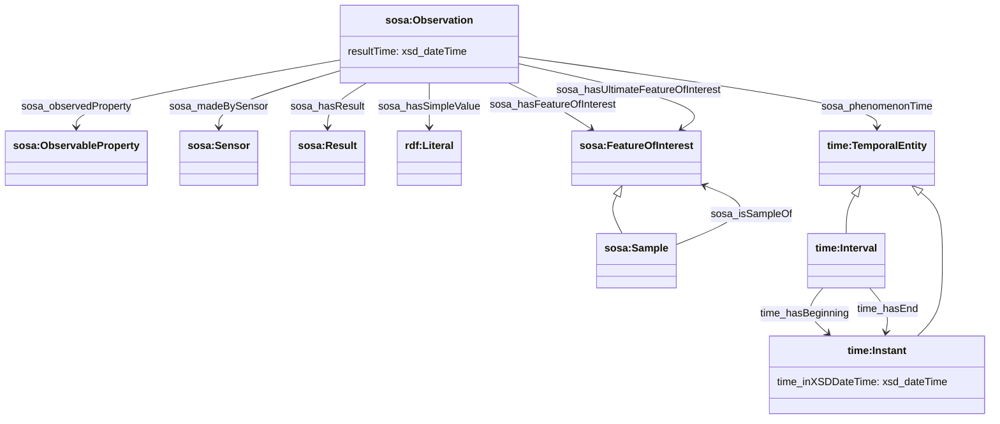
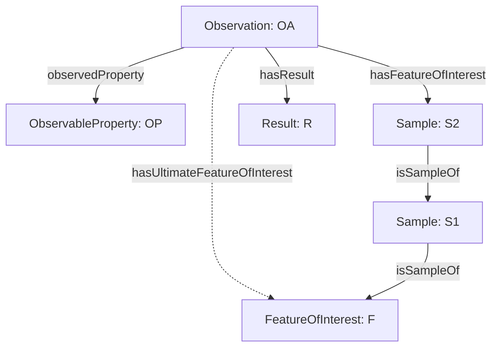
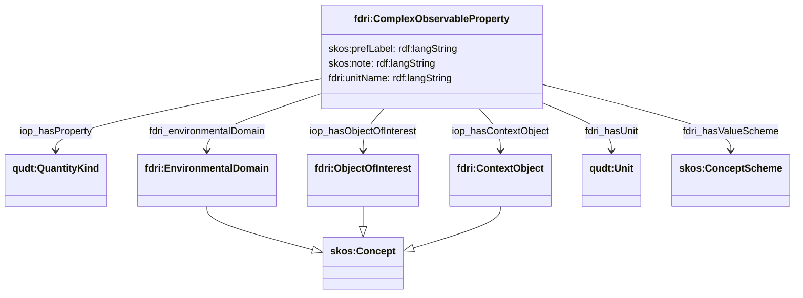

## Observations and Observable Properties Model

### Observations

Observations are modelled using the `sosa:Observation` class. An observation is a value recorded for some observable property of a feature of interest at a moment in time by a sensor. The observed phenomenon might be instantaneous or have occurred over some interval of time.

>> NOTE: Individual observations are not stored in the metadata store, but understanding the model for observations is necessary to understand how features of interest and observable properties as dataset metadata would relate to the data contained in the datasets.

>> NOTE: It is possible that quality metric observations *could* be stored in the metadata store, but if the expected volume of such metrics is too great, there is also the possibility of creating "dataset quality metrics datasets" that would be managed in the same way as the datasets that they provide metrics on. 

The feature whose property is recorded may be a sample taken from or a local representative of a wider feature. SOSA provides a `sosa:isSampleOf` relation between a `sosa:Sample` and the `sosa:FeatureOfInterest` that it samples. The `sosa:hasUltimateFeatureOfInterest` property (defined in the SOSA Extentions Working Draft) can be used to relate an observation to that wider feature. For example if a sample is taken from a water body and then analyzed in a laboratory, the direct feature of interest of the observation is the sample, but the ultimate feature of interest may be the water body (or some part of it), or even the catchment that the water body is in.

Maintaining an accurate chain of sample relationships is crucial in allowing users to drill down into exactly how a specific measurement was derived.

### Observed Property Model

For an observation record to be meaningful we need to capture many facets of the nature of thing observed. In SOSA/SSN there is some flexibility in where this information is carried:

We adopt the approach recommended by the Entrain review, and use the `FeatureOfInterest` to primarily represent location and all other facets will be carried on the `ObservableProperty`. 

Terminology and facet properties follows [i-Adopt](https://www.rd-alliance.org/group/interoperable-descriptions-observable-property-terminology-wg-i-adopt-wg/wiki/i-adopt) ([ontology](https://i-adopt.github.io/index.html)) where possible.

Complex Observable Properties are managed as Concepts in a SKOS concept and may have broader/narrower relations.
For example the COP `dissolved oxygen` might have a narrower COP `dissolved oxygen at 20 degrees centigrade`, 
and a there may be multiple sibling COP with differing units or value statistics (e.g mean daily windspeed, max daily windspeed)

| Facet | Description | Example(s) | Coding |
|---|---|---|---|
| `skos:prefLabel` | Human readable description of the property | _length of individual of species Atlantic Salmon (Salmo salar) in mm_ | langString |
| `skos:note?` | Human readable commentary if required | _derived from NFPD_ | langString |
| `iop:hasProperty` | The generic property being measured. | quantitykind:Concentration | URI for QUDT QuantityKind |
| `iop:hasObjectOfInterest` | The specific thing being measured (species, chemical etc). | Atlantic Salmon, phosphate | URI for skos:Concept in reference data |
| `iop:hasContextObject?` | Additional context to define the object of interest. Has specialised sub-property of `iop:hasMatrix` but recommend using super property | _Downstage_, _unionised-as-N_, _at-25C_ | URI for skos:Concept in reference data |
| `fdri:environmentalDomain?` | The environmental domain of the thing being measured. |
| `fdri:hasUnit?` | Unit of measure of the result | 	unit:CubicMeterPerSecond | URI for QUDT unit |
| `fdri:unitName?` | Textual representation of the unit for convenience | m3/s | string |
| `fdri:hasValueScheme?` | The concept scheme from which values of this property may be drawn. This property should be defined when the value Complex Observable Property is a category or classification. | | URI of the SKOS Concept Scheme
| `skos:broader?` |
| `skos:narrower?` |
| `skos:exactMatch?` | Optional links to equivalent concept in other schemes, other SKOS match types maybe be used if appropriate | | URI |

> **NOTE**
> [#35](https://github.com/NERC-CEH/fdri-discovery/issues/35) resolved that the facet for EnvironmentalDomain should be on `ComplexObservableProperty` rather than on the `GeospatialFeatureOfInterest`.