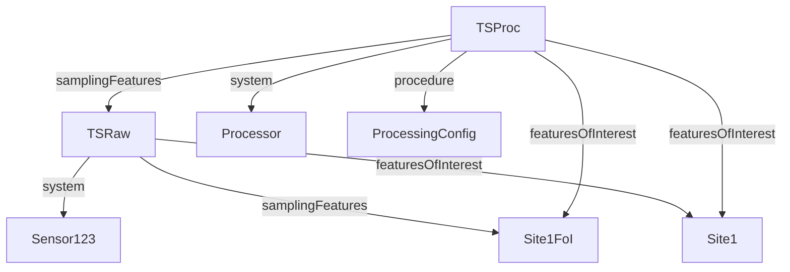

# OGC Connected Systems API Specification and FDRI Model

## Introduction

This section discusses how the proposed FDRI metadata model might be aligned with the [OGC Connected Systems API standard](https://ogcapi.ogc.org/connectedsystems/). 

> [!NOTE]
> The OGC standard specification is currently (as of 2024-11-11) in draft, and its data model and requirements may change which may impact the validity of the discussion here. The version-controlled versions of the specification documents accessed are [version 23-001r0](https://docs.ogc.org/DRAFTS/23-001r0.html) and [version 23-002r0](https://docs.ogc.org/DRAFTS/23-002r0.html).

For brevity, this document does not go into detail about the content of the OGC specification. It is assumed that the reader has read (or has access to read) the two specification documents linked to above.

## Part 1 Type Mappings

Part 1 of the OGC specification focusses on the description of the systems that measure properties of features of the environment, the properties measured and the features observed. It reuses many concepts from SOSA/SSN and so has a fairly close alignment to the proposed FDRI model.

The diagram below, taken from the OGC spec, shows the relevant types. Types defined in Part 2 are shown with dotted outlines.

| OGC Type | FDRI Type | Comments
|----------|-----------|----------|
| Feature           | Region | Scope of Feature in OGC is quite wide. Sampling Feature (listed below)is a subtype of Feature |
|                   | Catchment | |
|                   | EnvironmentalMonitoringSite | |
| Deployment        |
| System            | EnvironmentalMonitoringPlatform | System Type = Platform
|                   | EnvironmentalMonitoringSystem | systemType = System
|                   | EnvironmentalMonitoringSensor | systemType = Sensor
| Procedure (SystemKind) | EnvironmentalMonitoringSystemType | SystemKind
|                   | EnvironmentalMonitoringFacilityType | Possibly not all values are mappable to Procedure
| Procedure         | Procedure |
| Property          | Variable |
| Sampling Feature  | GeospatialFeatureOfInterest |

## Part 2 Type Mappings

NOTE: For the purpose of this discussion we limit our mappings to those related to observations and ignore actuations and events which currently have no equivalence in the FDRI data model.

| OGC Type | FDRI Type | Comment |
|----------|-----------|----------|
| DataStream | ObservationDataset | This is a partial mapping, the implication in OGC is that observations are a required child resource of DataStream, whereas in FDRI the ObservationDataset is a record of the existence of the data, not the collection of data itself. 
|            | TimeSeriesDataset |
| Observation | | No direct mapping in FDRI as the model is not intended to store observations. There is an indirect mapping to the SOSA/SSN Observation type.

## Model extensibility

The OGC API schema definitions are open, so additional properties can be added to the JSON to cover domain-specific metadata.

## Missing from OGC

### Provenance

The OGC specification does not directly addresss provenance information for datasets.

It might be possible to map a process such as in-fill to `System` (OGC spec does specify that a System may be a process) with a `Procedure` that captures what kind of processing is applied. This is illustrated in the diagragm below with a processed datastream (`TSProc`) being created by the application of the `ProcessingConfig` by a `Processor` system on the raw datastream `TSRaw` generated by the sensor `Sensor123`. Note that the direct feature of interest  (`samplingFeature`) of the raw stream is the directly measured environmental feature, whereas the direct feature of interest of the processed data stream is the raw datastream. This implies that a `TSRaw` is both a `DataStream` and a `Feature` which may be incompatible with the OGC scheme (although OGC does allow resources to have multiple types)

### Sensor interventions

Installation and replacement could be covered by Deployment, but calibration and cleaning do not have any equivalence in the OGC API.

### Data Processing Configurations

Potentially these could be modelled as procedures. The precise modelling and how it can be applied to data processing agents would depend on the related issue of representing dataset provenance relations.