## Programme Catalog Structure

The fine-grained metadata store will maintain a separate `fdri:ProgrammeCatalog` for each environmental monitoring programme that provides data through FDRI.

`fdri:ProgrammeCatalog` extends `dcat:Catalog` to capture configuration information regarding the metadata stored for a particular `ef:MonitoringProgramme`. This configuration information defines the concept schemes, observed properties and annotation properties used in the metadata structures for the programme and allows these to vary on a per-programme basis as needed.

```mermaid
classDiagram
direction LR
class Catalog["dcat:Catalog"]
class ProgrammeCatalog["fdri:ProgrammeCatalog"]
class Programme["ef:MonitoringProgramme"]
Catalog <|-- ProgrammeCatalog
ProgrammeCatalog --> Programme: fdri_programme
ProgrammeCatalog --> ComplexObservablePropertyScheme: fdri_observedPropertyScheme
ProgrammeCatalog --> ComplexObservablePropertyScheme: fdri_annotationPropertyScheme
ProgrammeCatalog --> RegionScheme: fdri_regionScheme
ProgrammeCatalog --> CatchmentScheme: fdri_catchmentScheme
ProgrammeCatalog --> ConfigurationPropertyScheme: fdri_configurationPropertyScheme
ProgrammeCatalog --> EnvironmentalMonitoringFacilityTypeScheme: fdri_monitoringFacilityTypeScheme
ProgrammeCatalog --> EnvironmentalMonitoringFacilityTypeScheme: fdri_monitoringSystemTypeScheme

```

### Scheme Properties

| Property | Value  |
|----------|--------|
| fdri:observedPropertyScheme | The list of observed properties which are measured by the programme. |
| fdri:annotationPropertyScheme | The list of metadata annotations which may be used in the metadata records for sites, stations and sensors associated with this programme. |
| fdri:regionScheme | The list or hierarchy of geographic regions covered by this programme.
| fdri:catchmentScheme | The list or hierarchy of hydrographic catchment areas covered by this programme.
| fdri:configurationPropertyScheme | The list of sensor (or system) configuration properties applied to the sensors (or systems of sensors) used by this programme.
| fdri:monitoringFacilityTypeScheme | The scheme of concepts that define types of network sites and stations participating in the programme.
| fdri:monitoringSystemTypeScheme | The scheme of concepts that define the types of sensors and sensor systems used by the facilities that participate in the programme.

> **NOTE**
> There are no maximum cardinality constraints on these scheme refernce properties, allowing them to be repeated to indicate that values may come from several different concept schemes.

> **NOTE**
> For this release of the model we have decided that the schema should not mark any of these properties as required. As we establish more concretely how the properties will be used by downstream applications we can tighten constraints and mark some properties as required in future releases.

> **QUESTION**
> Should we also include some of the indirectly used concept schemes here too? For example to COP will use concepts from an `fdri:ObjectOfInterestScheme` and an `fdri:ContextObjectScheme`. I feel that it might be cleaner to just specify the schemes that define our extension points directly (COP, annotations, regions, catchments and configuration properties) and leave out the indirect ones.

> **QUESTION**
> Now that there is a mechanism for annotations do we want to drop the specific catchment and reigon relations in favour of using annotations for those instead? If we do that though, how do we identify those annotation properties that provide geospatial information for resources?

### Other Properties

| Property | Value |
|----------|-------|
| fdri:programme | References the `ef:MonitoringProgramme` whose observations are recorded as datasets in this catalog.