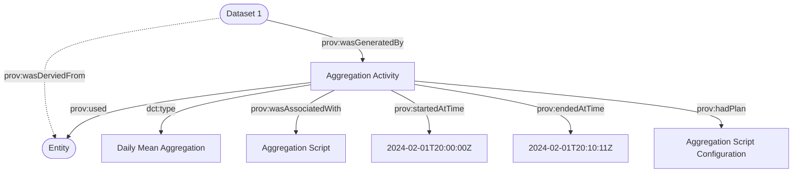
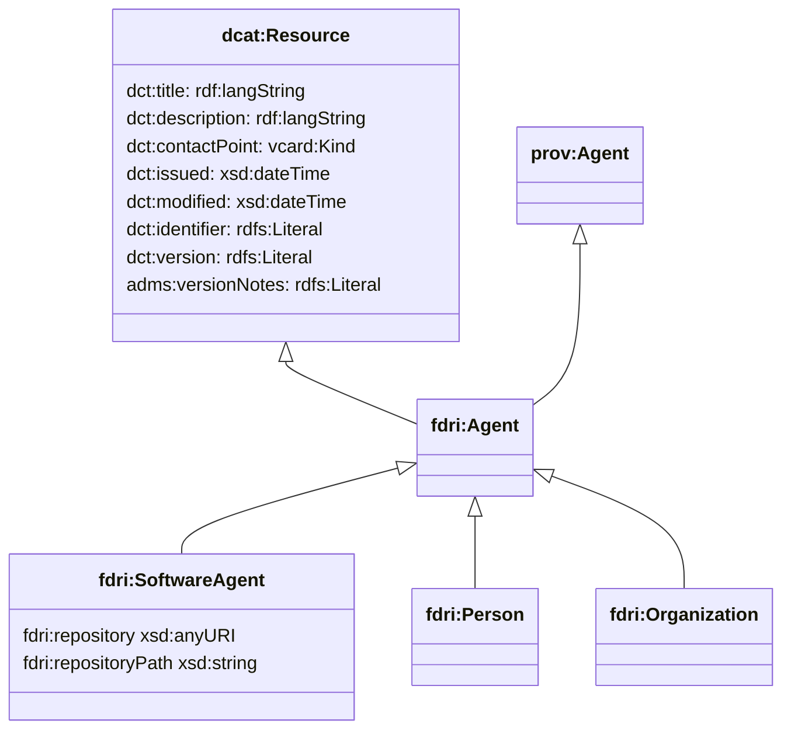

## Provenance and Activity Model

The core model will use the PROV-O ontology to record details of activities, their inputs and their outputs.
Activities related to datasets would include processes such as data ingestion, quality checking, quality improvement, statistical derivation and so on. Activities can also be related to other assets, e.g. the installation of an asset, the repair or replacement of an asset, the decomissioning of an asset and so on.

We recommend using unqualified provenance relationships and a simple taxonomy of activity types. For example the derivation of one dataset from another could be modelled as:

> **NOTE**
> In situations where the ingest is streaming/near-realtime it might make sense to have an open-ended Derivation and Ingest Activity which are only ended when the stream is closed or the ingest software agent updated. If so then it might be worth adding a notion of a run log (timestamp and log pointer) structure that can be appended to an open activity for each run instance.

### PROV-O extension properties

PROV-O defines entity to activity relations only for generation(`prov:wasGeneratedBy`) and invalidation(`prov:wasInvalidatedBy`). To model the case where an activity extends or otherwise modifies an existing dataset without creating a new dataset instance, we add `fdri:wasModifiedBy` as a subproperty of `prov:wasInfluencedBy`.

### Model for Agents

The model for agents is deliberately kept simple and inherits from `dcat:CatalogResource`. By implication, the metadata catalog will track individual agents that are involved in activities that update catalog resources.

> **QUESTION**
> The assumption made here is that the metadata store is required to track information for both software agents *and* people and organisations and that this will be done by treating all such agents as resources in the metadata catalog. Is this a valid assumption, or do we in fact only need to track software agents as catalog resources - in which case we can use prov:Person and prov:Organisation directly and don't need the `fdri` namespaced types.

Note that `dcat:Resource` already has a property (`dct:contactPoint`) which can be used to capture contact details for `prov:Person` and `prov:Organization` resources.

`dcat:Resource` also provides a `dct:version` property which can be used to capture the version of a software agent as well as `dct:issued` and `dct:modified` for tracking when a software release was made, and `adms:versionNotes` for capturing software release notes. We add the `fdri:repository` property to provide an explicit property for capturing a link to a version control repository.

If additional software agent metadata should be captured, this model could be extended but it should be noted that each additional piece of metadata will need to be reported through to the metadata system by the workflow system, and assuming an appropriate version control system is already in place for managing software versions and releases, we should not be seeking to replicate all of that metadata in the FDRI catalog.

### Model for Software Agent Configuration

The configuration used by an agent for an activity is captured by the `prov:hadPlan` property on the activity resource. The modelling for software agent configurations is discussed in more detail in [Data Processing Configurations](data-processing-configurations.md).