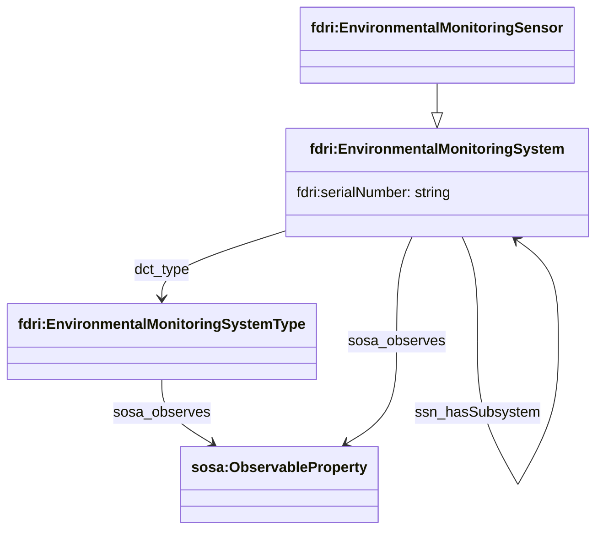
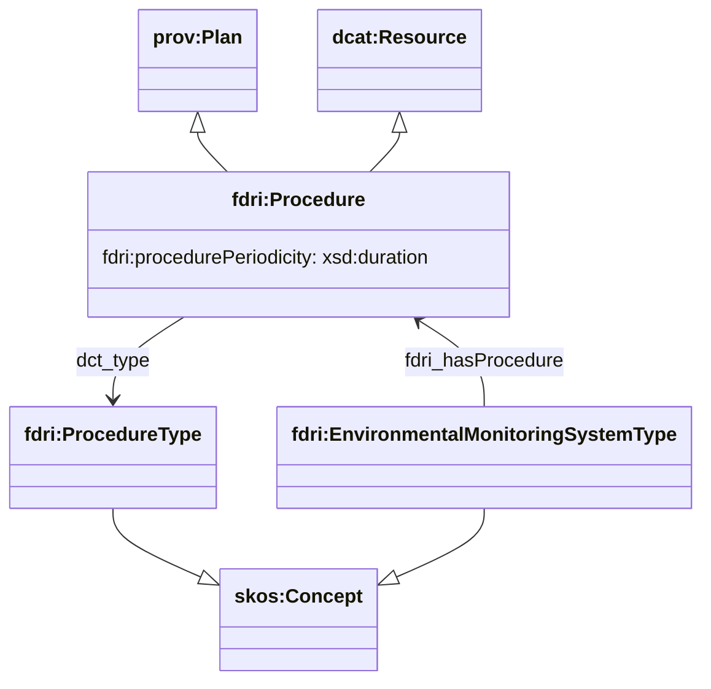
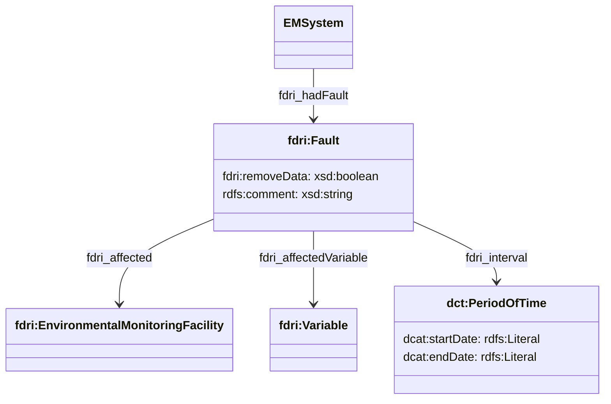
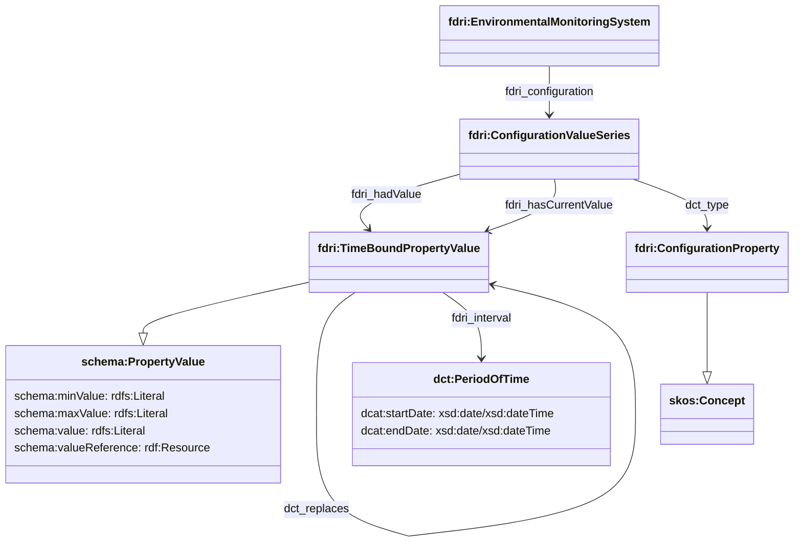
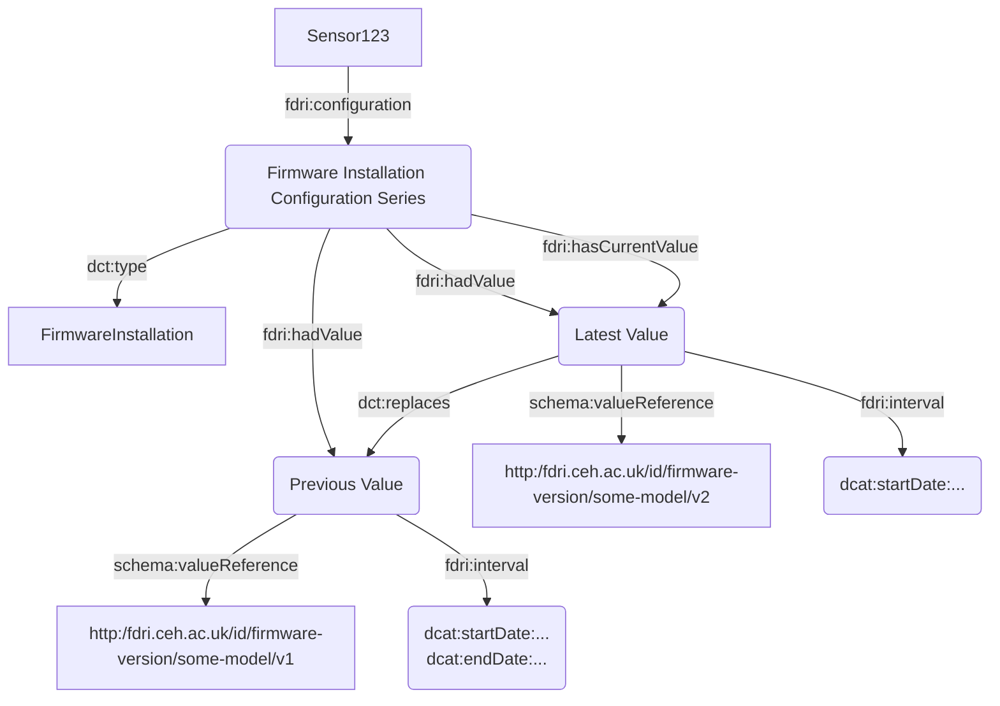
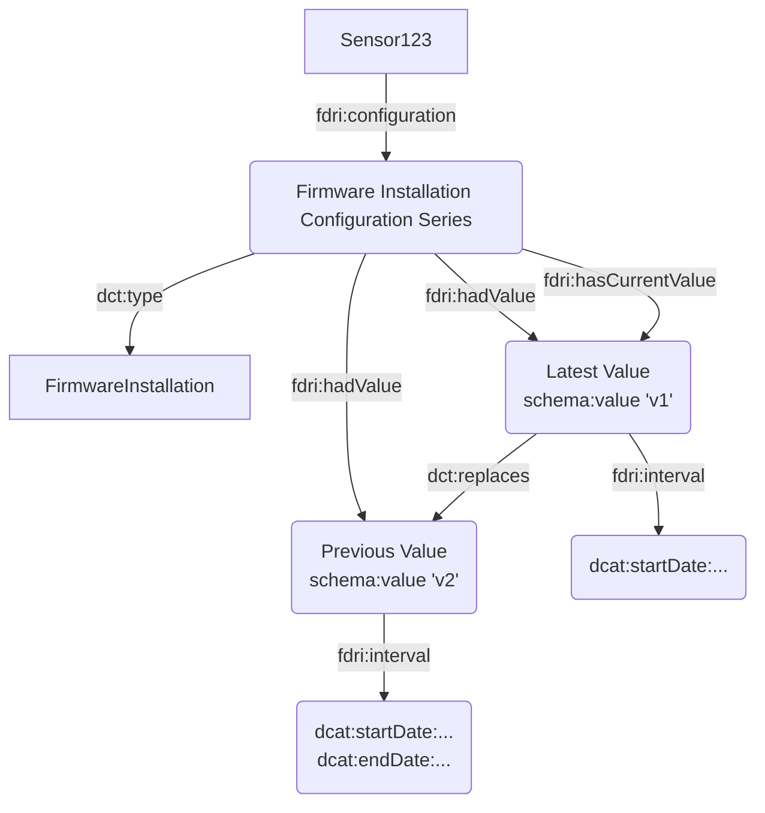
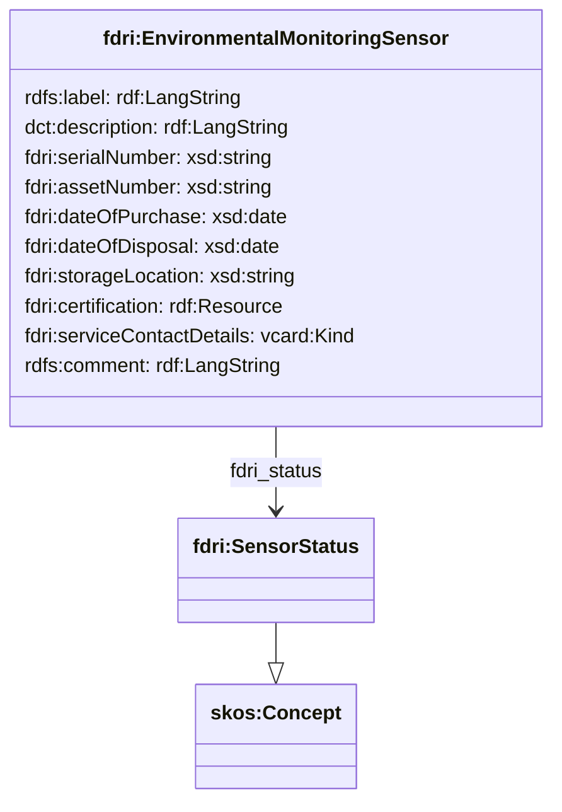
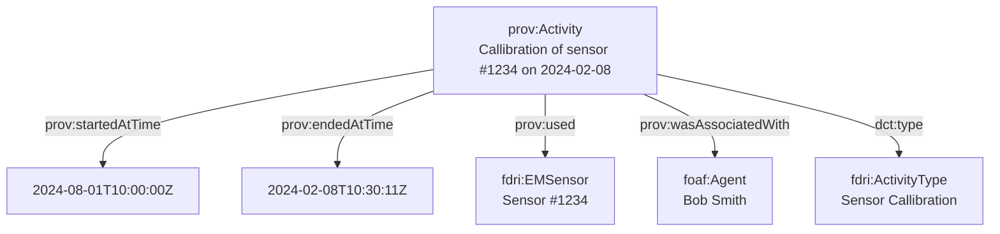

  ## Sensor / System Model

This area of the model is concerned with defining sensor packages, models of sensor used and related procedures as well as the relationship to deployed instances of specific packages/sensors.

`EnvironmentalMonitoringSystemType` is intended to be used to capture specific pre-defined packages of sensors or sub-systems. e.g. `FDRI Weather Station Sensor Package`, `FRDI Precipitation Station Sensor Package`, as well as specific models of Sensor e.g. `TFA 30-3121 Temperature Sensor`. The `dct:hasPart` relation is used to construct part-whole relations between a system/package and its components. Although not shown in this diagram, `fdri:EnvironmentalMonitoringSystemType` is defined as a subclass of `skos:Concept`.

`fdri:EnvironmentalMonitoringSensor` is intended to capture a specific physical instance of some type of sensor. It is defined to extend `sosa:Sensor`. 

`fdri:EnvironmentalMonitoringSystem` is intended to capture packages of multiple sensors. 

The `dct:type` relation relates a `fdri:EnvironmentalMonitoringSensor` or `fdri:EnvironmentalMonitoringSystem` to the `fdri:EnvironmentalMonitoringSystemType` that represents the package build or sensor model.

An `fdri:EnvironmentalMonitoringSystemType` represents a model of sensor, or a package of specific models of sensor. It can be related to the observable property/ies it provides measurements for using the `sosa:observes` property.

### Sensor / System Procedures

`fdri:ProcedureType` is intended to capture categories of procedure, e.g. `Installation Procedure`, `Calibration Procedure` etc. The class `fdri:Procedure` is used to represent the procedure that applies to a specific system. `fdri:Procedure` is defined as a subclass of `prov:Plan`, enabling it to be used in relation to `prov:Activity` instances that represent the installation or calibration of a sensor or pacage of sensors. The class is also defined as a subclass of `dcat:CatalogResource` allowing all procedures to be recorded in a procedures catalog,  The property `procedurePeriodicity` may be used to capture the recommended/required period between applications of the procedure to a given sensor.

### Sensor / System Faults

A record of a system fault relates the affected `EnvironmentalMonitoringFacility` to one or more parameters which are affected by the fault. 

A fault is a time-bounded event and so has a related interval with start and end date/date-times. The range of `dcat:startDate` and `dcat:endDate` is specified in DCAT as one of the following XSD datatypes `xsd:gYear`, `xsd:gYearMonth`, `xsd:date`, or `xsd:dateTime` .

The fault is understood as affecting all observations of the specified `Variable` made by the system during the specified interval. Multiple `Variable` instances may be specified on a single fault.

The `removeData` flag is set to true to indicate that affected observations should be removed from the data.

### Sensor Configuration

Each configuration property of a sensor is represented as a collection of time-bounded property values. 

The `dct:type` property is used to relate a `ConfigurationValueSeries` to a `skos:Concept` that speficies the configured sensor property. This approach uses a taxonomy of configuration properties to capture the different ways in which a sensor could be configured which may provide greater flexibility in adapting the model to new sensor types with novel configuration properties than an approach based on using semantic relationships defined in the domain model.

The `fdri:hasValue` property relates the `ConfigurationValueSeries` to a collection of `TimeBoundValueProperty` instances representing the different values of the configured property through time (excluding the current value).

The `fdri:hasCurrentValue` property relates the `fdri:ConfigurationValueSeries` to the `fdri:TimeBoundPropertyValue` that represents the configuration value that currently applies to the sensor.

On each `fdri:TimeBoundPropertyValue`, the `fdri:interval` property specifies the period over which the configuration applies and the `fdri:value` property specifies the configuration value applied. By inheriting `fdri:TimeBoundPropertyValue` from `schema:PropertyValues` we can support single values, value ranges and references to other resources as the value of a configuration.

An ordering of `fdri:TimeBoundPropertyValue` instances could additionally be modelled using the `dct:replaces` relationship with each value referencing its immediate predecssor.

> **NOTE**
> The preceding is based on the assumption that there is a need for the metadata store to retain historical configuration information. If there are no motivating use cases for this then the structure could be significantly simplified.
 

> **TODO**
> If we decide that the different time-bound property series of an `EnvironmentalMonitoringSite` can be captured in a soft-typed property value type, then reuse that type here rather than introduce `ConfigurationValue`

The diagram below shows how this structure can be used to capture the
use of a specific version of firmware on a sensor with the firmware version identified by use of a URI

The same configuration value could also be captured as a string value if there is no registry of firmware versions that an identifier could resolve to:

### Sensor Metadata

Metadata relating to a physical instance of a sensor can be modelled as properties of the `fdri:EnvironmentalMonitoringSensor` instance.

> **QUESTION**
> Should any/all of this metadata appear on `EnvironmentalMonitoringSystem` ?

> **QUESTION**
> Would we prefer the flexibility of soft-typed property values here rather than modelling a set of direct properties?

> **QUESTION**
> Should any of these properties be captured as value series to track historical changes?

### Sensor Deployment

Deployment history can be constructed from the SOSA model, by following `ssn:deployedSystem` back from the System to the Deployment(s) the system had. Such a traversal may also follow `ssn:hasSubsystem` relations to include deployments in which the system in question was one part of a larger package.

### Sensor Maintenance Activities

Interventions made on a sensor, such as callibration or repair can be modelled as PROV-O activities which can also be used to capture information such as the individual or organisation undertaking the procedure.

> **NOTE**
> If there is more of a one to many relationship between recorded activities and the interventions on systems/sensors (e.g. a single site visit by an engineer results in the callibration of 6 sensors, the cleaning of 2 and the replacement of 2 others), then this might be better modelled using the full qualified version of PROV-O, possibly with a custom subclass of `prov:Activity` for maintenance

> **QUESTION**
> Replace prov:used with a more meaningful relationship such as `affected` or `appliedTo` to relate the activity to the system affected by the activity.