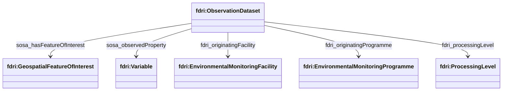
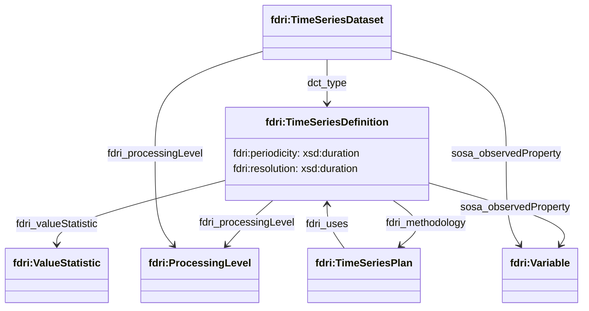
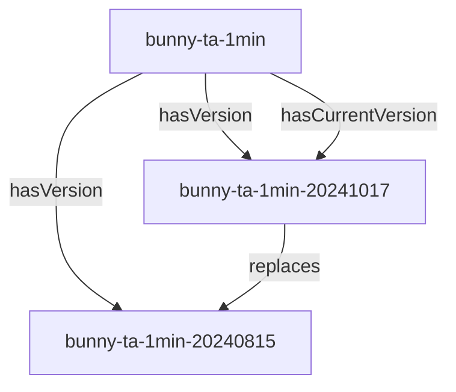

## Observation Dataset Model

`fdri:ObservationDataset` is defined as a subclass of `dcat:Dataset` and is intended to represent the class of datasets providing environmental observations.

`fdri:ObservationDataset` has the following properties:

* `sosa:hasFeatureOfInterest` relates the dataset to the feature(s) in the environment that the dataset provides observations on.
* `sosa:observedProperty` relates the dataset to the variable(s) that the dataset provides values for.
* `fdri:originatingFacility` relates the dataset to the facility or facilities that contribute some or all of the measurements recorded in the dataset.
* `fdri:originatingProgramme` relates the dataset to the monitoring programme or programmes that contribute some or all of the measurements recorded in the dataset (this may be indirectly, via some facility which is part of the programme).
* `fdri:processingLevel` specifies the level of data processing that has been carried out on the data in the dataset.

## Time-Series Dataset Model

An `fdri:TimeSeriesDataset` is defined as a subclass of `fdri:ObservationDataset` with some additional properties to convey any statistical aggregation applied to the observations in the dataset.

An `fdri:TimeSeriesDataset` represents a dataset that consists of a time-series of observations of a single variable by some `fdri:EnvironmentalMonitoringFacility`, the time series itself is soft-typed (using `dct:type`) by an `fdri:TimeSeriesDefinition`, which in turn has the following properties:

* `fdri:processingLevel` a reference to the concept that defines the level of data processing applied to the time series. This property is repeated on `fdri:TimeSeriesDataset` to ensure consistency with the `fdri:ObservationDataset` base class.
* `sosa:observedProperty` a reference to the `fdri:Variable` that defines the measurement being captured by the dataset. This property is repeated on `fdri:TimeSeriesDataset` to ensure consitency with the `fdri:ObservationDataset` base class.
* `fdri:valueStatistic` a reference to the concept that defines the type of statistical processing applied to produce the values contained in the dataset.
* `fdri:methodology` a reference to the `fdri:TimeSeriesPlan` which documents the method by which the dataset is produced. Where a time series is produced by derivation from one or more input time series, the `fdri:uses` relation relates the `fdri:TimeSeriesPlan` to the input time series.
* `fdri:periodicity` specifies the maximum period between recorded observations in the time series
* `fdri:resolution` specifies the temporal resolution of the monitoring of the environmental feature that was used to derive the aggregated values contaied in the time series dataset. 

> **NOTE**
> The existing DCAT property `dcat:temporalResolution` is not used as it is defined as a minimum spacing between observations, whereas in FDRI the `fdri:periodicity` is the *maximum* spacing between observations.

### Time-Series Dataset Versioning

For each time-series, there is a dataset resource representing the time-series (the "versioned dataset") and a separate resource for each version of the time-series (the "dataset version"). A new version is created whenever a new processing pipeline is applied to the raw data and each version of the time series will have a different DOI.

> **QUESTION**
> Does this proposal align with the processing architecture?
> What context does a processing agent have when it processes the upstream dataset.

> **QUESTION**
> What metadata is strictly consistent across versions? This might be metadata that is stated only on the versioned dataset and not restated on each dataset version.

> **QUESTION**
> Are raw datasets treated as versioned datasets or just as a single unversioned dataset that is monotonically increasing in size?

> **QUESTION**
> DCAT is relatively relaxed about version relationships and so we can have one TimeSeriesDataset as a version of another. However this could potentially get confusing and makes it slightly harder to filter a query to only return the top level versioned datasets (though these would be the only dataset resources with a `hasCurrentVersion` property on them). Should we consider adding `TimeSeriesDatasetVersion` to represent the dataset versions and introduce additional constraints so that a `TimeSeriesDatasetVersion` resource cannot itself have versions.
