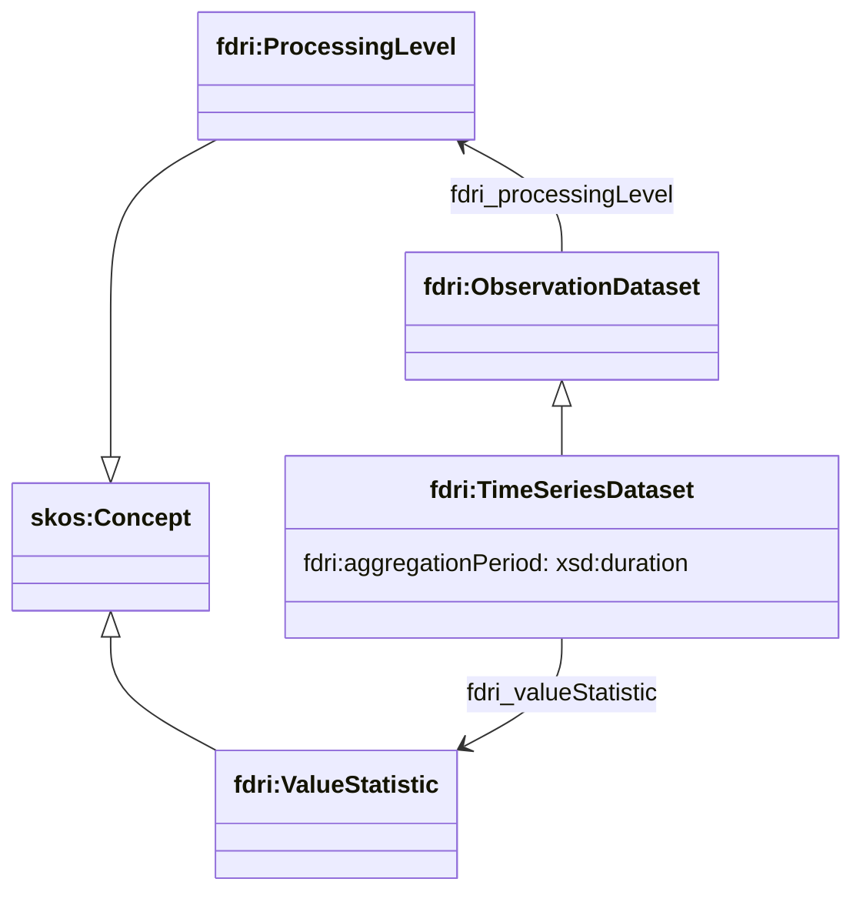
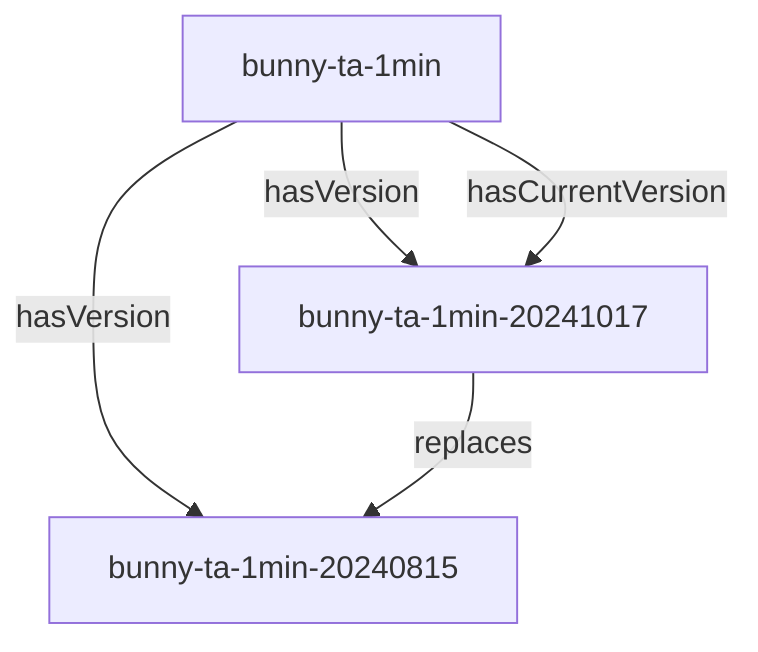

## Time-Series Dataset Model

An `fdri:TimeSeriesDataset` is defined as a subclass of `fdri:ObservationDataset` with some additional properties to convey any statistical aggregation applied to the observations in the dataset.

`fdri:ObservationDataset` is the base class for representing datasets of environmental observations. The property `fdri:processingLevel` relates the dataset to a concept which describes the level of quality processing that has been applied to the data in the set. These levels are described as SKOS concepts in a simple concept scheme.

An `fdri:TimeSeriesDataset` which represents a series of aggregated measurements will use the `fdri:aggregationPeriod` and `fdir:valueStatistic` properties to specify the aggregation applied to the source data.

The `fdri:valueStatistic` property relates a the dataset to a concept which describes an aggregation method (e.g. min, max, mean etc.). The `fdri:aggregationPeriod` property specifies the period over which the aggregation method applies for each observation in the `fdri:TimeSeriesDataset`.

> **QUESTION**
> Is the notion of an aggregated TimeSeriesDataset useful enough to warrant a separate RDFS class ?

> **QUESTION**
> Should we instead use the existing DCAT property `dcat:temporalResolution` to specify the aggregation period?

### Time-Series Dataset Versioning

For each time-series, there is a dataset resource representing the time-series (the "versioned dataset") and a separate resource for each version of the time-series (the "dataset version"). A new version is created whenever a new processing pipeline is applied to the raw data and each version of the time series will have a different DOI.

> **QUESTION**
> Does this proposal align with the processing architecture?
> What context does a processing agent have when it processes the upstream dataset.

> **QUESTION**
> What metadata is strictly consistent across versions? This might be metadata that is stated only on the versioned dataset and not restated on each dataset version.

> **QUESTION**
> Are raw datasets treated as versioned datasets or just as a single unversioned dataset that is monotonically increasing in size?

> **QUESTION**
> DCAT is relatively relaxed about version relationships and so we can have one TimeSeriesDataset as a version of another. However this could potentially get confusing and makes it slightly harder to filter a query to only return the top level versioned datasets (though these would be the only dataset resources with a `hasCurrentVersion` property on them). Should we consider adding `TimeSeriesDatasetVersion` to represent the dataset versions and introduce additional constraints so that a `TimeSeriesDatasetVersion` resource cannot itself have versions.
