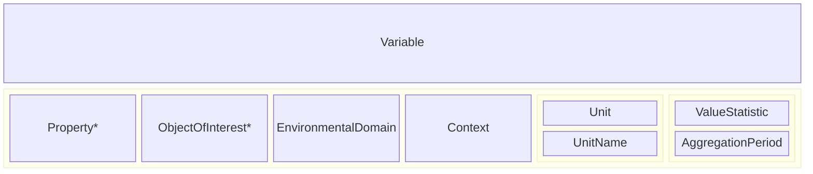
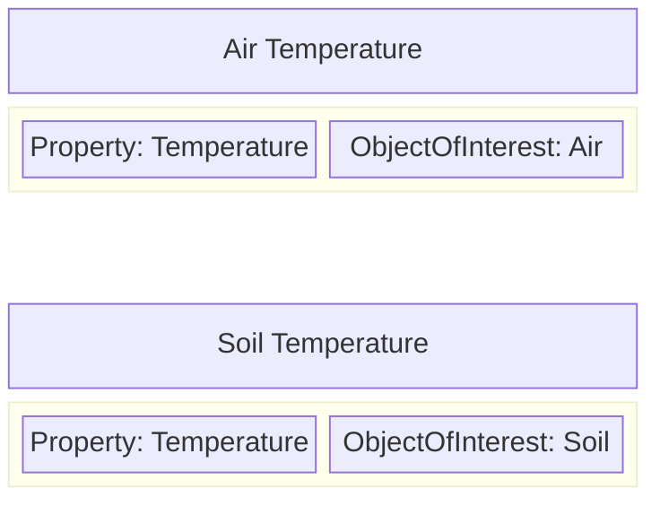
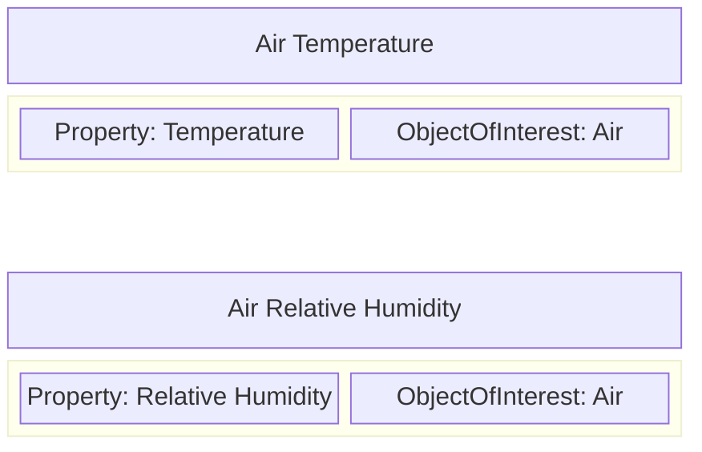

# Variables

A `Variable` is a "description of something observed or derived, minimally consisting of an ObjectOfInterest and its Property" (taken from the description of the [I-Adopt ontology](https://i-adopt.github.io/ontology/#/Variable) upon which this part of the modelling is based).

The purpose of the `Variable` is to provide a structured way to capture information about what observations are recorded in environmental datasetes and to attempt to provide some commonality in descriptions across multiple projects. By describing datasets in terms of the `Variables` that they provide measurements for, we can improve discoverability and help users more quickly locate related datasets within the FDRI catalog.

The description of a Variable consists of multiple facets. Only the facets marked with an asterisk(*) are required. Those shown in groups are co-dependent and when one is present the other is recommended to provide context.

## Property

The Property facet represents the abstract characteristic of the object of interest that is measured by the Variable. Some examples:

* Temperature
* Relative Humidity
* Depth

These properties should be gathered into a shared reference vocabulary and where possible it is recommended to relate properties to [QUDT QuantityKind](https://www.qudt.org/doc/DOC_VOCAB-QUANTITY-KINDS.html) instances.

## ObjectOfInterest

The ObjectOfInterest facet represents the class of thing whose property is measured by the Variable. e.g.

* Air
* Soil
* Longwave Radiation
* Wind

With just Property and ObjectOfInterest we can construct simple Variables which share the same property facet, but differ in the object of interest:

Equally we can construct simple Variables that share the same ObjectOfInterest but differ in the property observed:

Through this reuse of vocabulary terms it is possibel to create networks of related variables and to construct more complex shared vocabularies (of variables), from more simple building blocks (properties and objects of interest).

## EnvironmentalDomain

The EnvironmentalDomain facet can be optionally used to relate a Variable to the broad domain(s) of environmental study to which the variable belongs. Examples of environmental domain include:

* Atmosphere
* Lithosphere
* Hydrosphere

## Context

The Context facet relates a Variable to concepts which provide additional background information regarding the object of interest. Examples of context include:

* in CNRS tube (contextualising an air temperature reading)
* at 20cm depth (contextualising a soil temperature reading)
  
> [!NOTE]
> In the current iteration of the sample data, there are no longer distinct Variables for soil properties measured at different depths.

> [!NOTE]
> [I-Adopt](https://i-adopt.github.io/ontology/) also provides a more specific `hasMatrix` property for contextualising the container of the object of interest which might be more properly used for the CNRS tube example above. It also provides a separate `hasConstraint` property for specifying constraints on the thing being measured which might be more properly used for the soil depth example above. Some further discussion and investigation into the current practice within NERC and the wider community is required.

## Unit and Unit Name

The Unit property relates a Variable to a concept that describes the units in which the measurement is expressed. Examples include:

* hecto-Pascal
* metres per second
* percent
* unitless (e.g. for ratios or for classification observations)

Where a unit is specified, the unit name property SHOULD also be specified providing a default display string for rendering a value with its units.

It is strongly recommended to use a common vocabulary for expressing units. The [QUDT unit vocabulary](https://www.qudt.org/doc/DOC_VOCAB-UNITS.html) provides a wide range of units as a controlled vocabulary.

## Value Statistic and Aggregation Period

Where a recorded observation is the result of the aggregation of multiple values over some time period, the Value Statistic facet can be used to relate the Variable to a concept representing how the input values are aggregated to produce the recorded measurement. Examples include:

* Minimum
* Maximum
* Mean
* Standard Deviation

When a Variable has a Value Statistic facet, it should also provide a value for the Aggregation Period facet which defines the period over which values are aggregated to provide each recorded measurement of the variable. This implies that a Variable capturing an hourly mean is distinct from a Variable capturing a daily mean of the same property.

> [!NOTE]
> In the current iteration of the sample data, the decision was taken to move the recording of statistic and aggregation period from the Variable definition to the dataset definition.

## Specialisation and Variable Hierarchies

A Variable can have broader/narrower relations to other Variables which define more generic or more specialised variants of the Variable.

For example a generic "Air Temperature" variable might only have its Property and ObjectOfInterest facets defined, and have a specialisation of "Sonic Air Temperature" with a Context facet indicating the method by which the observation is made, which may itself have a specialisation "Sonic Air Temperature at 2m above sea level" with an additional Context facet indicating the height at which the reading is taken. Further specialisations might be used to capture the unit of measurement, and any aggregation applied. By arranging all of these related variables in a hierarchy we can enable searches using a broad variable definition to easily discover all of the more specialised variants that might be present in the recorded data.

> [!NOTE]
> It should be noted that even without the structure of a hierarchy, the faceted nature of Variables makes it relatively easy to discover specialisations and generalisations simply by comparing the facet values (e.g. all Temperature variables, all Air Temperature variables, all Sonic Air Temperature variables etc.), as well as to search in more unusual cross-cutting ways (e.g. all variables that provide a daily mean for properties in the hydrosphere environmental domain).