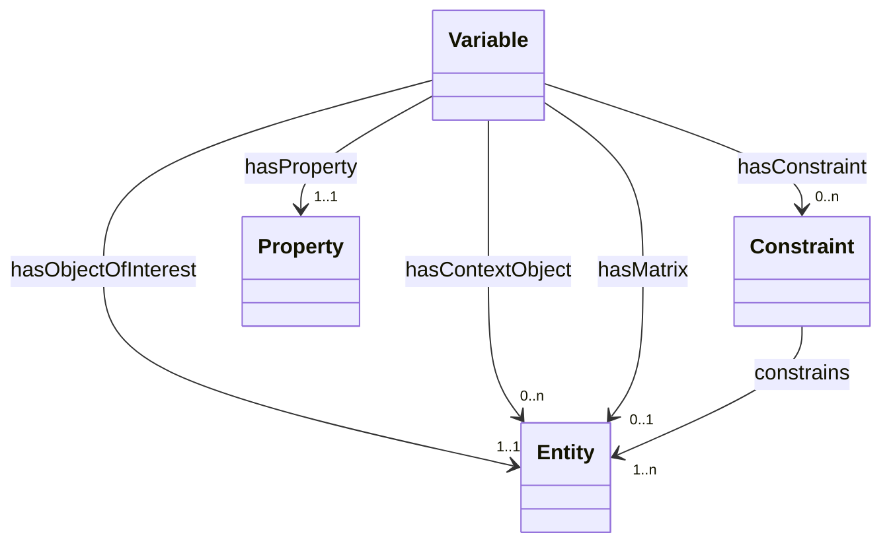
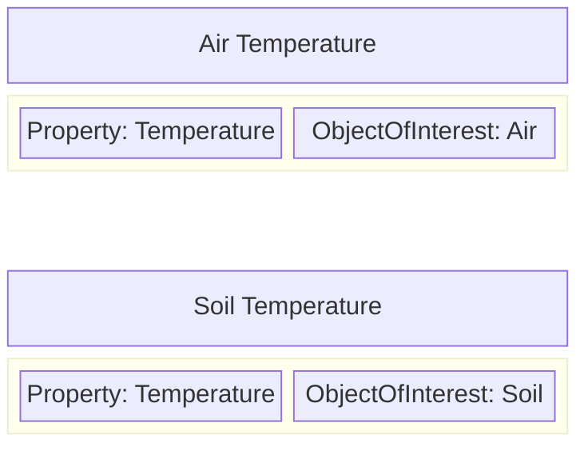
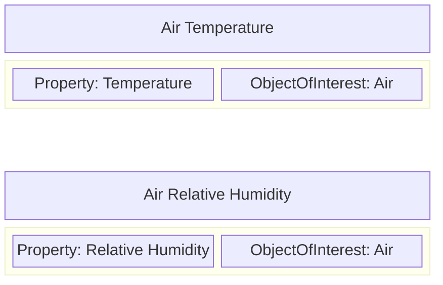
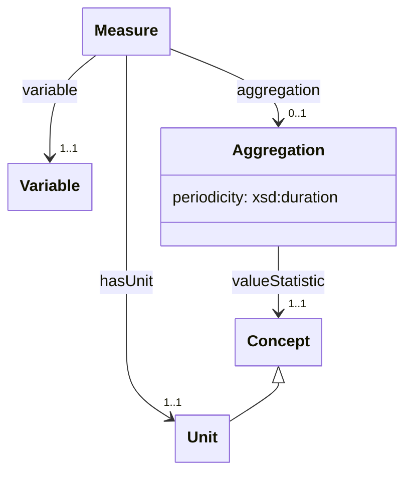

# Variables

A `Variable` is a "description of something observed or derived, minimally consisting of an ObjectOfInterest and its Property" (taken from the description of the [I-Adopt ontology](https://i-adopt.github.io/ontology/#/Variable) upon which this part of the modelling is based).

The purpose of the `Variable` is to provide a structured way to capture information about what observations are recorded in environmental datasetes and to attempt to provide some commonality in descriptions across multiple projects. By describing datasets in terms of the `Variables` that they provide measurements for, we can improve discoverability and help users more quickly locate related datasets within the FDRI catalog.

The description of a Variable consists of multiple facets. The property, object of interest, context, matrix and constraints. Only the property and object of interest facets are required.

## Property

The Property facet represents the abstract characteristic of the object of interest that is measured by the Variable. Some examples:

* Temperature
* Relative Humidity
* Depth

These properties should be gathered into a shared reference vocabulary and where possible it is recommended to relate properties to [QUDT QuantityKind](https://www.qudt.org/doc/DOC_VOCAB-QUANTITY-KINDS.html) instances.

## ObjectOfInterest

The ObjectOfInterest facet represents the class of thing whose property is measured by the Variable. e.g.

* Air
* Soil
* Longwave Radiation
* Wind
* Water

With just Property and ObjectOfInterest we can construct simple Variables which share the same property facet, but differ in the object of interest:

Equally we can construct simple Variables that share the same ObjectOfInterest but differ in the property observed:

Through this reuse of vocabulary terms it is possibel to create networks of related variables and to construct more complex shared vocabularies (of variables), from more simple building blocks (properties and objects of interest).

## Context

The Context facet relates a Variable to concepts which provide additional background information regarding the object of interest.

> [!TODO]
> Find an example of context from the COSMOS data

## Matrix

Tne Matrix facet describes the thing within which the object of interest is contained. For example if a variable measures "Dissolved nitrate molar concentration in precipitation water", the object of interest is "nitrate" and the matrix is "precipitation".

## Constraint

Constraints provide additional contextual information for the object of interest, matrix and/or context object facets. A constraint may apply to any one of these facets or to multiple facets.

Constraints are often used to specify more detail about the context in which a measurement is taken e.g. "20cm depth" (which may contextualise the object of interest of a variable)

# Measures

The iAdopt framework provides a means of describing what is being observed by a dataset. However, this does not provide information about how the observations are recorded and treated in the dataset. The Measure class combines the observed property with information about the unit and statistical aggregation of the measures taken of the observed property.

## Variable
The `hasVariable` property relats a Measure to the Variable for which values are provided.

## Unit

The `hasUnit` property relates a Measure to a concept that describes the units in which the measurement is expressed. Examples include:

* hecto-Pascal
* metres per second
* percent
* unitless (e.g. for ratios or for classification observations)

Where a unit is specified, the unit name property SHOULD also be specified providing a default display string for rendering a value with its units.

It is strongly recommended to use a common vocabulary for expressing units. The [QUDT unit vocabulary](https://www.qudt.org/doc/DOC_VOCAB-UNITS.html) provides a wide range of units as a controlled vocabulary.

## Aggregation

Where a measure is the result of the aggregation of multiple values over some time period, the `aggregation` property can be used to relate the Measure to an Aggregation which represents both how the input values are aggregated (using the `valueStatistic` property) to produce the recorded measurement, and the time period over which that aggregation is applied. Examples of value statistic concepts include:

* minimum
* maximum
* mean
* standard deviation

The `periodicity` property specifies the time period between aggregated values being reported.

## Specialisation and Variable Hierarchies

A Variable can have broader/narrower relations to other Variables which define more generic or more specialised variants of the Variable.

For example a generic "Air Temperature" variable might only have its Property and ObjectOfInterest facets defined, and have a specialisation of "Sonic Air Temperature" with a Context facet indicating the method by which the observation is made, which may itself have a specialisation "Sonic Air Temperature at 2m above sea level" with an additional Context facet indicating the height at which the reading is taken. 

> [!NOTE]
> It should be noted that even without the structure of a hierarchy, the faceted nature of Variables makes it relatively easy to discover specialisations and generalisations simply by comparing the facet values (e.g. all Temperature variables, all Air Temperature variables, all Sonic Air Temperature variables etc.).